# Análisis Integral del Peronismo: Múltiples Perspectivas

## 1. Los Fundamentos Filosóficos e Intelectuales

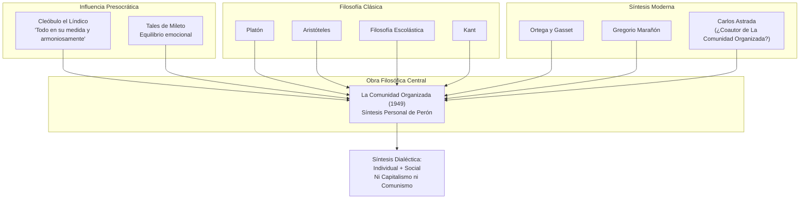

## 2. La Crisis del Liberalismo y las Respuestas Internacionales (1870-1930)

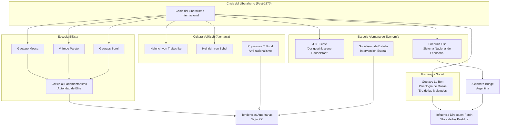

## 3. El Complejo Militar-Intelectual Argentino

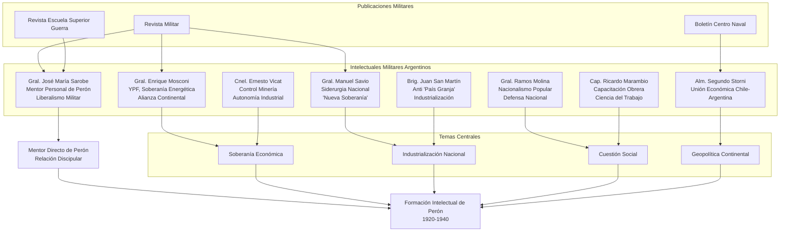

## 4. La Doctrina Social Católica y el Peronismo

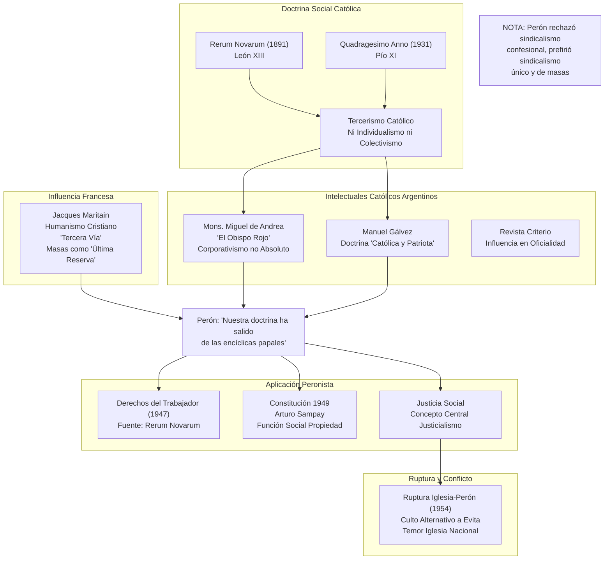

## 5. Los Nacionalismos Populares Latinoamericanos: El Contexto Regional

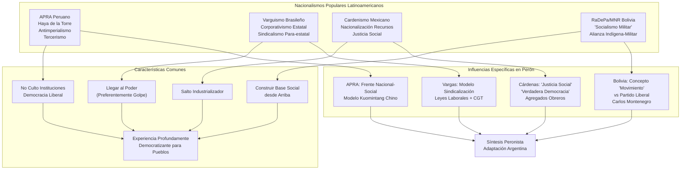
## 6. El Pensamiento Económico y el Eje Bunge-Figuerola

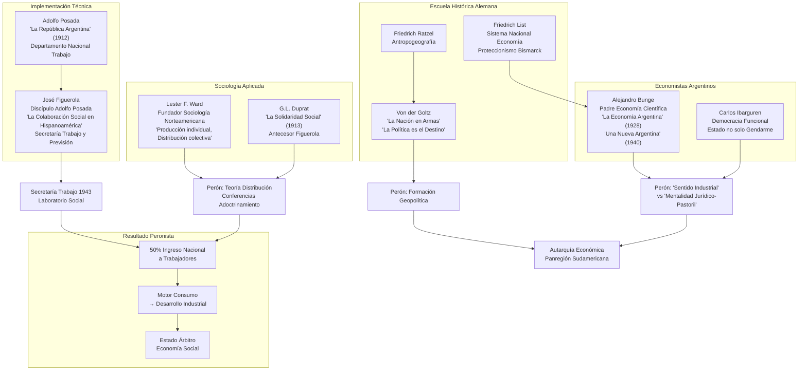

## 7. El Fracaso de la Alianza de Clases y la Resistencia Empresarial

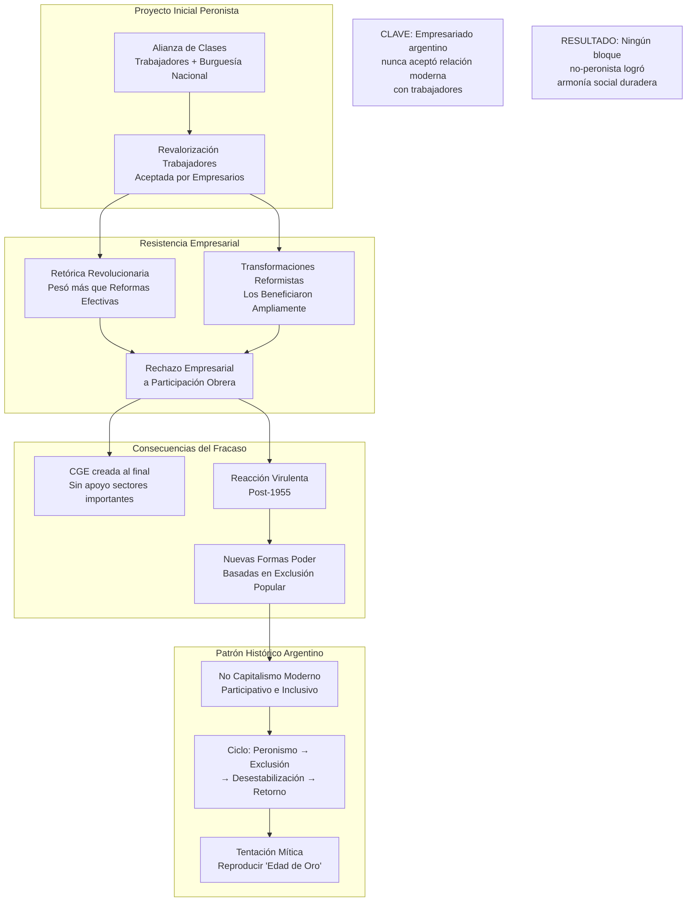

## 8. Lo que NO fue el Peronismo: Desmontando el Mito Fascista

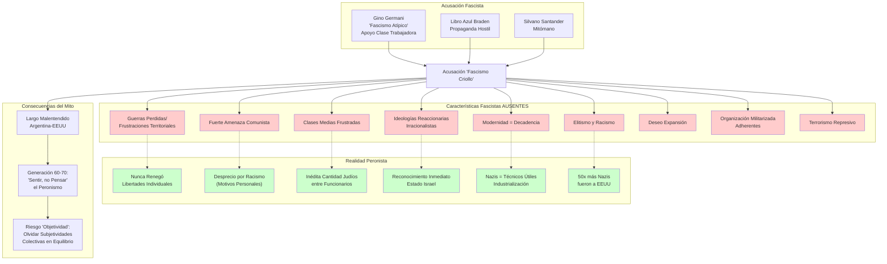

## 9. El Método Pragmático: La Estrategia de Síntesis de Perón

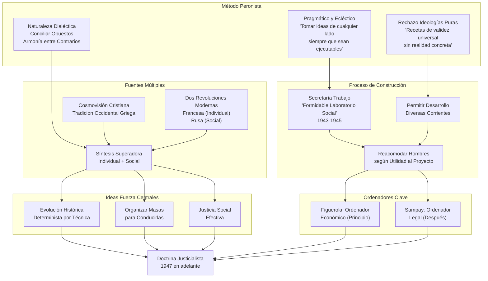

## 10. Las Continuidades y Rupturas: El Peronismo en la Tradición Política Argentina

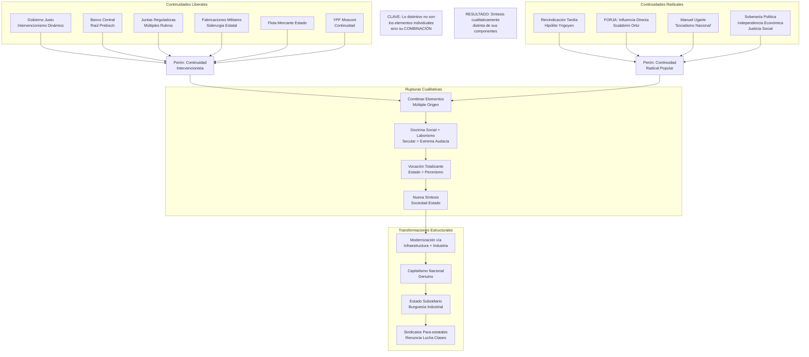

## 11. La Formación Geopolítica y Militar de Perón

```mermaid
graph TD
    subgraph "Formación Geopolítica"
        HAUSHOFER["Karl Haushofer<br/>Geopolítica Alemana<br/>Sobredimensión Espacial"]
        MACKINDER["Halford Mackinder<br/>Sistematización Británica"]
        KJELLEN["Rudolf Kjellen<br/>Término 'Geopolítica'"]
    end
    
    subgraph "Influencia Aeronáutica"
        DOUHET["Giulio Douhet<br/>'El Dominio del Aire'<br/>Revolución Arte Militar"]
        PERTINE["Mayor Fantini Pertine<br/>'Suficiencia Industrial Total'<br/>'Construcción Criolla'"]
        MOSCONI_AVIA["Mosconi: Plan Aeronáutico 1921<br/>Complemento Ferrocarril"]
    end
    
    subgraph "Doctrina Militar Alemana"
        GOLTZ_NAC["Von der Goltz<br/>'La Nación en Armas'<br/>Múltiples Relecturas Perón"]
        CLAUSEWITZ["Clausewitz"]
        JOMINI["Jomini"]
        SCHLIEFEN["Schliefen"]
    end
    
    subgraph "Aplicación Peronista"
        COMUNIDAD_ORG["Comunidad Organizada<br/>Versión Pacífica<br/>'Nación en Armas'"]
        CONTINENTAL["Continentalismo<br/>Panregión Sudamericana"]
        AUTARQUIA_GEO["Autarquía Económica<br/>No Dependencia Externa"]
        UNIDAD_NAC["Imperativo Unidad Nacional"]
    end
    
    HAUSHOFER --> PERON_GEO["Perón: Formación<br/>Estrategia Militar"]
    MACKINDER --> PERON_GEO
    KJELLEN --> PERON_GEO
    
    DOUHET --> PERON_AERO["Perón: Insignias Alas<br/>Revolución Técnica"]
    PERTINE --> PERON_AERO
    MOSCONI_AVIA --> PERON_AERO
    
    GOLTZ_NAC --> PERON_DOCT["Perón: 'Guerra Mundial 1914'<br/>Experto Historia Militar"]
    CLAUSEWITZ --> PERON_DOCT
    JOMINI --> PERON_DOCT
    SCHLIEFEN --> PERON_DOCT
    
    PERON_GEO --> COMUNIDAD_ORG
    PERON_GEO --> CONTINENTAL
    PERON_GEO --> AUTARQUIA_GEO
    PERON_GEO --> UNIDAD_NAC
    
    PERON_AERO --> INDUSTRIAL["Visión Industrial<br/>Integral"]
    PERON_DOCT --> ORGANIZACION_POD["Organización =<br/>Poder"]
```

## 12. La Conexión Lugones-Criollismo: Nacionalismo Cultural

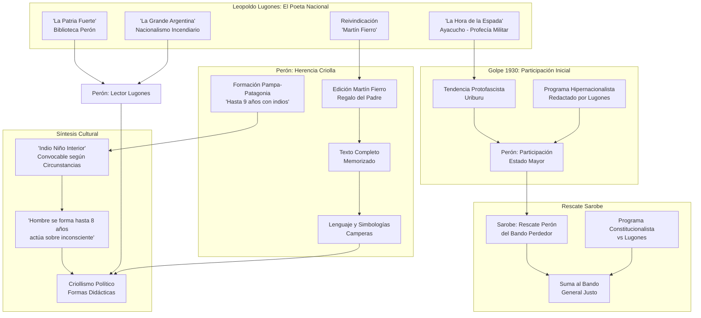

## Conclusión: La Amalgama Eficaz

El análisis integral revela que el peronismo no fue ni una creación de laboratorio ni una simple continuación de tendencias existentes, sino una **amalgama eficaz** que combinó elementos de múltiples orígenes en una síntesis cualitativamente nueva. Los puntos clave son:

1. **Sofisticación Filosófica**: Lejos de ser anti-intelectual, Perón extrajo desde los presocráticos hasta la filosofía moderna, creando una síntesis dialéctica que reconcilió las dimensiones individual y social.

2. **Contexto Internacional**: El peronismo surgió como respuesta argentina a la crisis global del liberalismo, influenciado por pero distinto de otros nacionalismos populares latinoamericanos.

3. **Fundamento Militar-Intelectual**: El ejército argentino produjo una generación de "oficiales intelectuales" que proporcionaron la base técnica e ideológica para la transformación nacional.

4. **Síntesis Social Cristiana**: La integración de la doctrina social católica proporcionó legitimidad moral y una "tercera vía" entre capitalismo y comunismo.

5. **Pragmatismo Económico**: El eje Bunge-Figuerola proporcionó la experiencia técnica para implementar la redistribución como motor del desarrollo industrial.

6. **Contradicciones Estructurales**: El fracaso en lograr una cooperación duradera entre empresarios y trabajadores revela los límites de la síntesis peronista y explica la inestabilidad política cíclica argentina.

7. **Innovación Metodológica**: El eclecticismo pragmático de Perón le permitió combinar elementos aparentemente incompatibles en una doctrina política funcional.

La "amalgama eficaz" logró crear una nueva forma de organización política que no era ni fascista ni democrática liberal, sino que representaba una solución distintivamente latinoamericana a los desafíos de la modernización e integración social.
