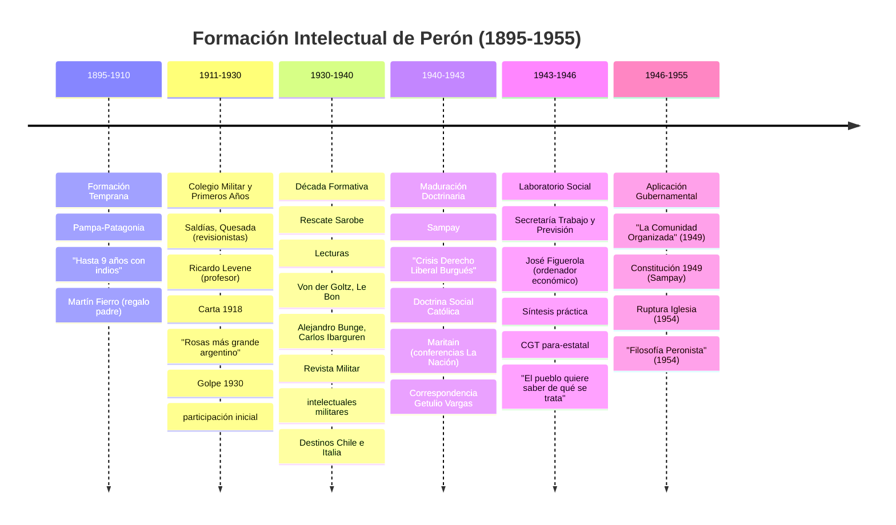
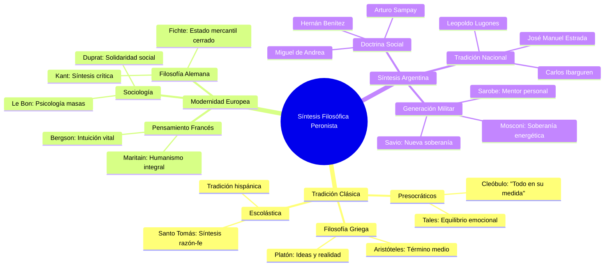
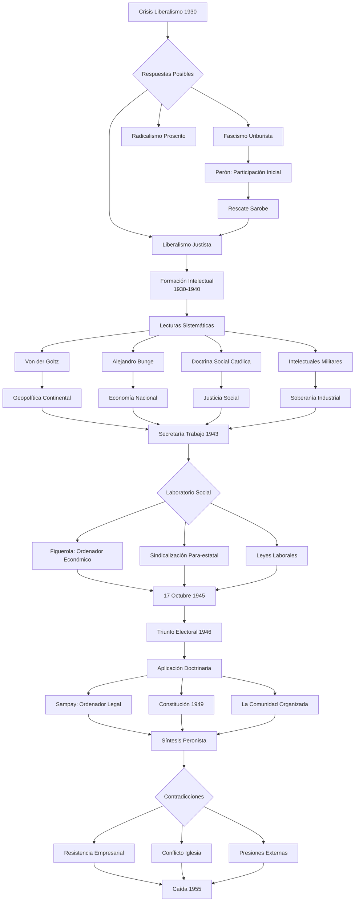
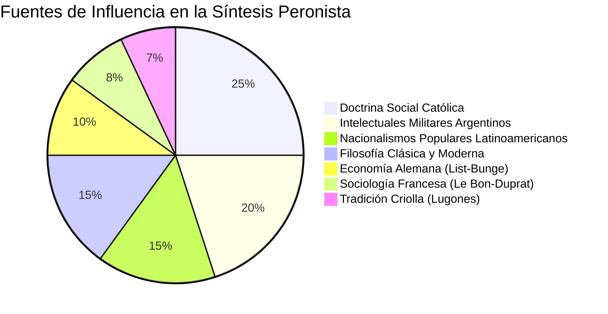
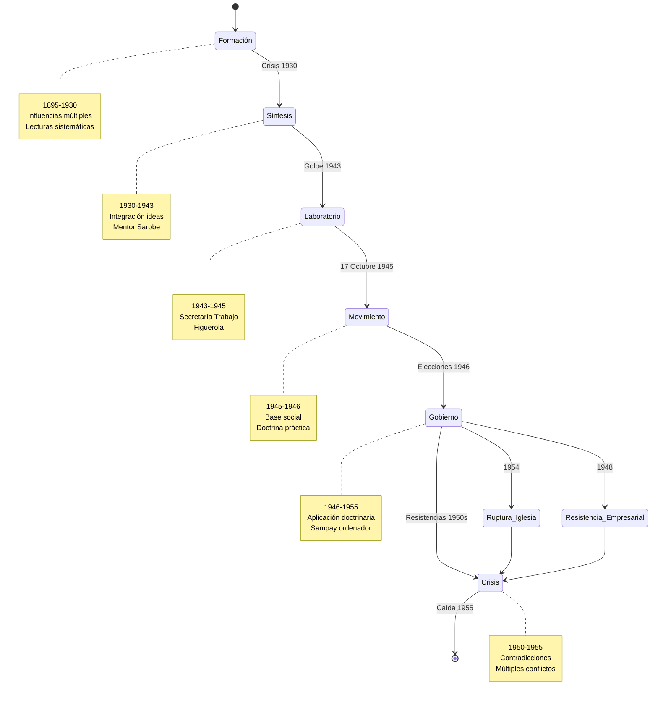
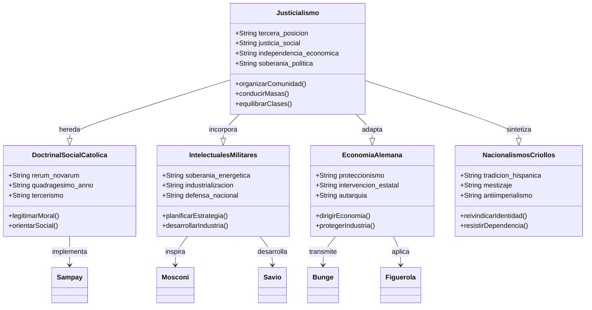
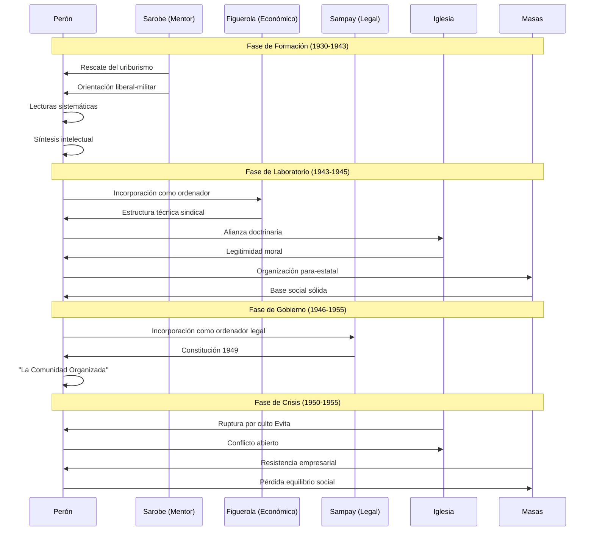
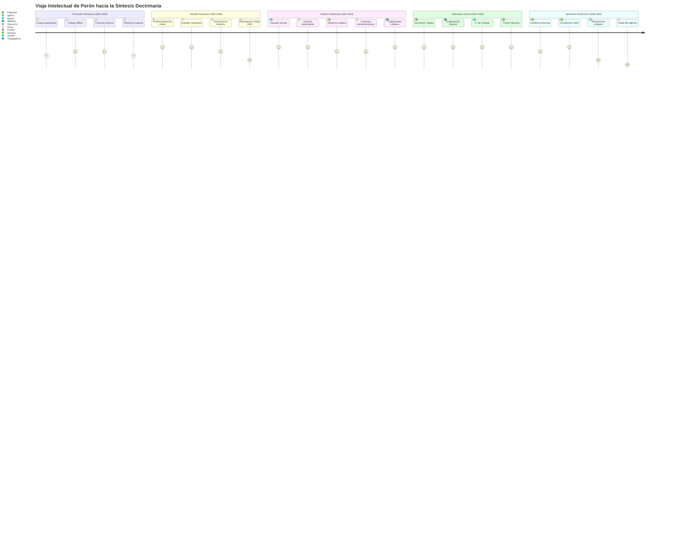
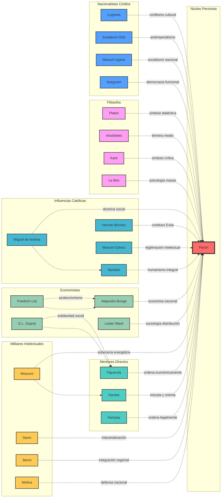

# Análisis Sofisticado del Peronismo: Diagramas Especializados

## 1. Cronología de Influencias Intelectuales: Timeline



## 2. Mapa Mental de Influencias Filosóficas: Mindmap



## 3. Diagrama de Flujo del Proceso de Síntesis: Flowchart



## 4. Diagrama de Gantt: Evolución Temporal de Ideas Clave

```mermaid
gantt
    title Desarrollo Temporal de Ideas Peronistas
    dateFormat X
    axisFormat %s
    
    section Formación Intelectual
    Lecturas Clásicas          :1920, 1940
    Influencia Militar         :1925, 1943
    Doctrina Social Católica   :1930, 1950
    
    section Síntesis Práctica
    Secretaría Trabajo         :1943, 1946
    Organización Sindical      :1943, 1955
    Política Económica         :1944, 1955
    
    section Elaboración Doctrinaria
    Derechos del Trabajador    :1947, 1947
    La Comunidad Organizada    :1949, 1949
    Constitución 1949          :1949, 1949
    Filosofía Peronista        :1954, 1954
    
    section Conflictos y Crisis
    Resistencia Empresarial    :1948, 1955
    Presiones Internacionales  :1945, 1955
    Ruptura con Iglesia        :1954, 1955
```



## 5. Diagrama de Sectores: Composición de Influencias



## 6. Diagrama de Estados: Evolución del Peronismo



## 7. Diagrama de Clases: Estructura Conceptual del Justicialismo



## 8. Diagrama de Secuencia: Proceso de Construcción Doctrinaria


## 9. Diagrama de Viaje del Usuario: La Experiencia de Síntesis Peronista



## 10. Mapa de Calor: Intensidad de Influencias por Período

```mermaid
gitgraph
    commit id: "Formación Criolla (1895-1910)"
    branch filosofia_clasica
    checkout filosofia_clasica
    commit id: "Platón, Aristóteles"
    commit id: "Escolástica"
    
    checkout main
    branch intelectuales_militares
    checkout intelectuales_militares
    commit id: "Mosconi (1920)"
    commit id: "Sarobe (1925)"
    commit id: "Savio (1930)"
    
    checkout main
    merge filosofia_clasica
    commit id: "Síntesis Temprana (1920)"
    
    branch doctrina_catolica
    checkout doctrina_catolica
    commit id: "Rerum Novarum"
    commit id: "Miguel de Andrea"
    commit id: "Maritain (1936)"
    
    checkout main
    branch economia_alemana
    checkout economia_alemana
    commit id: "Von der Goltz"
    commit id: "Alejandro Bunge"
    commit id: "José Figuerola"
    
    checkout main
    merge intelectuales_militares
    commit id: "Formación Militar (1930)"
    
    merge doctrina_catolica
    commit id: "Síntesis Católica (1940)"
    
    merge economia_alemana
    commit id: "Laboratorio Social (1943)"
    
    commit id: "Doctrina Peronista (1947)"
    commit id: "La Comunidad Organizada (1949)"
```

## 11. Diagrama de Red: Conexiones Intelectuales Complejas



## 12. Diagrama Sankey: Flujo de Ideas hacia la Síntesis

```mermaid
sankey-beta
    
    Filosofía Clásica,Síntesis Temprana,25
    Doctrina Católica,Síntesis Temprana,30
    Intelectuales Militares,Síntesis Temprana,20
    Economía Alemana,Síntesis Temprana,15
    Criollismo,Síntesis Temprana,10
    
    Síntesis Temprana,Laboratorio Social,60
    Nacionalismos Latinoamericanos,Laboratorio Social,25
    Sociología Francesa,Laboratorio Social,15
    
    Laboratorio Social,Doctrina Peronista,70
    Resistencias Externas,Doctrina Peronista,20
    Adaptaciones Pragmáticas,Doctrina Peronista,10
    
    Doctrina Peronista,Aplicación Gubernamental,80
    Contradicciones Internas,Aplicación Gubernamental,20
```

## Conclusión: La Sofisticación de la Síntesis Peronista

Estos diagramas especializados revelan la extraordinaria complejidad y sofisticación de la formación intelectual peronista. Utilizando diferentes tipos de visualización, podemos apreciar:

### **Dimensión Temporal** (Timeline, Gantt)
- La formación fue un proceso de **décadas**, no improvisación
- Cada período aportó elementos específicos a la síntesis final
- Las crisis actuaron como **catalizadores** de integración doctrinaria

### **Dimensión Estructural** (Clases, Estados, Secuencia)
- El peronismo como **sistema conceptual** coherente
- Evolución por **fases definidas** con lógica interna
- **Interacciones complejas** entre actores y ideas

### **Dimensión Relacional** (Red, Mindmap, Sankey)
- **Múltiples fuentes** convergiendo en síntesis única
- **Conexiones cruzadas** entre diferentes tradiciones intelectuales
- **Flujo direccional** de ideas hacia aplicación práctica

### **Dimensión Experiencial** (Journey, Pie)
- El **proceso vivencial** de construcción doctrinaria
- **Proporciones equilibradas** de diferentes influencias
- **Momentos críticos** de decisión y síntesis

La utilización de estos diversos tipos de diagramas demuestra que el peronismo no fue una improvisación populista, sino el resultado de una **síntesis intelectual sofisticada** que combinó tradiciones filosóficas, doctrinarias, económicas y políticas en una **amalgama eficaz** adaptada a las condiciones argentinas y latinoamericanas del siglo XX.
