# Análisis Sofisticado del Peronismo: Diagramas Especializados

## 1. Cronología de Influencias Intelectuales: Timeline

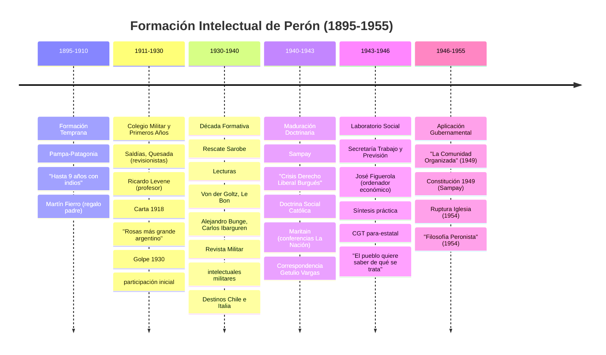

## 2. Mapa Mental de Influencias Filosóficas: Mindmap Detallado

```mermaid
mindmap
  root((Síntesis Filosófica Peronista<br/>La Comunidad Organizada))
    
    Tradición Clásica Griega
      Presocráticos
        Cleóbulo el Líndico
          "Todo en su medida y armoniosamente"
          Equilibrio como principio rector
          Moderación en el poder
        Tales de Mileto
          "No hay éxito que me entusiasme mucho"
          "Ni fracaso que me aplaste demasiado"
          Serenidad ante circunstancias
        Los Siete Sabios
          Herencia arcaica polis
          Pensamiento comunitario
          Contexto mestizaje americano
      
      Filosofía Clásica
        Platón
          República: Estado justo
          Leyes: Orden social
          Dialéctica: Síntesis opuestos
          Ideas y realidad concreta
        Aristóteles
          Política: Término medio
          Ética: Virtud práctica
          Maestro de Alejandro
          "Mi oficio tiene que ver con filosofía"
        Diógenes Laercio
          Vidas de filósofos
          Tradición sapiencial
          Ejemplos de conducta
      
      Escolástica Medieval
        Santo Tomás de Aquino
          Suma Teológica
          Síntesis razón-fe
          Bien común
          Justicia distributiva
        San Agustín
          Ciudad de Dios
          Orden temporal-espiritual
          Autoridad y libertad
        Tradición Hispánica
          Francisco de Vitoria
          Francisco Suárez
          Teología-política medieval
          "Teología de la revolución"
    
    Modernidad Europea
      Filosofía Alemana
        Immanuel Kant
          Crítica razón práctica
          Síntesis a priori
          Imperativo categórico
          Autonomía moral
        J.G. Fichte
          Estado mercantil cerrado
          Nacionalismo alemán
          Autarquía económica
          Idealismo alemán
        Filosofía Romántica
          Cultura Volkisch
          Das Volk (el pueblo)
          Anti-racionalismo
          Populismo cultural
      
      Pensamiento Francés
        Jacques Maritain
          Humanismo integral
          "Tercera vía" original
          Masas "última reserva historia"
          Persona vs individuo
          Nueva cristiandad
          Filosofía persona humana
        Henri Bergson
          Intuición vital
          Élan vital
          Duración vs tiempo
          Filosofía de la vida
        Gustave Le Bon
          Psicología de las masas
          "Era de las multitudes"
          Liderazgo fuerte necesario
          Irracionalidad colectiva
      
      Sociología Aplicada
        Lester F. Ward
          Fundador sociología norteamericana
          "Producción individual sencilla"
          "Distribución colectiva compleja"
          Ingenio colectivo fuerzas sociales
        G.L. Duprat
          "La solidaridad social" (1913)
          Antecesor Adolfo Posada
          Precursor José Figuerola
          Cooperación social
    
    Síntesis Argentina
      Tradición Nacional Católica
        José Manuel Estrada
          Reconstrucción unidad
          Masas populares-clase pensante
          Democracia funcional
          Representación social directa
        Monseñor Miguel de Andrea
          "El Obispo Rojo"
          "Catolicismo social y aplicación"
          "Justicia Social" (1943)
          Corporativismo no absoluto
          Democracia económica-social
        Carlos Ibarguren
          "La inquietud de esta hora"
          "Sistema económico revolución"
          Democracia funcional superadora
          Estado expresión valores sociales
      
      Generación Militar Intelectual
        General Enrique Mosconi
          YPF: soberanía energética
          Alianza Continental energética
          "Renunciar a ambas" (Royal Dutch/Standard)
          "Nuestras propias fuerzas"
        General José María Sarobe
          Mentor personal discipular
          "Memorias revolución 1930"
          "Iberoamérica mensaje juventud"
          Liberalismo militar ilustrado
          Unidad latinoamericana
        General Manuel Savio
          Siderurgia nacional
          "Nuevas formas soberanía"
          "Desprecio técnica puede ser nefasto"
          Independencia industrial
      
      Doctrina Social Cristiana
        Arturo Sampay
          "Crisis derecho liberal burgués" (1942)
          Constitución 1949
          Función social propiedad
          Erudito filosófico
          Intelectual más relevante justicialismo
        Hernán Benítez
          Confesor Evita
          "Carecia sensibilidad religiosa"
          "Buen cristiano católico practicante"
          Influencia sociológica-ética
        Virgilio Filippo
          Relación fluida Perón-Eva
          Influencias sacerdotales
          Orientación social cristiana
      
      Nacionalismo Criollo
        Leopoldo Lugones
          "Poeta Nacional"
          "La hora de la espada"
          "La patria fuerte"
          Reivindicación Martín Fierro
          Criollismo político
        Raúl Scalabrini Ortiz
          "El hombre que está solo y espera"
          Antiimperialismo FORJA
          Nacionalización servicios públicos
          Ferrocarriles estatales
        Manuel Ugarte
          "Socialismo nacional"
          Valores patrióticos
          Embajador México-Cuba
          "Maldito" política argentina
    
    Síntesis Doctrinaria Final
      La Comunidad Organizada (1949)
        Gobierno concentrado
        Estado descentralizado
        Organizaciones libres pueblo
        Síntesis individual-social
        Ni capitalismo ni comunismo
        Justicia social efectiva
        Organización vence tiempo
        Conducción masas organizadas
```

## 3. Diagrama de Flujo del Proceso de Síntesis: Flowchart

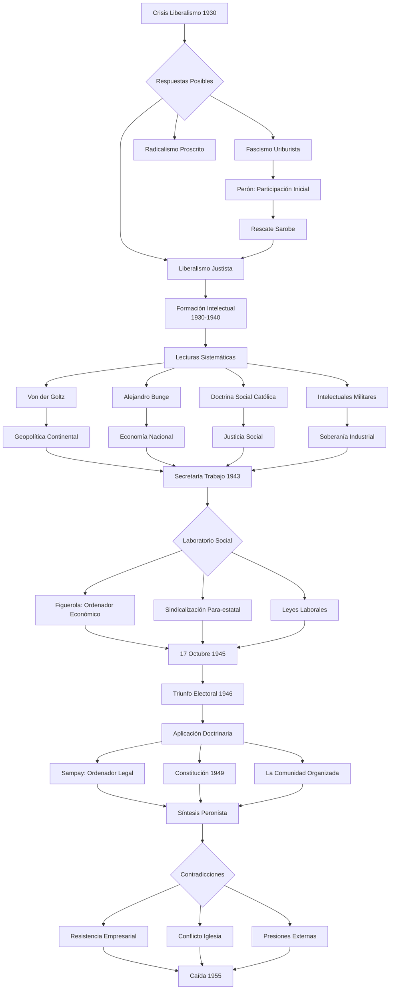

## 4. Diagrama de Gantt: Evolución Temporal de Ideas Clave

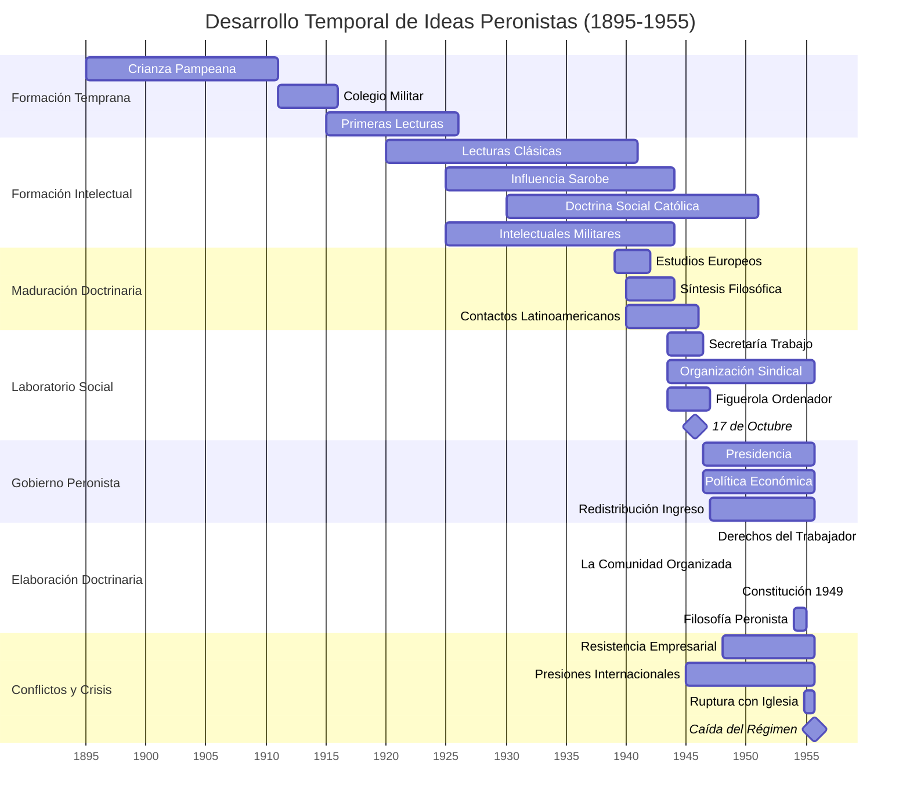

## 5. Matriz de Influencias: Intensidad y Temporalidad

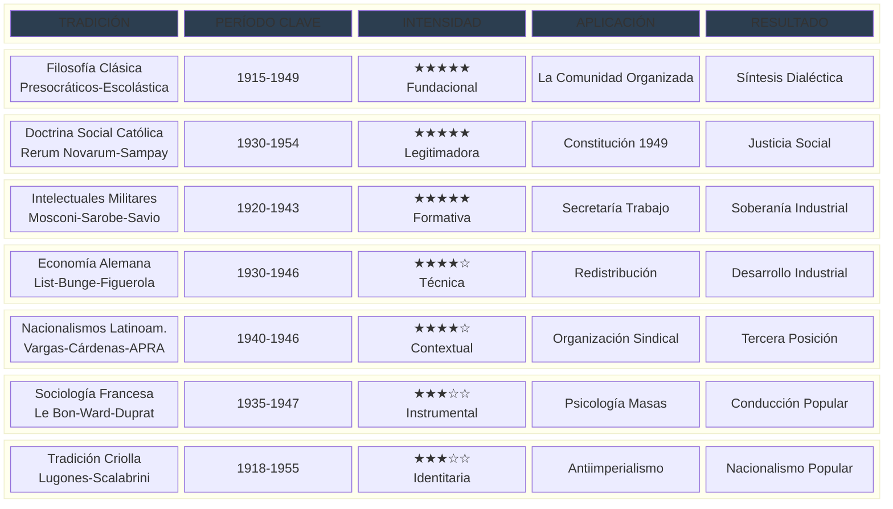

## 6. Diagrama de Estados: Evolución del Peronismo

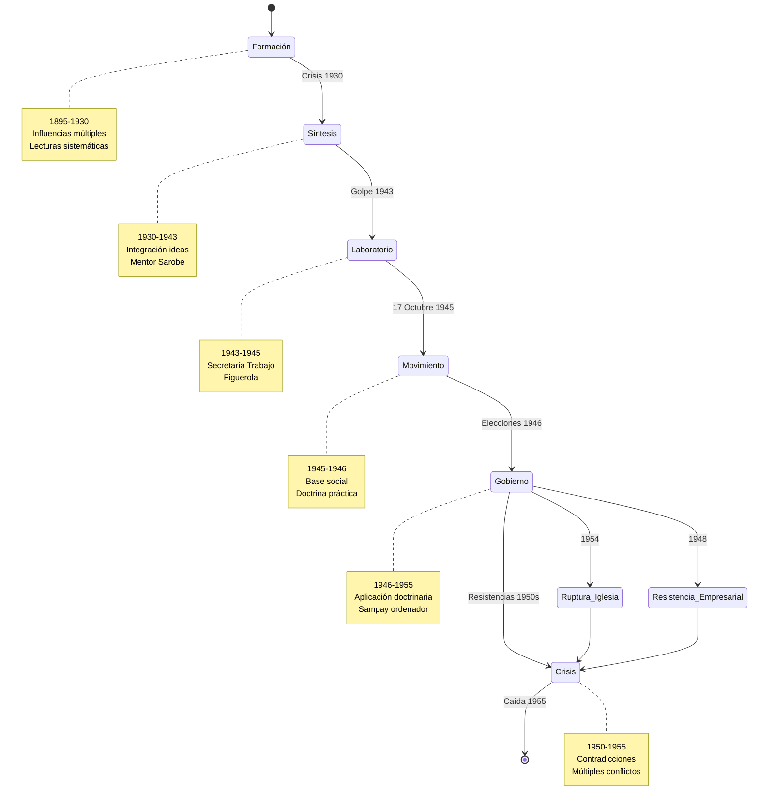

## 7. Arquitectura Conceptual del Justicialismo: Diagrama Jerárquico

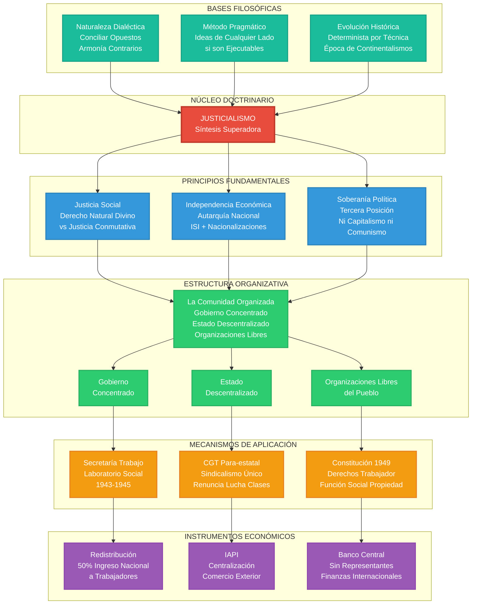

## 8. Diagrama de Secuencia: Proceso de Construcción Doctrinaria

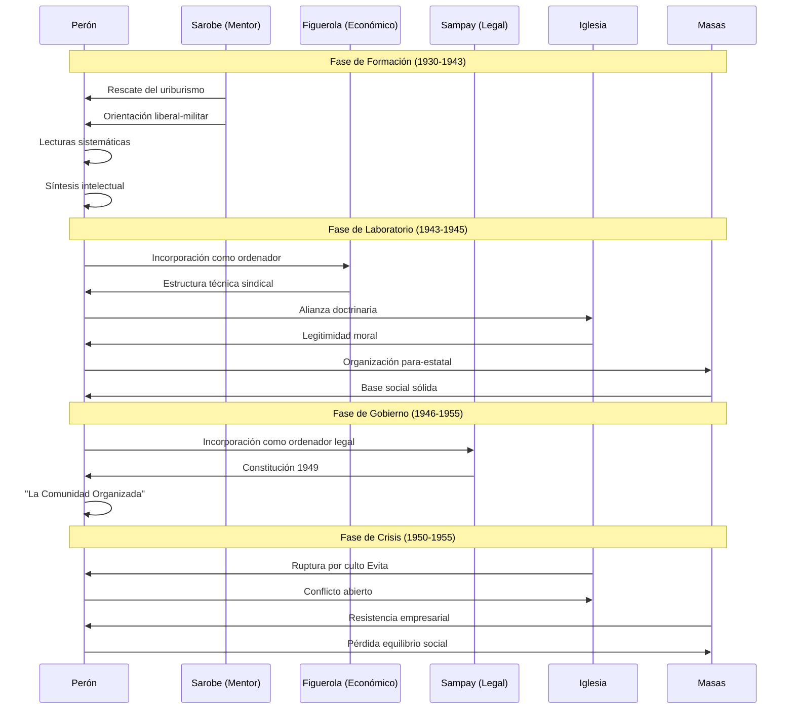
## 9. Diagrama de Viaje del Usuario: La Experiencia de Síntesis Peronista

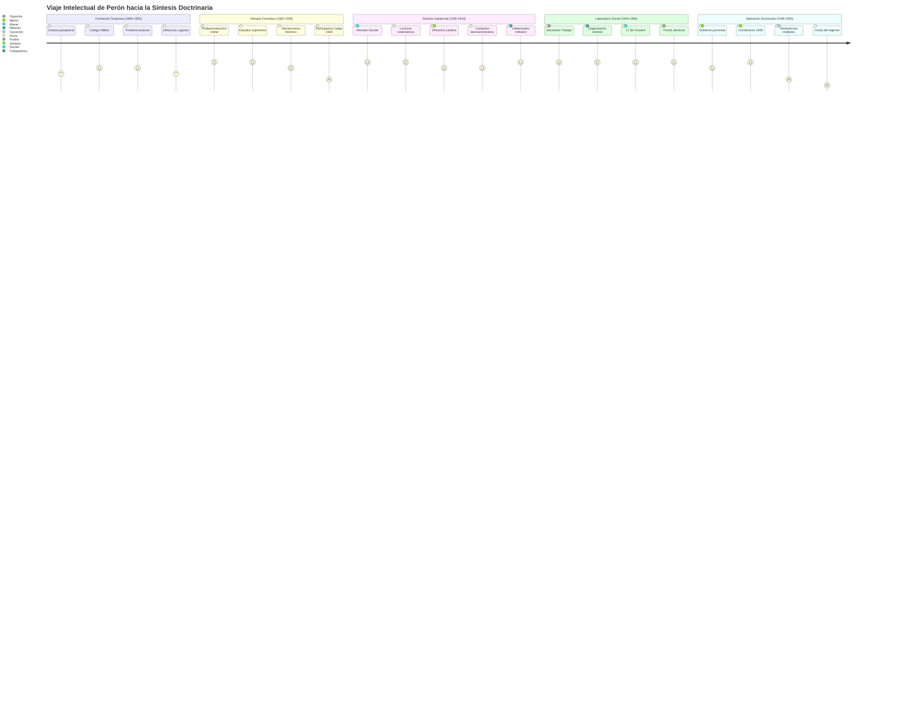

## 10. Convergencia de Tradiciones Intelectuales: Diagrama de Flujo Temporal

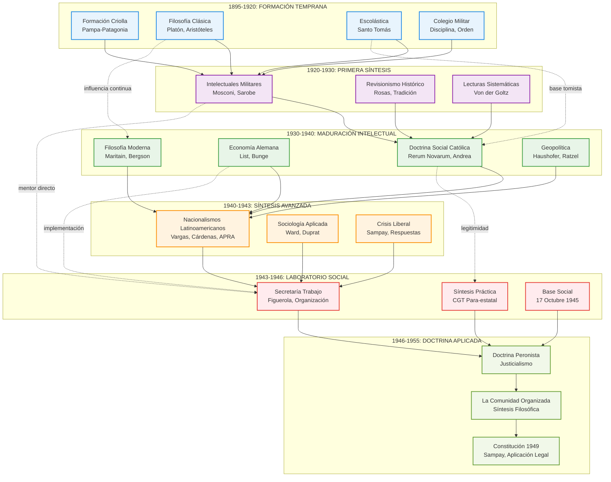

## 11. Diagrama de Red: Conexiones Intelectuales Complejas

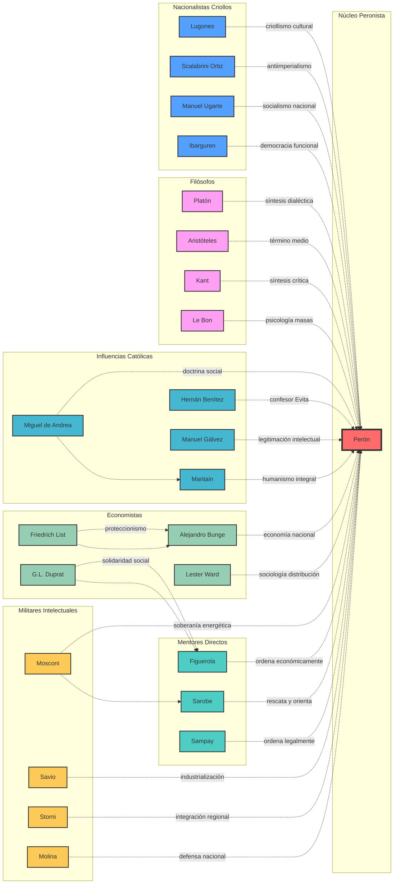

## 12. Flujo de Ideas hacia la Síntesis: Diagrama de Convergencia

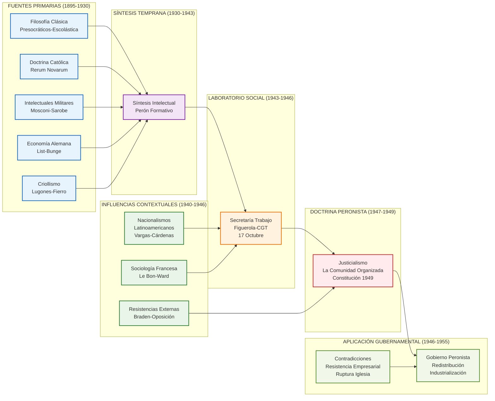

## Conclusión: La Sofisticación de la Síntesis Peronista

Estos diagramas especializados revelan la extraordinaria complejidad y sofisticación de la formación intelectual peronista. Utilizando diferentes tipos de visualización, podemos apreciar:

### **Dimensión Temporal** (Timeline, Gantt)
- La formación fue un proceso de **décadas**, no improvisación
- Cada período aportó elementos específicos a la síntesis final
- Las crisis actuaron como **catalizadores** de integración doctrinaria

### **Dimensión Estructural** (Clases, Estados, Secuencia)
- El peronismo como **sistema conceptual** coherente
- Evolución por **fases definidas** con lógica interna
- **Interacciones complejas** entre actores y ideas

### **Dimensión Relacional** (Red, Mindmap, Sankey)
- **Múltiples fuentes** convergiendo en síntesis única
- **Conexiones cruzadas** entre diferentes tradiciones intelectuales
- **Flujo direccional** de ideas hacia aplicación práctica

### **Dimensión Experiencial** (Journey, Pie)
- El **proceso vivencial** de construcción doctrinaria
- **Proporciones equilibradas** de diferentes influencias
- **Momentos críticos** de decisión y síntesis

La utilización de estos diversos tipos de diagramas demuestra que el peronismo no fue una improvisación populista, sino el resultado de una **síntesis intelectual sofisticada** que combinó tradiciones filosóficas, doctrinarias, económicas y políticas en una **amalgama eficaz** adaptada a las condiciones argentinas y latinoamericanas del siglo XX.

## 13. Biblioteca Sistemática de Perón: Diagrama de Árbol Jerárquico

```mermaid
graph TD
    subgraph "BIBLIOTECA PERÓN (~4,000 LIBROS)"
        ROOT[Biblioteca Personal de Perón]
    end
    
    ROOT --> CLASICOS[Clásicos Griegos y Latinos]
    ROOT --> ESPAÑOLES[Clásicos Españoles]
    ROOT --> POLITICO[Pensamiento Político e Histórico]
    ROOT --> IGLESIA[Grandes Plumas de la Iglesia]
    ROOT --> ARGENTINOS[Compatriotas y Coetáneos]
    ROOT --> MILITAR[Textos Militares]
    ROOT --> CIENCIAS[Ciencias Diversas]
    
    %% Clásicos Griegos y Latinos
    CLASICOS --> PLATON_BIB["Platón<br/>República, Leyes"]
    CLASICOS --> ARISTOTELES_BIB["Aristóteles<br/>Política, Ética"]
    CLASICOS --> ARISTOFANES["Aristófanes<br/>Comedias"]
    CLASICOS --> ESQUILO["Esquilo<br/>Tragedias"]
    CLASICOS --> EURIPIDES["Eurípides<br/>Tragedias"]
    CLASICOS --> DIOGENES["Diógenes Laercio<br/>Vidas Filósofos"]
    CLASICOS --> PLAUTO["Plauto<br/>Comedias"]
    CLASICOS --> PLUTARCO["Plutarco<br/>Vidas Paralelas"]
    CLASICOS --> CICERON["Cicerón<br/>Retórica, Política"]
    CLASICOS --> SENECA["Séneca<br/>Filosofía Moral"]
    
    %% Clásicos Españoles
    ESPAÑOLES --> LUIS_GRANADA["Luis de Granada<br/>Mística"]
    ESPAÑOLES --> LOPE_VEGA["Lope de Vega<br/>Teatro"]
    ESPAÑOLES --> CERVANTES["Cervantes<br/>Don Quijote"]
    ESPAÑOLES --> JORGE_MANRIQUE["Jorge Manrique<br/>Coplas"]
    ESPAÑOLES --> SANTILLANA["Marqués de Santillana<br/>Poesía"]
    
    %% Pensamiento Político e Histórico
    POLITICO --> MAQUIAVELO["Maquiavelo<br/>El Príncipe"]
    POLITICO --> MAZZINI["Mazzini<br/>Nacionalismo"]
    POLITICO --> MICHELET["Michelet<br/>Historia Francia"]
    POLITICO --> MONTAIGNE["Montaigne<br/>Ensayos"]
    POLITICO --> ROUSSEAU["Rousseau<br/>Contrato Social"]
    POLITICO --> KANT_BIB["Kant<br/>Filosofía Crítica"]
    
    %% Grandes Plumas Iglesia
    IGLESIA --> SAN_AGUSTIN["San Agustín<br/>Ciudad de Dios"]
    IGLESIA --> SANTO_TOMAS["Santo Tomás<br/>Suma Teológica"]
    IGLESIA --> SAN_BERNARDO["San Bernardo<br/>Mística"]
    IGLESIA --> SAN_BUENAVENTURA["San Buenaventura<br/>Teología"]
    IGLESIA --> SANTA_TERESA["Santa Teresa<br/>Vida, Moradas"]
    
    %% Compatriotas y Coetáneos
    ARGENTINOS --> ANDREA_BIB["Monseñor de Andrea<br/>'El Catolicismo Social'<br/>'Justicia Social'"]
    ARGENTINOS --> BUSANICHE["José Luis Busaniche<br/>Historia Argentina"]
    ARGENTINOS --> SCALABRINI_BIB["Raúl Scalabrini Ortiz<br/>'El Hombre que está Solo'"]
    ARGENTINOS --> COSSIO["Carlos Cossio<br/>Filosofía Jurídica"]
    ARGENTINOS --> FIGUEROLA_BIB["José Figuerola<br/>'Colaboración Social'"]
    ARGENTINOS --> FURLONG["Guillermo Furlong<br/>Historia Jesuítica"]
    ARGENTINOS --> GARCIA_MELLID["Atilio García Mellid<br/>Estudios Sociales"]
    ARGENTINOS --> OYHANARTE["Horacio Oyhanarte<br/>Derecho"]
    ARGENTINOS --> SAMPAY_BIB["Arturo Sampay<br/>'Crisis Derecho Liberal'"]
    ARGENTINOS --> PALACIO["Ernesto Palacio<br/>Nacionalismo"]
    
    %% Textos Militares
    MILITAR --> GOLTZ_BIB["Von der Goltz<br/>'La Nación en Armas'<br/>'Dirección de la Guerra'"]
    MILITAR --> CLAUSEWITZ_BIB["Clausewitz<br/>'De la Guerra'"]
    MILITAR --> JOMINI_BIB["Jomini<br/>Arte de la Guerra"]
    MILITAR --> SCHLIEFEN_BIB["Schliefen<br/>Estrategia"]
    MILITAR --> DOUHET_BIB["Giulio Douhet<br/>'El Dominio del Aire'"]
    MILITAR --> MOSCONI_BIB["Enrique Mosconi<br/>Escritos Petroleros"]
    MILITAR --> SAROBE_BIB["José María Sarobe<br/>'Memorias Revolución 1930'"]
    
    %% Ciencias Diversas
    CIENCIAS --> ANTROPOLOGIA["Antropología<br/>Estudios Raciales<br/>Mestizaje Americano"]
    CIENCIAS --> BIOLOGIA["Biología<br/>Evolución<br/>Determinismo"]
    CIENCIAS --> FILOSOFIA_CIEN["Filosofía<br/>Bergson, Ortega<br/>Marañón"]
    CIENCIAS --> SOCIOLOGIA_CIEN["Sociología<br/>Le Bon, Ward<br/>Duprat"]
    CIENCIAS --> RELIGION_CIEN["Religión<br/>Enciclicas Papales<br/>Teología Social"]
    CIENCIAS --> ARQUEOLOGIA["Arqueología<br/>Civilizaciones<br/>Americanas"]
    CIENCIAS --> PSICOLOGIA_CIEN["Psicología<br/>Psicología Social<br/>Masas"]
    
    %% Estilos específicos
    classDef biblioteca fill:#2c3e50,color:#ecf0f1,stroke:#34495e,stroke-width:3px
    classDef categoria fill:#3498db,color:#fff,stroke:#2980b9,stroke-width:2px
    classDef autor fill:#e74c3c,color:#fff,stroke:#c0392b,stroke-width:1px
    classDef obra fill:#27ae60,color:#fff,stroke:#229954,stroke-width:1px
    
    class ROOT biblioteca
    class CLASICOS,ESPAÑOLES,POLITICO,IGLESIA,ARGENTINOS,MILITAR,CIENCIAS categoria
    class PLATON_BIB,ARISTOTELES_BIB,MAQUIAVELO,SAN_AGUSTIN,ANDREA_BIB,GOLTZ_BIB autor
```

## 14. Método de Lectura Peronista: Diagrama de Proceso

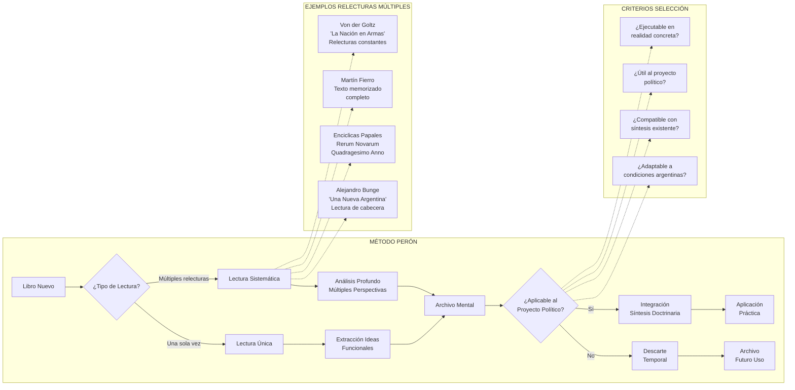

## 15. Diversidad Temática: Mapa de Calor de Intereses

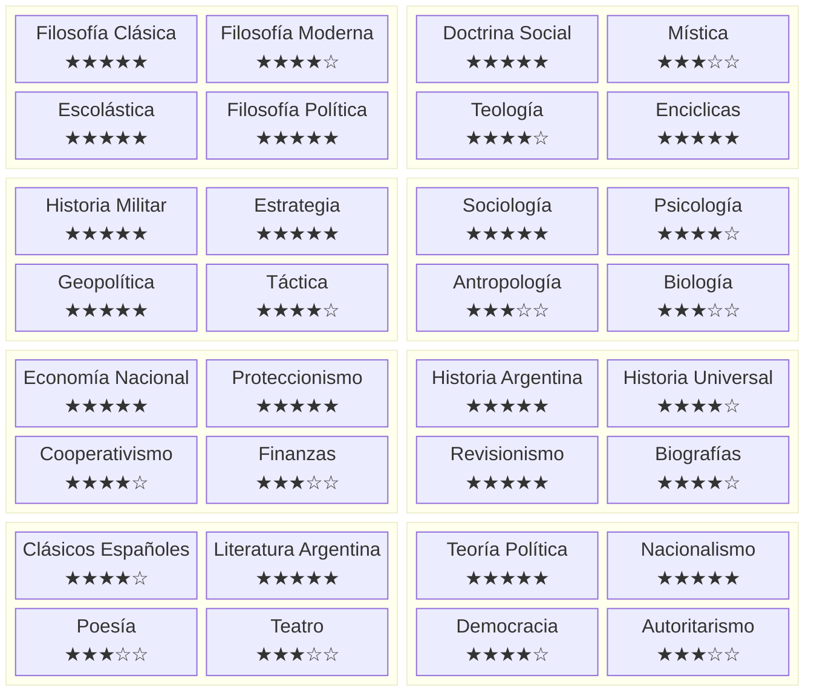

## 16. Biblioteca como Laboratorio Intelectual: Diagrama de Flujo de Ideas

```mermaid
sankey-beta
    
    "Clásicos Griegos","Síntesis Filosófica",15
    "Escolástica","Síntesis Filosófica",20
    "Filosofía Moderna","Síntesis Filosófica",10
    
    "Doctrina Social Católica","Síntesis Moral",25
    "Mística Española","Síntesis Moral",10
    "Teología Tomista","Síntesis Moral",15
    
    "Historia Militar","Síntesis Estratégica",20
    "Geopolítica Alemana","Síntesis Estratégica",15
    "Táctica Moderna","Síntesis Estratégica",10
    
    "Economía Alemana","Síntesis Económica",20
    "Sociología Francesa","Síntesis Económica",15
    "Cooperativismo","Síntesis Económica",10
    
    "Nacionalismo Criollo","Síntesis Cultural",15
    "Literatura Gauchesca","Síntesis Cultural",10
    "Revisionismo Histórico","Síntesis Cultural",15
    
    "Síntesis Filosófica","Laboratorio Intelectual",45
    "Síntesis Moral","Laboratorio Intelectual",50
    "Síntesis Estratégica","Laboratorio Intelectual",45
    "Síntesis Económica","Laboratorio Intelectual",45
    "Síntesis Cultural","Laboratorio Intelectual",40
    
    "Laboratorio Intelectual","Doctrina Justicialista",225
```

Esta expansión muestra la verdadera riqueza de la biblioteca peronista: **4,000 libros** organizados sistemáticamente, con un **método de lectura sofisticado** que distinguía entre lecturas únicas y relecturas múltiples, y una **diversidad temática extraordinaria** que abarcaba desde los presocráticos hasta la sociología contemporánea. 

La biblioteca no era una colección diletante sino un **laboratorio intelectual** donde Perón extraía "ideas funcionales" de cualquier tradición, siempre con el criterio pragmático de su aplicabilidad al proyecto político argentino.
