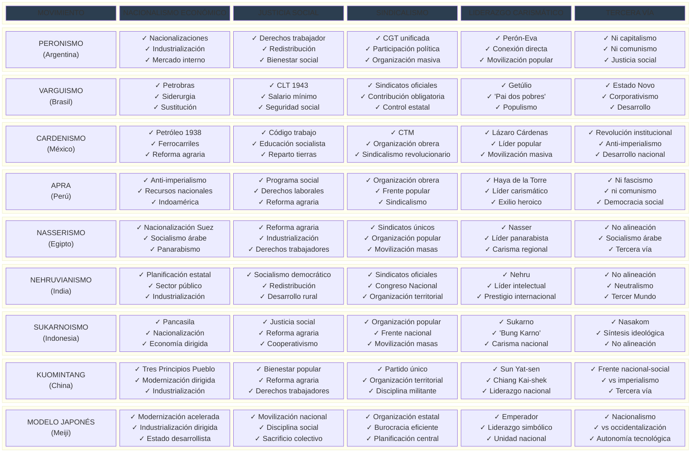
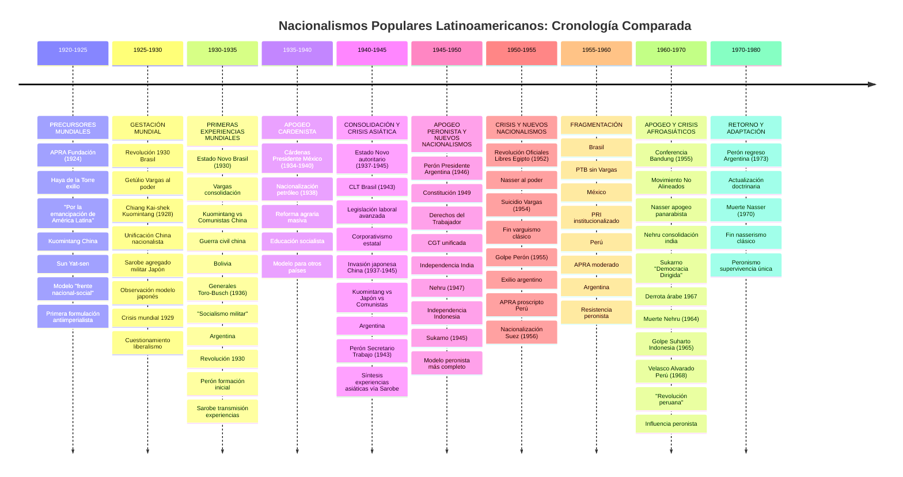
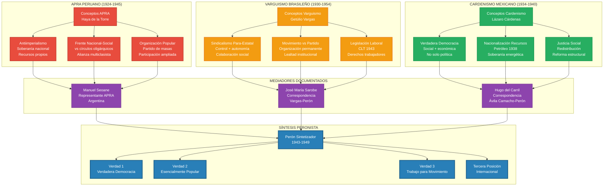
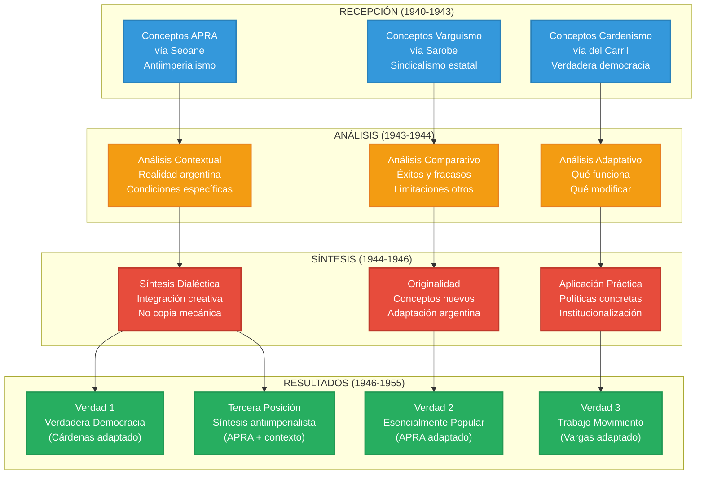
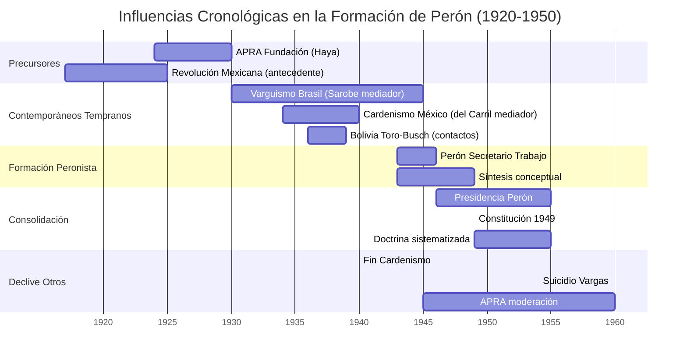
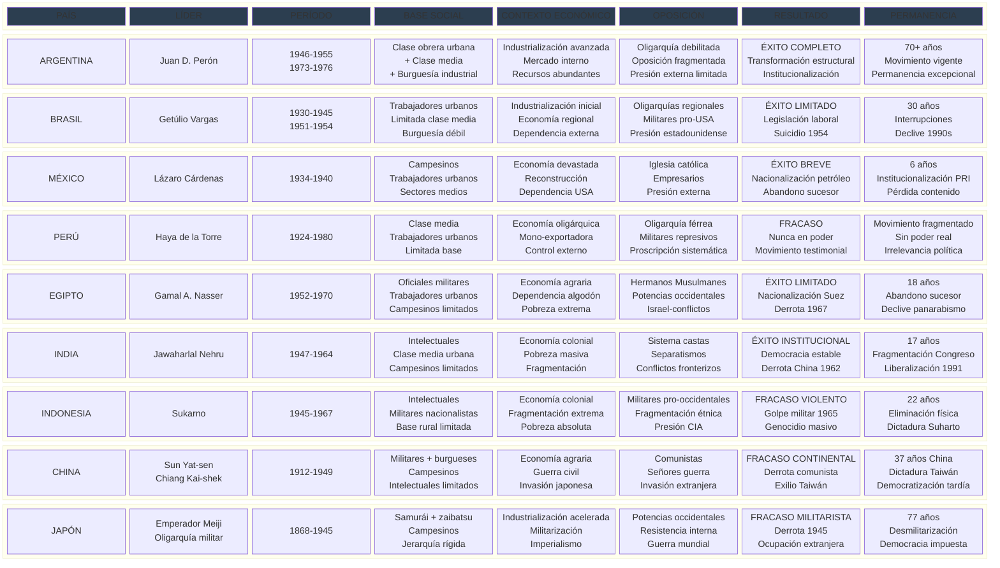

# Los "Otros Peronismos": Por Qué No Florecieron Como el Argentino

## Introducción: El Fenómeno de los Nacionalismos Populares Latinoamericanos

Durante las décadas de 1930-1950, América Latina se convirtió en el escenario de una extraordinaria efervescencia política. Como respuesta a la crisis mundial del liberalismo iniciada en 1929, surgieron simultáneamente varios **nacionalismos populares** que parecían ofrecer una alternativa tanto al capitalismo liberal como al comunismo soviético. **Getúlio Vargas** construía su Estado Novo en Brasil, **Lázaro Cárdenas** nacionalizaba el petróleo mexicano, **Víctor Raúl Haya de la Torre** formulaba desde el exilio las bases del APRA peruano, mientras que en Bolivia los generales Toro y Busch experimentaban con un "socialismo militar" que fascinaba a los observadores de la época.

Estos movimientos, que podríamos denominar **"otros peronismos"**, compartían un aire de familia inconfundible. Todos proclamaban un **nacionalismo económico** que buscaba romper las cadenas de la dependencia externa, todos prometían **justicia social** para las masas trabajadoras hasta entonces excluidas, todos apostaban a una **industrialización dirigida** por el Estado como motor del desarrollo nacional. El **sindicalismo organizado** se convertía en pieza clave de sus estrategias políticas, mientras que sus líderes carismáticos encarnaban una **tercera vía** que pretendía superar las limitaciones tanto del capitalismo como del comunismo.

Sin embargo, cuando observamos el panorama desde la perspectiva de los setenta años transcurridos, una realidad se impone con fuerza abrumadora: solo el peronismo argentino logró **florecer plenamente** y mantener una **permanencia histórica excepcional**. Mientras Vargas terminaba suicidándose en 1954, mientras Cárdenas veía cómo su sucesor abandonaba su programa, mientras el APRA se convertía en un movimiento testimonial sin acceso real al poder, el peronismo no solo sobrevivía a la caída de su fundador sino que se adaptaba a contextos cambiantes manteniendo su identidad esencial.

La pregunta que surge entonces es inevitable y fascinante: **¿por qué el peronismo argentino tuvo éxito donde otros movimientos aparentemente similares fracasaron, se limitaron o declinaron?** La respuesta a esta interrogante no puede encontrarse en explicaciones simples o monocausales. Requiere, por el contrario, un análisis minucioso que identifique tanto las **condiciones de fondo** de largo plazo como las **circunstancias específicas** que hicieron posible el florecimiento único del peronismo en el suelo argentino.

---

## GETÚLIO VARGAS Y EL VARGUISMO BRASILEÑO (1930-1954)

### El Experimento Brasileño: Promesas y Limitaciones

Cuando Getúlio Vargas llegó al poder en 1930 tras la Revolución que derrocó a la República Velha, Brasil parecía destinado a convertirse en el laboratorio más ambicioso de transformación social en América Latina. Durante casi un cuarto de siglo, el líder gaúcho construiría un modelo político que anticipaba muchos de los elementos que luego caracterizarían al peronismo argentino.

El **Estado Novo** (1937-1945) representó el momento de mayor audacia del experimento varguista. Con un autoritarismo modernizador que recordaba las experiencias europeas contemporáneas, Vargas impulsó una industrialización dirigida que transformó el paisaje económico brasileño. La creación de la **Companhia Siderúrgica Nacional** en Volta Redonda simbolizaba la voluntad de construir una base industrial propia, mientras que la **Consolidação das Leis do Trabalho** (CLT) de 1943 establecía un marco de derechos laborales que era revolucionario para los estándares latinoamericanos de la época.

Pero quizás el aspecto más innovador del varguismo fue su peculiar forma de **sindicalismo oficial**. Vargas logró crear un sistema donde los trabajadores obtenían conquistas reales - salarios mínimos, vacaciones pagas, estabilidad laboral - a cambio de aceptar una organización sindical controlada por el Estado. Esta fórmula de colaboración entre capital y trabajo, mediada por un Estado árbitro, sería observada con atención por los militares argentinos que por entonces comenzaban a pensar en alternativas al liberalismo oligárquico.

La conexión entre el experimento brasileño y la futura experiencia peronista no fue casual ni indirecta. Según el material disponible, el general José María Sarobe, mentor intelectual de Perón, "debe considerárselo como el intermediario para Perón de las experiencias que se realizaban en el Brasil de Getulio Vargas". Esta transmisión sugiere un intercambio de ideas sobre políticas concretas, métodos organizativos y estrategias de construcción de consenso social, aunque los detalles específicos de esta influencia requieren mayor investigación.

### Por Qué el Varguismo No Pudo Consolidarse

Sin embargo, el experimento varguista enfrentaba desde su origen obstáculos insuperables que lo condenarían a un éxito parcial y, finalmente, al fracaso. Brasil no era Argentina, y esta diferencia aparentemente obvia encerraba realidades profundas que determinarían el destino de ambos movimientos.

**El Desafío de la Inmensidad Territorial**

La primera y más evidente limitación del varguismo residía en la propia geografía brasileña. Con sus ocho millones y medio de kilómetros cuadrados, Brasil presentaba una **extensión territorial** que hacía casi imposible la integración nacional efectiva. Las diferencias entre el Nordeste árido y el Sur industrial, entre la Amazonia selvática y las plantaciones paulistas, no eran meramente geográficas sino que se traducían en **fragmentaciones regionales** que ningún liderazgo personal, por carismático que fuera, podía superar completamente.

Las **comunicaciones deficientes** de la época convertían al país en un archipiélago de regiones apenas conectadas entre sí. Mientras Argentina contaba con una red ferroviaria de 47.000 kilómetros que integraba efectivamente su territorio, Brasil luchaba por conectar sus diversos núcleos poblacionales. Esta realidad geográfica se traducía en **múltiples identidades regionales** que competían con la identidad nacional que Vargas intentaba construir desde Río de Janeiro.

**La Persistencia de las Estructuras Oligárquicas**

Pero quizás más determinante aún era la **estructura social** brasileña, marcadamente más rígida que la argentina. Las **oligarquías regionales** - los coroneles del Nordeste, los fazendeiros paulistas, los estancieros gaúchos - habían consolidado un poder local que resistía tenazmente cualquier intento de transformación desde el centro. Estas élites regionales no eran simplemente grupos de presión económico: constituían verdaderas estructuras de poder territorial con raíces centenarias y capacidad de veto sobre las políticas nacionales.

La composición demográfica brasileña presentaba desafíos adicionales que Argentina no conocía. Con un 70% de **población rural** dispersa en un territorio inmenso, frente al 60% de población urbana argentina concentrada en pocas ciudades, Vargas carecía de la base social compacta que permitiría a Perón construir su movimiento. El **analfabetismo masivo** - que alcanzaba al 60% de la población - limitaba severamente las posibilidades de participación política consciente, mientras que la **exclusión racial** sistemática de la población afrobrasileña creaba fracturas sociales que fragmentaban cualquier intento de construcción de una identidad popular unificada.

**2. Factores Coyunturales Limitantes:**

**Presión estadounidense:**
- **Segunda Guerra Mundial**: Brasil aliado Estados Unidos, dependencia militar
- **Inversión extranjera**: Capital norteamericano condiciona políticas
- **Guerra Fría**: Presión anticomunista limita políticas sociales
- **Geopolítica**: Brasil como "aliado preferencial" Estados Unidos

**Oposición interna:**
- **Fuerzas Armadas**: Sector pro-estadounidense, golpe 1945
- **Oligarquía cafetera**: Resistencia industrialización, poder económico
- **Clase media**: Limitada, insuficiente base social
- **Iglesia**: Conservadora, oposición reformas sociales

### El Trágico Final: El Suicidio de Vargas y la Fragmentación del Legado

El desenlace del varguismo encierra una dimensión trágica que ilustra perfectamente los obstáculos insuperables que lo aquejaban. El 24 de agosto de 1954, acorralado por una crisis política que combinaba presión externa, oposición interna y escándalos de corrupción, Getúlio Vargas se quitaba la vida en el Palacio de Catete con un tiro al corazón. Su carta-testamento, que hablaba de "fuerzas terribles" que se levantaban contra él y de su decisión de salir de la vida para entrar en la historia, se convertía en el epitafio no solo de un hombre sino de todo un proyecto político.

**La Imposibilidad de la Sucesión Institucional**

El **suicidio de Vargas** reveló una debilidad fundamental del varguismo: su incapacidad para crear una estructura política que trascendiera la figura del líder. A diferencia del peronismo, que sobreviviría a la caída y el exilio de Perón, el varguismo se **fragmentó** inmediatamente tras la muerte de su fundador. El Partido Trabalhista Brasileiro (PTB), que debía ser el vehículo de continuidad del proyecto, se convirtió en una colección de caudillos regionales sin capacidad de articular un liderazgo nacional unificado.

Esta fragmentación no era accidental sino que reflejaba los obstáculos de fondo que habían aquejado al varguismo desde sus orígenes. Sin una base social suficientemente integrada, sin una tradición democrática sólida, sin la capacidad de superar las fragmentaciones regionales, el movimiento varguista dependía excesivamente de la figura carismática de su líder. Cuando esa figura desapareció, el edificio político se desplomó como un castillo de naipes.

**El Golpe de 1964 y la Interrupción Definitiva**

La debilidad del legado varguista se hizo evidente cuando, apenas diez años después de la muerte de Getúlio, un **golpe militar** interrumpía definitivamente el proyecto nacional-desarrollista brasileño. La dictadura que se instaló en 1964 no solo persiguió a los herederos políticos de Vargas sino que desmanteló sistemáticamente las estructuras sindicales y las políticas sociales que habían sido el núcleo del experimento varguista.

Cuando Brasil retornó a la democracia en 1985, el mundo había cambiado radicalmente. El **neoliberalismo** de los años noventa completaría el desmantelamiento del legado varguista, privatizando las empresas estatales que habían sido el orgullo del nacionalismo económico brasileño. La Companhia Siderúrgica Nacional, símbolo de la industrialización dirigida, pasaba a manos privadas, mientras que Petrobras, la joya de la corona del nacionalismo petrolero, veía reducido su papel estratégico.

**Permanencia Limitada: Treinta Años Frente a Setenta**

El contraste con el peronismo es elocuente. Mientras el varguismo tuvo una **permanencia efectiva de apenas treinta años** (1930-1964), interrumpida por la dictadura militar y definitivamente sepultada por el neoliberalismo, el peronismo ha demostrado una capacidad de supervivencia y adaptación que ya supera los setenta años. Esta diferencia no es casual: refleja las distintas condiciones estructurales en que surgieron y se desarrollaron ambos movimientos.

---

## LÁZARO CÁRDENAS Y EL CARDENISMO MEXICANO (1934-1940)

### El Sexenio Dorado: Cuando México Pareció Encontrar su Destino

Si el varguismo brasileño representaba la ambición de construir un nacionalismo popular en un país fragmentado por la geografía y la historia, el cardenismo mexicano encarnaba algo diferente y quizás más audaz: la voluntad de radicalizar una revolución que parecía haberse agotado en la rutina institucional. Cuando Lázaro Cárdenas asumió la presidencia mexicana en diciembre de 1934, México llevaba ya casi un cuarto de siglo intentando encontrar un equilibrio entre las promesas revolucionarias de 1910 y las exigencias de la estabilidad política.

El **sexenio cardenista** (1934-1940) se convertiría en el momento de mayor radicalización social de la historia mexicana post-revolucionaria. Con una audacia que asombró tanto a partidarios como a detractores, Cárdenas emprendió transformaciones que parecían imposibles: la **nacionalización del petróleo** en marzo de 1938 desafió abiertamente a las compañías extranjeras más poderosas del mundo, mientras que la **reforma agraria masiva** redistribuyó 18 millones de hectáreas entre campesinos que por siglos habían trabajado tierras ajenas.

Pero el cardenismo no se limitaba a medidas económicas espectaculares. La creación de la **Confederación de Trabajadores de México** (CTM) bajo el liderazgo de Vicente Lombardo Toledano articulaba un **sindicalismo revolucionario** que movilizaba a las masas obreras como nunca antes en la historia mexicana. Simultáneamente, la **educación socialista** llevaba a las escuelas rurales más remotas una pedagogía que combinaba alfabetización con concientización política, desafiando el monopolio tradicional de la Iglesia Católica sobre la formación de las conciencias.

**Los Ecos Mexicanos en el Peronismo Argentino**

La influencia del experimento cardenista sobre la futura experiencia peronista parece haber sido significativa. Según el material disponible, "importantes elementos del discurso político peronista parecen calcados del que se empleara en la experiencia nacionalista popular mexicana". Las fórmulas de **"justicia social"** y **"verdadera democracia"**, que se convertirían en pilares del discurso peronista, encontraron en el cardenismo una formulación previa en el contexto latinoamericano.

Esta transmisión conceptual no operaba a través de canales abstractos sino mediante contactos personales concretos y documentados. Hugo del Carril, el futuro actor y cantante que se convertiría en ícono del peronismo, sirvió como intermediario para "transportar correspondencia enviada por el entonces presidente mexicano Ávila Camacho, dirigida a quien era, en ese entonces, ministro de Guerra" - es decir, al propio Perón. Estos intercambios epistolares no eran meras cortesías diplomáticas: constituían verdaderos laboratorios de ideas donde se discutían experiencias, se analizaban políticas y se elaboraban estrategias de transformación social.

### Las Contradicciones Insuperables del Experimento Cardenista

Sin embargo, el cardenismo enfrentaba contradicciones estructurales que lo condenarían a ser un episodio brillante pero efímero en la historia mexicana. A diferencia del peronismo argentino, que surgiría en un país con tradiciones democráticas consolidadas y una estructura social relativamente integrada, el cardenismo debía operar en un contexto marcado por fracturas profundas que ninguna voluntad política, por decidida que fuera, podía superar en el breve lapso de un sexenio presidencial.

**El Peso Muerto de una Revolución Agotada**

La primera y más paradójica limitación del cardenismo residía en el propio legado de la **Revolución Mexicana**. Para 1934, el proceso revolucionario iniciado en 1910 había perdido gran parte de su dinamismo transformador y se había cristalizado en una estructura institucional que privilegiaba la estabilidad sobre el cambio. El **Partido Nacional Revolucionario** (luego **PRM**) se había convertido en una maquinaria de poder que, si bien permitía cierta movilidad social y política, también generaba sus propias inercias burocráticas y sus propios intereses creados.

El **caudillismo regional**, lejos de haber sido superado por la institucionalización revolucionaria, había encontrado nuevas formas de expresión dentro del sistema político post-revolucionario. Los **caciques locales** - herederos de los antiguos jefes revolucionarios - controlaban territorios enteros y constituían verdaderos feudos políticos que limitaban severamente la capacidad del gobierno central para implementar políticas transformadoras. Esta fragmentación del poder no era meramente política: reflejaba una realidad social donde las identidades locales y regionales competían permanentemente con cualquier proyecto de construcción nacional.

La **violencia endémica** que había caracterizado a México desde 1910 no había desaparecido con la institucionalización revolucionaria. La Guerra Cristera (1926-1929) había demostrado la persistencia de fracturas religiosas y culturales profundas, mientras que los conflictos regionales continuos mantenían al país en un estado de inestabilidad latente que dificultaba cualquier proyecto de transformación pacífica y gradual.

**Una Sociedad Fragmentada por la Historia y la Geografía**

Pero quizás más determinante aún era la **estructura social** mexicana, marcada por fragmentaciones que se remontaban a la época colonial y que la Revolución había modificado pero no superado. Con un **80% de población campesina** dispersa en un territorio accidentado y mal comunicado, México carecía de la base social urbana e integrada que permitiría al peronismo construir su movimiento de masas. La **diversidad étnica** - con múltiples pueblos indígenas que mantenían sus propias lenguas, culturas y formas de organización social - creaba un mosaico de identidades que resistía cualquier intento de homogeneización nacional.

El **analfabetismo**, que afectaba al 60% de la población, no era simplemente un problema educativo sino una barrera estructural para la participación política consciente. A diferencia de Argentina, donde la inmigración europea había creado una sociedad relativamente alfabetizada y politizada, México debía construir su proyecto nacional sobre una base social que carecía de los instrumentos básicos para la participación democrática moderna.

**2. Factores Coyunturales Limitantes:**

**Presión externa:**
- **Estados Unidos**: Boicot petrolero, presión económica
- **Segunda Guerra Mundial**: Necesidad alianza, moderación políticas
- **Inversión extranjera**: Dependencia capital norteamericano
- **Geopolítica**: Frontera Estados Unidos, vulnerabilidad estratégica

**Oposición interna:**
- **Iglesia Católica**: Guerra Cristera, resistencia laicismo
- **Empresarios**: Oposición nacionalizaciones, fuga capitales
- **Militares conservadores**: Sector pro-estadounidense
- **Clase media**: Limitada, insuficiente apoyo social

### El Abandono del Sueño: Ávila Camacho y la Traición al Cardenismo

El destino del cardenismo se selló no en una confrontación dramática con fuerzas externas, como ocurriría con el varguismo, sino en algo más sutil y quizás más doloroso: el **abandono gradual** del proyecto transformador por parte de sus propios herederos políticos. Cuando Manuel Ávila Camacho asumió la presidencia en diciembre de 1940, México parecía estar en el umbral de consolidar las transformaciones cardenistas. Sin embargo, lo que siguió fue una **moderación sistemática** que, en nombre del realismo político y las exigencias internacionales, fue desmantelando pieza por pieza el edificio construido durante el sexenio anterior.

**La Institucionalización que Mató la Revolución**

Ávila Camacho, quien había sido elegido con el apoyo de Cárdenas, representaba aparentemente la continuidad del proyecto revolucionario. Sin embargo, su presidencia marcó el inicio de lo que los historiadores llamarían el **"milagro mexicano"** - un período de crecimiento económico sostenido que se logró al precio de abandonar los objetivos redistributivos y de justicia social que habían definido al cardenismo.

La **institucionalización del PRI** (Partido Revolucionario Institucional, como se llamaría a partir de 1946) completó este proceso de burocratización y pérdida de contenido social. El partido que había sido el vehículo de las transformaciones cardenistas se convirtió en una maquinaria electoral eficiente pero ideológicamente vacía, capaz de ganar elecciones pero incapaz de impulsar cambios estructurales. La **"familia revolucionaria"** se transformó en una élite política que administraba el poder más que lo utilizaba para transformar la sociedad.

**El Peso de la Guerra Fría**

La **Guerra Fría** proporcionó el contexto internacional que justificó y aceleró este proceso de moderación. Las políticas cardenistas, con su retórica antiimperialista y su apoyo a la República Española, habían generado suspicacias en Washington que se intensificaron con el inicio del conflicto bipolar. La presión anticomunista llevó a los sucesores de Cárdenas a distanciarse de cualquier política que pudiera ser interpretada como radical o pro-soviética.

**Seis Años Frente a Setenta: La Imposibilidad de la Continuidad**

El contraste con el peronismo es, una vez más, revelador. Mientras el cardenismo tuvo apenas **seis años** para implementar su proyecto transformador - el breve lapso de un sexenio presidencial -, el peronismo contó con la posibilidad de construir un movimiento político que trascendiera los períodos gubernamentales específicos. Esta diferencia no era accidental: reflejaba las distintas tradiciones políticas y las diferentes estructuras sociales de ambos países.

El cardenismo, por audaz que fuera, operaba dentro de los límites del sistema político mexicano post-revolucionario, que privilegiaba la rotación presidencial y desalentaba la continuidad de proyectos políticos específicos. El peronismo, en cambio, surgía en un contexto donde la construcción de movimientos políticos permanentes era no solo posible sino necesaria para la estabilidad democrática.

Cuando Cárdenas dejó la presidencia en 1940, su proyecto político no tenía los instrumentos institucionales para sobrevivir sin él. A diferencia de Perón, que construiría un movimiento capaz de sobrevivir a su caída y exilio, Cárdenas vio cómo sus sucesores abandonaban gradualmente sus políticas sin que existiera una estructura organizativa capaz de resistir esta deriva conservadora.

---

## HAYA DE LA TORRE Y EL APRA PERUANO (1924-1980)

### El Profeta del Exilio: La Tragedia del Primer Nacionalismo Popular Latinoamericano

Víctor Raúl Haya de la Torre ocupa un lugar único en la historia de los nacionalismos populares latinoamericanos: fue el primero en formular de manera sistemática una alternativa al liberalismo oligárquico, pero también el que pagó el precio más alto por su audacia intelectual. Fundada en 1924 durante el exilio mexicano de su líder, la **Alianza Popular Revolucionaria Americana** (APRA) se convertiría en el laboratorio ideológico más sofisticado del continente, pero también en el ejemplo más dramático de cómo las condiciones estructurales adversas pueden condenar al fracaso a los proyectos políticos más brillantes.

El **antiimperialismo** aprista no era una consigna retórica sino una teoría elaborada que analizaba las formas específicas de dominación que las potencias centrales ejercían sobre América Latina. Haya de la Torre había comprendido, antes que muchos de sus contemporáneos, que la independencia política formal no garantizaba la autonomía real mientras persistiera la dependencia económica. Su concepto de **"Indoamérica"** - que integraba las tradiciones indígenas con la herencia hispánica - ofrecía una alternativa identitaria al panamericanismo promovido desde Washington.

Pero quizás la contribución más original del aprismo fue su formulación del **"frente nacional-social"** como estrategia política. A diferencia de los partidos tradicionales, que representaban intereses sectoriales específicos, el APRA se proponía articular una **alianza multiclasista** que incluyera a trabajadores, clase media, intelectuales y sectores de la burguesía nacional en una coalición anti-oligárquica. Esta fórmula, que Haya de la Torre había tomado del modelo del **Kuomintang chino**, se convertiría en el antecedente directo de la estrategia política peronista.

**El Puente Intelectual hacia el Peronismo**

La influencia del aprismo sobre el futuro peronismo no operó a través de canales abstractos sino mediante contactos personales concretos y documentados. **Manuel Seoane**, representante del APRA en Argentina durante los años cruciales de formación del movimiento peronista, estableció vínculos estrechos con los círculos militares nacionalistas que rodeaban a Perón. Como testimonia la documentación disponible, los apristas argentinos "estuvieron muy cerca del peronismo" y compartían un "programa de justicia social" que influiría decisivamente en la formulación de las políticas laborales peronistas.

Esta transmisión no se limitaba a intercambios de ideas generales: incluía fórmulas políticas específicas que el peronismo adoptaría casi textualmente. El concepto aprista de **"frente nacional-social"** se convertiría en la base conceptual de la Verdad Peronista que proclama que "el Peronismo es esencialmente popular" y que "todo círculo político es antipopular". La terminología de **"pueblo versus oligarquía"**, que se convertiría en el eje del discurso peronista, había sido elaborada sistemáticamente por los teóricos apristas una década antes del surgimiento de Perón.

### El Muro Infranqueable: Por Qué el APRA No Pudo Triunfar en el Perú Oligárquico

Sin embargo, el aprismo enfrentaba en el Perú obstáculos insuperables que lo condenarían a ser un movimiento testimonial, brillante en sus formulaciones teóricas pero impotente para transformar la realidad concreta. El Perú de los años veinte y treinta no era simplemente un país subdesarrollado: era una sociedad fracturada por siglos de dominación colonial que había cristalizado en estructuras de poder casi imposibles de modificar por medios democráticos.

**El Reino de las "Cuarenta Familias"**

La **oligarquía peruana** no era comparable a las élites de otros países latinoamericanos. Se trataba de una estructura de poder extraordinariamente concentrada - las famosas **"cuarenta familias"** - que controlaba no solo la economía sino también el Estado, la justicia, la educación y hasta la cultura nacional. Esta oligarquía **terrateniente-exportadora** había construido su poder sobre la base de la gran propiedad agrícola en la costa y la minería en la sierra, estableciendo alianzas estratégicas con el **capital británico y norteamericano** que le garantizaban el respaldo externo necesario para mantener su dominación interna.

Lo que hacía particularmente formidable a esta oligarquía era su capacidad para presentar **resistencia férrea** a cualquier intento de reforma estructural. A diferencia de Argentina, donde las élites tradicionales habían sido debilitadas por la inmigración masiva y el desarrollo económico diversificado, o de Brasil, donde las oligarquías regionales competían entre sí permitiendo ciertos márgenes de maniobra al poder central, la oligarquía peruana constituía un bloque monolítico con intereses perfectamente alineados y capacidad de veto absoluto sobre cualquier proyecto de transformación social.

**Una Sociedad Fragmentada por la Historia Colonial**

Pero quizás más determinante aún era la **fragmentación social extrema** que caracterizaba al Perú de la época. Con un **60% de población indígena** sometida a exclusión política total, el país carecía de la base social integrada que había permitido el surgimiento de movimientos populares en otros contextos. La **barrera racial** no era simplemente un prejuicio cultural sino una estructura sistemática de discriminación que fragmentaba a la sociedad en compartimentos estancos sin posibilidad de comunicación política efectiva.

El **analfabetismo**, que afectaba al 70% de la población, constituía una barrera adicional para cualquier proyecto de movilización democrática. Mientras Argentina contaba con una población mayoritariamente alfabetizada gracias a la inmigración europea y las políticas educativas liberales, Perú mantenía a la mayoría de su población en la ignorancia como mecanismo de control social. Esta realidad hacía imposible la construcción de una ciudadanía consciente capaz de sostener un proyecto político transformador.

El **regionalismo** peruano, expresado en la división estructural entre sierra y costa, añadía una dimensión adicional de fragmentación. La costa, modernizada y conectada con los mercados internacionales, vivía en un mundo completamente diferente al de la sierra, donde persistían formas de organización social casi feudales. Esta **fragmentación territorial** hacía imposible la construcción de una identidad nacional unificada que pudiera servir de base a un movimiento político de alcance nacional.

**2. Factores Coyunturales Limitantes:**

**Represión sistemática:**
- **Proscripción**: APRA ilegal 1932-1945, 1948-1956
- **Persecución**: Líderes exiliados, militantes encarcelados
- **Violencia**: Masacre Trujillo 1932, represión militar
- **Fragmentación**: División interna por represión

**Oposición militar:**
- **Fuerzas Armadas**: Anticomunismo, pro-oligarquía
- **Golpes militares**: Interrupciones democráticas frecuentes
- **Alianza oligárquica**: Militares + oligarquía vs APRA
- **Geopolítica**: Guerra Fría, presión anticomunista

### La Tragedia del Eterno Candidato: El APRA Condenado al Testimonio

El destino del aprismo encierra una de las tragedias más profundas de la política latinoamericana del siglo XX. A diferencia del varguismo, que al menos tuvo la oportunidad de implementar parcialmente su programa, o del cardenismo, que pudo realizar transformaciones significativas durante su breve período en el poder, el APRA fue condenado a ser un **movimiento testimonial** que nunca accedió al poder real a pesar de representar, en muchos momentos, a la mayoría de la población peruana.

**La Proscripción Sistemática: Cuando la Democracia se Vuelve Imposible**

La historia del aprismo es, en gran medida, la historia de una **proscripción sistemática** que se extendió por décadas. Cada vez que el APRA parecía estar cerca de acceder al poder por medios democráticos, las fuerzas conservadoras - oligarquía, militares, capital extranjero - se articulaban para impedirlo mediante **golpes preventivos** que restauraban el orden oligárquico. Esta dinámica se repitió con una regularidad que revelaba la imposibilidad práctica de la democracia en el Perú oligárquico.

La **masacre de Trujillo** en 1932, donde fueron asesinados miles de apristas tras un levantamiento desesperado, marcó el tono de lo que sería la relación entre el APRA y el sistema político peruano. A partir de ese momento, el aprismo fue considerado por las élites dominantes no como una opción política legítima sino como una amenaza existencial que debía ser eliminada por cualquier medio necesario.

**La Fragmentación Interna: El Precio del Exilio Permanente**

La **proscripción prolongada** tuvo efectos devastadores sobre la cohesión interna del movimiento aprista. Sin acceso al poder, sin posibilidad de implementar su programa, sin capacidad de ofrecer beneficios concretos a sus seguidores, el APRA se vio sometido a tensiones internas que lo fragmentaron progresivamente. Las **divisiones ideológicas** entre quienes mantenían la pureza doctrinaria y quienes buscaban adaptaciones pragmáticas se intensificaron con el paso de los años.

El **personalismo** de Haya de la Torre, que inicialmente había sido una fortaleza del movimiento, se convirtió gradualmente en una debilidad. Sin instituciones sólidas, sin experiencia de gobierno, sin cuadros formados en la gestión pública, el aprismo dependía excesivamente de la figura carismática de su líder. Cuando esa figura comenzó a envejecer sin haber logrado sus objetivos fundamentales, el movimiento perdió gran parte de su dinamismo transformador.

**La Moderación Suicida: El Abandono del Programa Revolucionario**

Paradójicamente, cuando el APRA finalmente logró cierta **legalidad** en los años cincuenta, lo hizo al precio de **moderar** su programa hasta hacerlo irreconocible. La búsqueda desesperada de respetabilidad llevó a los dirigentes apristas a abandonar gradualmente sus postulados antiimperialistas y sus promesas de transformación estructural. El partido que había nacido como la expresión más radical del nacionalismo popular latinoamericano se convirtió en una organización reformista dispuesta a **integrarse al sistema** sin transformarlo.

Esta **cooptación** fue quizás más devastadora que la represión abierta. Mientras la persecución había mantenido viva la mística revolucionaria del aprismo, la integración subordinada al sistema oligárquico lo despojó de su razón de ser histórica. El APRA se convirtió en un partido más del sistema político peruano, capaz de ganar algunas elecciones pero incapaz de realizar las transformaciones por las cuales había luchado durante décadas.

**El Contraste Doloroso: Cincuenta Años de Testimonio Frente a Setenta de Poder**

Cuando se compara la trayectoria del aprismo con la del peronismo, el contraste es devastador. Mientras el APRA acumuló **cincuenta años de testimonio** sin poder real, el peronismo construyó **setenta años de influencia efectiva** sobre la política argentina. Esta diferencia no refleja superioridades o inferioridades intrínsecas de los liderazgos o las doctrinas, sino las distintas condiciones estructurales en que operaron ambos movimientos.

---

## OTROS NACIONALISMOS POPULARES MENORES

### Bolivia: El Experimento Trunco de los Generales Socialistas (1936-1939)

En las alturas del altiplano boliviano, entre 1936 y 1939, se desarrolló uno de los experimentos políticos más audaces y menos conocidos de América Latina: el **"socialismo militar"** de los generales **David Toro** y **Germán Busch**. Este breve pero intenso período representó el primer intento sistemático en el continente de construir un nacionalismo popular desde el poder militar, anticipando en muchos aspectos lo que sería la experiencia peronista argentina una década más tarde.

**El Laboratorio Altiplánico del Nacionalismo Popular**

Los generales Toro y Busch no eran caudillos tradicionales sino **militares intelectuales** formados en las amargas lecciones de la Guerra del Chaco (1932-1935), donde Bolivia había perdido vastos territorios frente a Paraguay en un conflicto que reveló la debilidad estructural del país y la incompetencia de sus élites tradicionales. Esta experiencia traumática los convenció de que Bolivia necesitaba una transformación radical que solo podía venir de una alianza entre militares nacionalistas y masas populares organizadas.

El **"socialismo militar"** boliviano no era una copia de modelos europeos sino una respuesta original a las condiciones específicas del país. Incluía la **nacionalización de las minas de estaño** - desafiando abiertamente a los "barones del estaño" que habían dominado la economía boliviana durante décadas -, la promulgación de una **legislación laboral avanzada** que reconocía derechos sindicales hasta entonces inexistentes, y la formulación de una **doctrina nacionalista** que reivindicaba la soberanía popular frente a la oligarquía minero-exportadora.

**La Conexión Argentina: Un Puente Intelectual Documentado**

La influencia del experimento boliviano sobre la futura experiencia peronista no fue casual ni indirecta. Existían **contactos documentados** entre los círculos militares nacionalistas de ambos países, facilitados por la proximidad geográfica y las similitudes en las preocupaciones geopolíticas. Los oficiales argentinos que por entonces comenzaban a cuestionar el modelo liberal oligárquico siguieron con atención las innovaciones políticas y sociales que se desarrollaban en el altiplano.

Particularmente significativa fue la influencia del concepto boliviano de **"movimiento"** como alternativa a los partidos tradicionales. Los generales socialistas bolivianos habían comprendido que las transformaciones que proponían requerían una forma de organización política que trascendiera las divisiones partidarias convencionales y articulara una coalición nacional amplia. Esta intuición, desarrollada en el contexto boliviano, sería retomada y perfeccionada por Perón en su formulación del peronismo como "movimiento" antes que como partido.

**Por Qué Bolivia No Pudo Sostener el Experimento**

Sin embargo, el experimento boliviano enfrentaba obstáculos insuperables que lo condenarían a ser un episodio brillante pero efímero. Bolivia no era Argentina: se trataba de un **país pequeño** con apenas tres millones de habitantes dispersos en un territorio accidentado y mal comunicado. La **economía minera mono-exportadora** hacía al país extremadamente vulnerable a las fluctuaciones de los precios internacionales del estaño, limitando severamente los recursos disponibles para financiar políticas redistributivas.

La **inestabilidad política crónica** que caracterizaba a Bolivia desde su independencia constituía un obstáculo adicional para cualquier proyecto de transformación gradual. Los **golpes frecuentes** y la **fragmentación política** permanente hacían imposible la construcción de instituciones sólidas capaces de sostener políticas de largo plazo. En este contexto, cualquier experimento político dependía excesivamente de la supervivencia física de sus líderes.

**El Final Trágico: La Muerte de Busch y el Fin del Sueño**

El destino del socialismo militar boliviano se selló trágicamente el 23 de agosto de 1939, cuando el general **Germán Busch** apareció muerto en el Palacio de Gobierno en circunstancias que nunca fueron completamente esclarecidas. Su muerte - oficialmente catalogada como suicidio pero sospechada por muchos como asesinato político - marcó el **fin abrupto** del experimento más audaz de nacionalismo popular que había conocido Bolivia hasta entonces.

Con la desaparición de Busch, el edificio político construido durante tres años se desplomó inmediatamente. Sin instituciones sólidas, sin una base social suficientemente organizada, sin recursos económicos adecuados, el socialismo militar boliviano no pudo sobrevivir a la muerte de su líder principal. Las fuerzas conservadoras recuperaron rápidamente el control del país, desmontando las reformas sociales y restaurando el poder de la oligarquía minera.

### Colombia: Jorge Eliécer Gaitán y el Populismo Truncado (1928-1948)

En las calles empedradas de Bogotá, durante las décadas de 1930 y 1940, resonaba una voz que parecía capaz de transformar para siempre la política colombiana. **Jorge Eliécer Gaitán**, abogado de origen humilde convertido en tribuno popular, había logrado algo que parecía imposible en el rígido sistema bipartidista colombiano: articular un **populismo urbano** que trascendía las divisiones tradicionales entre liberales y conservadores y hablaba directamente a las masas trabajadoras de la capital.

**El Tribuno del Pueblo: Cuando Bogotá Vibró con la Esperanza**

Gaitán no era simplemente otro político liberal con ambiciones presidenciales. Era algo diferente y más peligroso para el establecimiento: un **líder carismático** que había comprendido que la política colombiana necesitaba una renovación radical que solo podía venir de la movilización de los sectores populares hasta entonces excluidos del juego político. Su famosa distinción entre el **"país político"** y el **"país nacional"** - el primero representado por las élites tradicionales, el segundo por las masas trabajadoras - anticipaba conceptos que luego serían centrales en el discurso peronista.

El **programa de justicia social** gaitanista no se limitaba a promesas electorales abstractas sino que incluía propuestas concretas de **redistribución de la riqueza**, **reforma agraria**, **legislación laboral avanzada** y **nacionalización de servicios públicos**. Su **antiimperialismo** se expresaba en la denuncia sistemática de la penetración del capital extranjero - particularmente norteamericano - en sectores estratégicos de la economía colombiana.

Pero quizás lo más significativo del fenómeno gaitanista era su capacidad para **movilizar masas** de una manera que no se había visto antes en Colombia. Sus concentraciones en la Plaza de Bolívar reunían a decenas de miles de trabajadores, empleados, artesanos y sectores medios que encontraban en su discurso una expresión de sus frustraciones y esperanzas. El famoso grito de **"¡A la carga!"** que cerraba sus discursos se había convertido en el símbolo de una Colombia popular que despertaba a la conciencia política.

**El 9 de Abril: Cuando una Bala Cambió la Historia**

El destino de Colombia - y quizás de toda América Latina - se decidió en pocos segundos la tarde del **9 de abril de 1948**. Cuando Jorge Eliécer Gaitán salía de su oficina en el centro de Bogotá, tres disparos de revólver segaron la vida del líder que parecía destinado a ganar las elecciones presidenciales de 1950 y a transformar radicalmente la estructura política y social del país.

El **asesinato de Gaitán** no fue simplemente un crimen político más: fue el momento en que se truncó la posibilidad de que Colombia desarrollara su propio nacionalismo popular comparable al peronismo argentino. La muerte del líder desató inmediatamente el **"Bogotazo"** - una explosión de violencia popular que destruyó gran parte del centro de la capital - y marcó el inicio de **"La Violencia"**, el período más sangriento de la historia colombiana moderna.

**La Violencia: Cuando la Política se Vuelve Imposible**

**"La Violencia"** (1948-1958) no fue simplemente una guerra civil convencional sino algo más complejo y devastador: la **fragmentación completa** de la sociedad colombiana en bandos irreconciliables que se masacraron mutuamente durante una década. Con más de 200.000 muertos, este período demostró la imposibilidad de construir un proyecto político nacional en un país donde las divisiones partidarias se habían convertido en identidades casi tribales.

El **sistema bipartidista tradicional** - la alternancia entre liberales y conservadores que había dominado la política colombiana desde el siglo XIX - se reveló incapaz de procesar las demandas de transformación social que había articulado el gaitanismo. En lugar de evolucionar hacia formas más inclusivas de representación política, el sistema se endureció y se militarizó, cerrando definitivamente los espacios para cualquier alternativa populista.

**El Contraste Doloroso: Veinte Años de Esperanza Frente a Setenta de Realización**

Cuando se compara la trayectoria truncada del gaitanismo con el desarrollo exitoso del peronismo, el contraste es devastador. Gaitán tuvo apenas **veinte años** (1928-1948) para construir su movimiento político, y cuando parecía estar en el umbral del poder, una bala interrumpió definitivamente su proyecto. El peronismo, en cambio, ha tenido **setenta años** para desarrollarse, adaptarse y consolidarse como fuerza política permanente.

Esta diferencia no refleja superioridades intrínsecas del liderazgo peronista sino las distintas condiciones estructurales en que operaron ambos movimientos. Mientras Argentina ofrecía un contexto de relativa estabilidad institucional que permitía la competencia política democrática, Colombia se caracterizaba por una violencia endémica que hacía imposible la supervivencia de liderazgos transformadores.

### Ecuador: José María Velasco Ibarra y el Populismo Cíclico (1934-1972)

En las plazas de Quito y Guayaquil, durante casi cuatro décadas, resonó una de las voces más singulares de la política latinoamericana. **José María Velasco Ibarra**, el **"Gran Ausente"** como lo llamaban sus seguidores, encarnó una forma peculiar de populismo que combinaba **liderazgo carismático excepcional** con **inestabilidad institucional crónica**. Su trayectoria política - cinco presidencias, cuatro golpes de Estado, exilios recurrentes - ilustra perfectamente las posibilidades y limitaciones del populismo personalista en contextos de debilidad institucional extrema.

**El Fenómeno Velasquista: Carisma Puro en Estado Bruto**

Velasco Ibarra representaba algo único en la política latinoamericana: **carisma puro** sin mediaciones institucionales significativas. Sus campañas electorales eran verdaderas epopeyas populares donde el líder establecía una **conexión directa** con las masas que trascendía cualquier programa político específico. Su famosa frase **"Dadme un balcón y el pueblo es mío"** no era simple jactancia sino la expresión de una realidad política: Velasco tenía la capacidad casi mágica de movilizar multitudes con la sola fuerza de su palabra.

El **nacionalismo** velasquista se expresaba en una retórica antiimperialista que denunciaba la penetración extranjera y reivindicaba la **soberanía nacional**, pero carecía de la sofisticación teórica del aprismo peruano o de la coherencia programática del peronismo argentino. Sus promesas de **justicia social** resonaban profundamente en las masas populares ecuatorianas, pero se traducían en **reformas limitadas** que no alteraban sustancialmente las estructuras de poder del país.

**El Círculo Vicioso: Cinco Presidencias, Cuatro Golpes**

La trayectoria política de Velasco Ibarra ilustra perfectamente las limitaciones del populismo personalista en contextos de **inestabilidad institucional crónica**. Sus **cinco presidencias** (1934-1935, 1944-1947, 1952-1956, 1960-1961, 1968-1972) siguieron un patrón repetitivo que revelaba la imposibilidad práctica de consolidar un proyecto político transformador en el Ecuador de la época.

Cada llegada al poder de Velasco generaba enormes expectativas populares que chocaban inmediatamente con las realidades insuperables del país y la resistencia de las élites tradicionales. Sin una **organización política sólida**, sin cuadros técnicos preparados, sin recursos económicos suficientes, los gobiernos velasquistas se caracterizaban por la improvisación y la ineficiencia. Los **golpes frecuentes** que interrumpían sus mandatos no eran simplemente conspiraciones militares sino expresiones de la incapacidad del sistema político ecuatoriano para procesar las demandas de transformación social.

**El Personalismo como Fortaleza y Debilidad**

La principal fortaleza del velasquismo - el **carisma excepcional** de su líder - se convertía paradójicamente en su principal debilidad. El movimiento dependía tan completamente de la figura de Velasco que no logró desarrollar **instituciones permanentes** capaces de sobrevivir a las ausencias del líder. Cada exilio de Velasco significaba la **fragmentación** inmediata de su movimiento, que se reconstituía mágicamente con su regreso pero sin acumular experiencia organizativa o cuadros dirigentes.

Esta **dependencia extrema** del liderazgo personal contrastaba dramáticamente con la capacidad del peronismo para institucionalizar su proyecto político. Mientras Perón construía un movimiento con estructuras organizativas sólidas - sindicatos, partido político, fundaciones - que podían funcionar incluso en su ausencia, Velasco nunca logró trascender el nivel del liderazgo carismático puro.

**El Contraste Revelador: Cuarenta Años de Ciclos Frente a Setenta de Continuidad**

La comparación entre el velasquismo y el peronismo revela diferencias fundamentales en las condiciones estructurales que enfrentaron ambos movimientos. Velasco tuvo **cuarenta años** (1934-1972) para construir su proyecto político, un período considerablemente más largo que el disponible para Cárdenas o Gaitán. Sin embargo, estos cuarenta años se fragmentaron en **ciclos repetitivos** de ascenso, gobierno, crisis y caída que impidieron cualquier acumulación política significativa.

El peronismo, en cambio, logró convertir sus **setenta años** de existencia en un proceso de **construcción institucional continua** que le permitió sobrevivir a las crisis, adaptarse a contextos cambiantes y mantener su identidad esencial. Esta diferencia no refleja superioridades personales de Perón sobre Velasco sino las distintas condiciones estructurales - estabilidad institucional, desarrollo económico, integración social - que caracterizaban a Argentina frente a Ecuador.

### Uruguay: Luis Alberto de Herrera y el Nacionalismo Oriental (1903-1959)

En las orillas del Río de la Plata, durante más de medio siglo, resonó una voz que se convertiría en el **"padre del nacionalismo uruguayo"** y en una influencia decisiva sobre la formación del pensamiento internacional peronista. **Luis Alberto de Herrera**, desde las páginas de su periódico **"El Debate"** y desde la tribuna del Senado uruguayo, elaboró una doctrina antiimperialista que anticipaba muchos de los conceptos que luego caracterizarían a la **Tercera Posición** argentina.

**El Laboratorio Intelectual del Río de la Plata**

Herrera no era simplemente otro político tradicional del sistema bipartidista uruguayo. Era algo diferente y más trascendente: un **intelectual político** que había comprendido, antes que muchos de sus contemporáneos rioplatenses, que la independencia formal de las repúblicas sudamericanas no garantizaba su autonomía real mientras persistiera la **dependencia económica y cultural** de las potencias centrales. Su concepto de **"no injerencia"** no era una consigna retórica sino una doctrina elaborada que analizaba las formas sutiles de dominación que las potencias imperiales ejercían sobre el espacio latinoamericano.

El **periódico "El Debate"**, fundado en 1931, se convirtió en algo más que un órgano partidario: era un verdadero **laboratorio de ideas** donde se elaboraban conceptos que trascendían las fronteras uruguayas y llegaban hasta los círculos intelectuales de Buenos Aires. Sus editoriales, escritos con la precisión del jurista y la pasión del patriota, desarrollaban una **visión continental** que reivindicaba la **integración latinoamericana** como única alternativa viable frente a la penetración de las potencias extracontinentales.

**La Conexión Intelectual con Perón: Un Puente Documentado**

La influencia de Herrera sobre la futura experiencia peronista no operó a través de canales abstractos sino mediante una **atención sistemática** que Perón prestó a las elaboraciones del líder nacionalista uruguayo. Según el material disponible, "Perón siguió con mucho detalle el derrotero político de Luis Alberto de Herrera, padre del nacionalismo uruguayo, y tomó muy en cuenta sus posiciones con respecto a la política internacional, especialmente en lo que se refiere a la no injerencia de las potencias imperiales en el espacio latinoamericano".

Esta transmisión parece haber incluido el estudio de **formulaciones doctrinarias** que Perón incorporaría en su concepción de la política exterior justicialista. Las ideas de Herrera, "expresadas a través de los editoriales de su periódico montevideano 'El Debate' y en la Cámara de Senadores de la República Oriental del Uruguay, inspiraron a Perón muchos de sus conceptos sobre la política exterior justicialista y la necesidad de la integración regional como prioridad absoluta de esa política".

**El Antiimperialismo Rioplatense: Una Escuela de Pensamiento**

El **antiimperialismo herrerista** se distinguía de otras corrientes latinoamericanas por su **sofisticación conceptual** y su **realismo político**. Herrera había comprendido que la oposición al imperialismo no podía limitarse a denuncias retóricas sino que requería la construcción de **alternativas concretas** basadas en la **integración regional** y la **complementariedad económica**. Su concepto de **"América para los americanos"** - pero entendida como América Latina para los latinoamericanos - se convertiría en uno de los pilares conceptuales de la Tercera Posición peronista.

La **doctrina de no injerencia** elaborada por Herrera no era simplemente defensiva sino que incluía una dimensión **propositiva**: la construcción de un **espacio geopolítico autónomo** sudamericano que pudiera relacionarse con las grandes potencias desde una posición de **dignidad e independencia**. Esta visión, desarrollada en el pequeño Uruguay de los años treinta y cuarenta, anticipaba la política de **"tercera vía"** que Perón implementaría desde la Argentina de los años cincuenta.

### Por Qué Uruguay No Pudo Ser Argentina

Sin embargo, el herrerismo enfrentaba obstáculos insuperables que lo condenarían a ser un **movimiento de ideas** brillante pero políticamente limitado. Uruguay no era Argentina: se trataba de un **país pequeño** con apenas tres millones de habitantes, sin recursos naturales significativos y geopolíticamente **dependiente** de las decisiones que se tomaran en Buenos Aires y Brasilia.

**El Peso de la Pequeñez: Cuando las Ideas Superan las Posibilidades**

La primera y más evidente limitación del herrerismo residía en la propia **escala del país**. Con una **población limitada** y **recursos escasos**, Uruguay carecía de la masa crítica necesaria para convertirse en un actor geopolítico independiente en el contexto sudamericano. Las ideas de Herrera, por brillantes que fueran, chocaban constantemente con la realidad de un país que dependía estructuralmente de sus **vecinos mayores** para su supervivencia económica y su seguridad estratégica.

La **dependencia regional** no era simplemente económica sino que se extendía a todos los aspectos de la vida nacional uruguaya. Las decisiones tomadas en Buenos Aires o en Río de Janeiro tenían más impacto sobre el destino uruguayo que las que pudieran adoptarse en Montevideo. Esta realidad geopolítica hacía imposible que Uruguay desarrollara una **política exterior autónoma** del tipo que Herrera propugnaba y que Perón lograría implementar desde Argentina.

**El Sistema Bipartidista: Una Camisa de Fuerza Institucional**

Pero quizás más determinante aún era la **rigidez del sistema político uruguayo**, cristalizado en un **bipartidismo tradicional** - blancos y colorados - que había dominado la vida política del país desde su independencia. Este sistema, si bien proporcionaba estabilidad institucional, también creaba **inercias conservadoras** que dificultaban cualquier proyecto de transformación radical.

Herrera, como líder del **Partido Nacional** (blancos), debía operar dentro de los límites de este sistema bipartidista, lo que limitaba severamente su capacidad para construir el tipo de **movimiento transversal** que caracterizaría al peronismo argentino. Su liderazgo, por carismático que fuera, permanecía encapsulado dentro de las estructuras partidarias tradicionales sin lograr trascender hacia la construcción de una **alternativa política nueva**.

**El Personalismo como Fortaleza y Debilidad**

La principal fortaleza del herrerismo - el **liderazgo intelectual excepcional** de su fundador - se convertía paradójicamente en su principal debilidad estructural. El movimiento dependía tan completamente de la figura de Herrera que no logró desarrollar **cuadros dirigentes** capaces de continuar su obra más allá de la vida del líder. Cada ausencia temporal de Herrera significaba una **pérdida de dinamismo** del movimiento, que se reconstituía con su regreso pero sin acumular **experiencia organizativa independiente**.

Esta **dependencia extrema** del liderazgo personal contrastaba dramáticamente con la capacidad del peronismo para **institucionalizar** su proyecto político. Mientras Perón construía un movimiento con estructuras organizativas que podían funcionar incluso en su ausencia - sindicatos, partido político, fundaciones -, Herrera nunca logró trascender el nivel del **liderazgo intelectual personal** hacia la construcción de **instituciones permanentes**.

**El Contraste Revelador: Cincuenta Años de Brillantez Intelectual Frente a Setenta de Poder Real**

Cuando se compara la trayectoria del herrerismo con el desarrollo del peronismo, el contraste es tanto admirativo como melancólico. Herrera tuvo **cincuenta y seis años** (1903-1959) para desarrollar su pensamiento político y construir su movimiento - un período considerablemente más largo que el disponible para la mayoría de los otros nacionalistas latinoamericanos. Sin embargo, estos cincuenta y seis años se caracterizaron por una **brillantez intelectual** que nunca logró traducirse en **poder político efectivo** capaz de transformar estructuralmente la realidad uruguaya.

El peronismo, en cambio, logró convertir sus **setenta años** de existencia en un proceso de **construcción de poder real** que le permitió no solo transformar Argentina sino también influir decisivamente en el desarrollo político de toda América Latina. Esta diferencia no refleja superioridades personales de Perón sobre Herrera - ambos fueron líderes intelectualmente excepcionales - sino las distintas **escalas nacionales** y **condiciones estructurales** en que operaron ambos movimientos.

**El Legado Paradójico: Más Influencia Externa que Interna**

Paradójicamente, el herrerismo tuvo más **influencia externa** - particularmente sobre el pensamiento internacional peronista - que **impacto interno** sobre la transformación de la propia sociedad uruguaya. Las ideas de Herrera sobre integración latinoamericana, no injerencia y tercera vía encontraron su realización práctica no en Uruguay sino en la Argentina peronista, que contaba con la **escala** y los **recursos** necesarios para implementar políticas que Herrera solo podía proponer teóricamente.

Esta situación ilustra perfectamente una de las **tragedias recurrentes** de los nacionalismos populares latinoamericanos: la frecuente **desproporción** entre la calidad intelectual de sus formulaciones y la capacidad material para implementarlas. Herrera fue, en muchos sentidos, un **Perón sin Argentina** - un líder con las ideas correctas pero sin el contexto nacional adecuado para realizarlas plenamente.

### Venezuela: Rómulo Betancourt y Acción Democrática (1928-1968): El Petróleo como Bendición y Maldición

**Rómulo Betancourt** y **Acción Democrática** representaron durante las décadas de 1930 y 1940 uno de los experimentos más prometedores y frustrados del nacionalismo popular latinoamericano. El joven intelectual de origen humilde que había fundado Acción Democrática en 1941 encarnaba las aspiraciones de millones de venezolanos que soñaban con transformar la **riqueza petrolera** en **bienestar popular** y **justicia social** para una nación que había permanecido durante siglos como una de las más pobres y atrasadas de América del Sur.

**El Forjador de la Venezuela Moderna**

Betancourt no era simplemente otro político más del sistema oligárquico venezolano. Era algo diferente y más peligroso para el establecimiento: un **intelectual orgánico** que había comprendido, antes que muchos de sus contemporáneos, que la **riqueza petrolera** podía convertirse en el instrumento de una **transformación social radical** si era administrada por un Estado comprometido con la **justicia distributiva** y la **soberanía nacional**. Su formación en el **exilio costarricense** (1928-1936) lo había puesto en contacto con las **corrientes más avanzadas** del pensamiento socialdemócrata latinoamericano, particularmente con la **red continental del APRA** que por entonces elaboraba las bases teóricas del nacionalismo popular antiimperialista.

**Acción Democrática** no era un partido tradicional sino algo más ambicioso: un **movimiento de masas** que se proponía articular una **coalición multiclasista** capaz de desafiar el poder de la **oligarquía terrateniente** y las **compañías petroleras extranjeras** que habían convertido a Venezuela en un **enclave colonial** dentro de su propio territorio. El programa del partido combinaba **nacionalismo económico** - control estatal de los recursos petroleros - con **justicia social** - redistribución del ingreso, derechos laborales, educación popular - y **democracia política** - sufragio universal, libertades públicas, alternancia en el poder.

**La Conexión con la Red Continental APRA**

La influencia del **aprismo continental** sobre la formación del pensamiento betancourista no fue casual ni indirecta. El material disponible menciona que **"Rómulo Betancourt: Acción Democrática Venezuela"** figura en el **"listado mediadores APRA continentales"**, sugiriendo su participación en la red que transmitió conceptos e ideas entre los diversos nacionalismos populares latinoamericanos. Esta conexión parece haber incluido el intercambio de **experiencias organizativas**, **estrategias políticas** y **formulaciones doctrinarias**, aunque los detalles específicos requieren mayor investigación.

El **antiimperialismo** de Acción Democrática adoptaba muchos de los conceptos elaborados por Haya de la Torre, particularmente la idea de que la **independencia política** formal no garantizaba la **autonomía real** mientras persistiera la **dependencia económica** de las potencias centrales. La **terminología** adeco - "pueblo versus oligarquía", "soberanía nacional", "justicia social" - reproducía casi textualmente las fórmulas apristas, adaptándolas a las condiciones específicas de la **economía petrolera** venezolana.

**El Trienio Adeco: Cuando Venezuela Pareció Encontrar su Destino**

El **"Trienio Adeco"** (1945-1948) representó el momento de mayor audacia del experimento venezolano. Cuando la **Revolución de Octubre** llevó a Betancourt al poder como presidente de la **Junta Revolucionaria de Gobierno**, Venezuela parecía estar en el umbral de convertirse en el modelo de **desarrollo democrático** para toda América Latina. La **nueva Constitución** de 1947 establecía el **sufragio universal** - incluyendo por primera vez el **voto femenino** -, mientras que la **Ley de Hidrocarburos** de 1943 había aumentado significativamente la participación del Estado en las **rentas petroleras**.

Las **políticas sociales** del Trienio transformaron radicalmente el paisaje venezolano. La **reforma educativa** multiplicó el número de escuelas y maestros, llevando la **alfabetización** a regiones que habían permanecido en el abandono durante siglos. La **legislación laboral** establecía **derechos sindicales**, **salarios mínimos** y **seguridad social** para los trabajadores petroleros y de otros sectores. La **reforma agraria** iniciaba la **redistribución de latifundios** entre campesinos sin tierra, mientras que las **obras públicas** - carreteras, hospitales, acueductos - integraban territorialmente al país y mejoraban las condiciones de vida de las masas populares.

**El Modelo Petrolero: Una Alternativa al Desarrollo Dependiente**

La **doctrina petrolera** elaborada por Betancourt y su equipo técnico representaba una alternativa original al **modelo de enclave** que había caracterizado la explotación de recursos naturales en América Latina. El concepto de **"sembrar el petróleo"** - utilizar las rentas petroleras para **diversificar la economía** y **desarrollar la industria nacional** - anticipaba muchas de las políticas que luego implementaría el peronismo argentino con los **excedentes agropecuarios**.

La **negociación** con las compañías petroleras extranjeras buscaba **maximizar** la participación del Estado venezolano en las **ganancias** sin llegar a la **nacionalización completa** que podría provocar **represalias internacionales**. Esta estrategia de **"nacionalismo pragmático"** reflejaba una comprensión sofisticada de las **limitaciones geopolíticas** que enfrentaba un país pequeño en el contexto de la **hegemonía estadounidense** en el Caribe.

### Por Qué Venezuela No Logró Consolidar su Proyecto

Sin embargo, el proyecto adeco enfrentaba desde su origen obstáculos insuperables que lo condenarían a una **permanencia fragmentaria** y, finalmente, a la **pérdida de su contenido transformador**. Venezuela no era Argentina, y las diferencias en **estructura social**, **tradición política** y **contexto geopolítico** determinarían el destino divergente de ambos experimentos.

**La Maldición del Petróleo: Cuando la Riqueza se Vuelve Debilidad**

La primera y más paradójica limitación del proyecto adeco residía en la propia **dependencia petrolera** que constituía simultáneamente su **principal fortaleza** y su **debilidad fundamental**. Mientras Argentina contaba con una **economía diversificada** que incluía **agricultura**, **ganadería** e **industria**, Venezuela dependía casi exclusivamente de las **exportaciones petroleras** para financiar su desarrollo. Esta **mono-dependencia** hacía al país extremadamente vulnerable a las **fluctuaciones** de los **precios internacionales** del petróleo y a las **decisiones** de las **compañías extranjeras** que controlaban la producción.

La **economía de enclave** petrolera había creado una **estructura social distorsionada** donde coexistían **enclaves de modernidad** - las zonas petroleras del Zulia y Anzoátegui - con **vastas regiones** que permanecían en condiciones **pre-modernas**. Esta **fragmentación territorial** hacía imposible la construcción del tipo de **mercado interno integrado** que había permitido el desarrollo argentino. La **clase obrera petrolera**, aunque bien organizada y relativamente próspera, constituía una **minoría privilegiada** dentro de una **masa campesina** que permanecía en condiciones de **pobreza extrema**.

**La Inestabilidad Política Crónica: El Peso del Caudillismo**

Pero quizás más determinante aún era la **tradición política venezolana**, marcada por más de un siglo de **guerras civiles**, **caudillismo** y **dictaduras militares** que habían impedido la consolidación de **instituciones democráticas** sólidas. A diferencia de Argentina, que contaba con **treinta años** de experiencia democrática (1916-1943) antes del surgimiento del peronismo, Venezuela carecía de la **cultura política** necesaria para sostener un **sistema democrático** estable.

El **golpe militar** de noviembre de 1948, que derrocó al gobierno constitucional de **Rómulo Gallegos** e inauguró la **dictadura de Marcos Pérez Jiménez** (1948-1958), demostró la **fragilidad** de las **instituciones democráticas** venezolanas. Las **Fuerzas Armadas**, a diferencia del **Ejército argentino** que había desarrollado una **doctrina nacional** y una **tradición institucional**, permanecían como un **factor de poder autónomo** dispuesto a intervenir cada vez que los **intereses conservadores** se sintieran amenazados.

**La Presión Externa Extrema: Venezuela en la Mira Imperial**

El proyecto adeco enfrentó una **presión externa** de una intensidad que el peronismo argentino solo conocería parcialmente. La **ubicación geográfica** de Venezuela - en el **Caribe**, zona de **influencia directa** estadounidense - hacía al país extremadamente vulnerable a las **presiones** de **Washington** y las **compañías petroleras** norteamericanas. La **Doctrina Monroe** y la **política del "buen vecino"** se traducían en **intervenciones sistemáticas** cada vez que algún gobierno venezolano intentaba **políticas nacionalistas** que afectaran los **intereses estadounidenses**.

Las **compañías petroleras** - **Standard Oil**, **Shell**, **Gulf** - no eran simplemente **actores económicos** sino **instrumentos geopolíticos** de sus respectivos países de origen. Su **capacidad de presión** incluía no solo el **chantaje económico** - amenazas de **reducir inversiones** o **manipular precios** - sino también la **influencia política directa** sobre **sectores militares** y **grupos conservadores** venezolanos dispuestos a **colaborar** con los **intereses extranjeros**.

**La Guerra Fría** intensificó estas presiones al convertir cualquier **política nacionalista** en una **amenaza potencial** al **orden hemisférico** que Estados Unidos buscaba consolidar. El **anticomunismo** se convirtió en el **pretexto** para **deslegitimar** cualquier proyecto de **transformación social**, mientras que la **ayuda militar** estadounidense **fortalecía** a los **sectores conservadores** de las Fuerzas Armadas venezolanas.

### El Ciclo Trágico: Democracia, Dictadura, Democracia Limitada

El destino del proyecto adeco ilustra perfectamente los **obstáculos insuperables** que enfrentaban los nacionalismos populares en **contextos geopolíticamente vulnerables**. A diferencia del peronismo, que logró **consolidarse** durante un período de **relativa autonomía internacional**, el adecismo se vio sometido a un **ciclo recurrente** de **avances** y **retrocesos** que impidió la **acumulación política** necesaria para una **transformación estructural** permanente.

**El Golpe de 1948: Cuando la Democracia se Vuelve Imposible**

El **golpe militar** que derrocó a Rómulo Gallegos el 24 de noviembre de 1948 no fue simplemente una **conspiración militar** sino la expresión de una **coalición conservadora** que incluía a **sectores militares**, **oligarquía tradicional**, **compañías petroleras** y **gobierno estadounidense**. La **dictadura de Pérez Jiménez** (1948-1958) no se limitó a **cambiar las políticas** del Trienio sino que **desmanteló sistemáticamente** las **organizaciones populares** y **persiguió** a los **líderes adecos**, obligando a Betancourt a un **nuevo exilio** que duraría una década.

Esta **interrupción violenta** contrastaba dramáticamente con la **continuidad institucional** que había permitido al peronismo **consolidar** su proyecto durante dos períodos presidenciales consecutivos (1946-1955). Mientras Perón pudo **institucionalizar** su movimiento y **crear estructuras** capaces de **resistir** la **represión posterior**, el adecismo se vio **fragmentado** por la **persecución** y **debilitado** por el **exilio prolongado** de sus **dirigentes principales**.

**El Retorno Democrático: Una Victoria Pírrica**

Cuando la **dictadura de Pérez Jiménez** fue derrocada en enero de 1958 y Betancourt regresó triunfalmente del exilio para asumir nuevamente la presidencia (1959-1964), Venezuela parecía estar en condiciones de **retomar** el **proyecto transformador** interrumpido una década antes. Sin embargo, el **contexto internacional** había cambiado radicalmente: la **Guerra Fría** se había **intensificado**, la **Revolución Cubana** había **radicalizado** las **posiciones** en el hemisferio, y Estados Unidos había adoptado una **política más agresiva** de **intervención** en América Latina.

El **"Pacto de Punto Fijo"** (1958), que establecía las **reglas del juego** de la **nueva democracia** venezolana, representaba simultáneamente un **triunfo** y una **derrota** del proyecto adeco. Por un lado, **garantizaba** la **estabilidad democrática** y la **alternancia pacífica** en el poder; por otro, **limitaba severamente** el **alcance** de las **transformaciones** posibles al **excluir** del **juego político** a las **fuerzas de izquierda** y **comprometer** a los **partidos firmantes** a **respetar** los **intereses** de los **sectores conservadores**.

**La Moderación Forzada: El Abandono del Proyecto Transformador**

El **segundo gobierno** de Betancourt (1959-1964) se caracterizó por una **moderación** que contrastaba dramáticamente con la **audacia** del Trienio. Las **presiones** de la **Guerra Fría** - particularmente tras la **Revolución Cubana** - obligaron al **liderazgo adeco** a **distanciarse** de cualquier **política** que pudiera ser **interpretada** como **radical** o **pro-comunista**. La **"Doctrina Betancourt"** - que **negaba reconocimiento** a los **gobiernos surgidos** de **golpes militares** - era **progresista** en términos **hemisféricos** pero **insuficiente** para **recuperar** el **impulso transformador** del proyecto original.

La **política petrolera** del segundo período betancourista, aunque **nacionalista** en la **retórica**, se **limitó** a **negociaciones graduales** con las **compañías extranjeras** sin **cuestionar** fundamentalmente el **modelo de enclave**. La **creación** de la **Organización de Países Exportadores de Petróleo** (OPEP) en 1960 representaba un **avance** en términos de **coordinación internacional**, pero no **alteraba** sustancialmente la **estructura** de la **economía venezolana**.

**Cuarenta Años de Ciclos Frente a Setenta de Continuidad**

Cuando se compara la trayectoria del **adecismo** con el desarrollo del **peronismo**, el contraste revela las **diferentes condiciones estructurales** en que operaron ambos movimientos. El proyecto adeco tuvo **cuarenta años** (1928-1968) para desarrollarse, pero estos cuarenta años se **fragmentaron** en **ciclos** de **avance** y **retroceso** - **Trienio** (1945-1948), **dictadura** (1948-1958), **democracia limitada** (1958-1968) - que impidieron la **acumulación política** necesaria para una **transformación estructural** permanente.

El peronismo, en cambio, logró convertir sus **setenta años** de existencia en un proceso de **construcción institucional continua** que le permitió **sobrevivir** a las **crisis**, **adaptarse** a **contextos cambiantes** y **mantener** su **identidad esencial**. Esta diferencia no refleja **superioridades personales** de Perón sobre Betancourt - ambos fueron **líderes excepcionales** - sino las **distintas condiciones geopolíticas** y **estructurales** que caracterizaban a Argentina frente a Venezuela.

**El Legado Contradictorio: Democracia sin Transformación**

El **legado** del **adecismo** es profundamente **contradictorio**: logró **consolidar** la **democracia venezolana** y **modernizar** parcialmente el país, pero **fracasó** en su **objetivo fundamental** de **transformar** la **estructura social** y **económica** que perpetuaba la **desigualdad** y la **dependencia**. La **Venezuela democrática** que emergió del **Pacto de Punto Fijo** era más **estable** políticamente pero también más **conservadora** socialmente que la que había soñado construir el **Betancourt** del Trienio.

Esta **moderación forzada** ilustra perfectamente las **limitaciones** que las **condiciones geopolíticas adversas** imponen a los **proyectos de transformación nacional**. El adecismo fue, en muchos sentidos, un **peronismo en condiciones imposibles**: un intento heroico de construir un **nacionalismo popular** en un contexto de **vulnerabilidad geográfica**, **dependencia económica** extrema y **presión imperial** sistemática que hacían imposible la **autonomía** necesaria para una **transformación estructural** exitosa.

---

## NACIONALISMOS AFROASIÁTICOS

### Gamal Abdel Nasser y el Nasserismo Egipcio (1952-1970): El Sueño Panarabista

**Gamal Abdel Nasser** y la **Revolución de los Oficiales Libres** de julio de 1952 representaron el intento más ambicioso de construir un nacionalismo árabe moderno en el siglo XX. El joven coronel que derrocó al corrupto rey Farouk encarnaba las aspiraciones de millones de árabes que soñaban con recuperar la dignidad perdida tras siglos de dominación otomana primero, y colonial europea después.

**El Despertar del Gigante del Nilo**

Cuando Nasser y sus compañeros derrocaron al corrupto rey Farouk, Egipto era poco más que un **protectorado británico de facto**, donde el 95% de la tierra cultivable pertenecía a apenas el 0,4% de la población, mientras que millones de fellahin vivían en condiciones de miseria que no habían cambiado sustancialmente desde los tiempos de los faraones. La **base naval británica de Suez** constituía un estado dentro del estado, símbolo humillante de una soberanía nacional que existía solo en el papel.

El **movimiento de los Oficiales Libres** no era simplemente una conspiración militar más en un país acostumbrado a los golpes de estado. Era algo diferente y más profundo: la expresión de una **generación de militares nacionalistas** que había sido forjada en las amargas lecciones de la **guerra de Palestina** (1948-1949), donde el ejército egipcio había sido humillado no tanto por la superioridad israelí como por la **corrupción** de sus propios dirigentes y la **traición** de un sistema político que vendía armas defectuosas a soldados que morían por la patria.

**El Socialismo Árabe: Una Tercera Vía Oriental**

La **doctrina del socialismo árabe** que Nasser comenzó a elaborar a partir de 1956 no era una copia mecánica de modelos europeos sino un intento original de construir una **tercera vía** específicamente adaptada a las condiciones del mundo árabe. Como el peronismo argentino, el nasserismo rechazaba tanto el **capitalismo occidental** - asociado con el imperialismo y la explotación - como el **comunismo soviético** - percibido como una forma de dominación extranjera que sustituía a los antiguos amos coloniales.

La **Carta Nacional** de 1962 sistematizaba esta visión en un programa que combinaba **nacionalización de los sectores estratégicos** de la economía con **justicia social** para las masas trabajadoras y **unidad árabe** como objetivo político supremo. La **reforma agraria** iniciada en 1952 redistribuyó millones de feddans entre los campesinos sin tierra, mientras que la **industrialización dirigida** por el Estado creaba una base productiva nacional que liberara a Egipto de su dependencia tradicional como exportador de algodón.

**La Conexión con el Peronismo: Influencias Recíprocas**

La relación entre el nasserismo y el peronismo no fue casual ni unidireccional. El material disponible menciona una **"influencia internacional (Nasser, Nehru, Sukarno)"** durante la **"fase consolidación peronista 1949-1955"**, sugiriendo intercambios de ideas que operaron en ambas direcciones. Los **Oficiales Libres** egipcios parecen haber observado con interés la experiencia del **GOU argentino** y los métodos utilizados por Perón para construir una coalición entre militares nacionalistas y masas trabajadoras.

Particularmente significativa fue la influencia del concepto peronista de **"tercera posición"** sobre la formulación nasserista del **"neutralismo positivo"** y la posterior creación del **Movimiento de Países No Alineados**. La **Conferencia de Bandung** (1955), donde Nasser emergió como líder del Tercer Mundo junto a Nehru y Sukarno, adoptó muchos de los principios que Perón había formulado en su doctrina de la Tercera Posición: **ni capitalismo ni comunismo**, **soberanía nacional**, **justicia social** y **cooperación entre países en desarrollo**.

### Por Qué Egipto No Pudo Sostener el Nasserismo

Sin embargo, el nasserismo enfrentaba desde su origen obstáculos insuperables que lo condenarían a un éxito parcial y, finalmente, al fracaso. Egipto no era Argentina, y esta diferencia aparentemente obvia encerraba realidades profundas que determinarían el destino de ambos movimientos.

**El Peso Abrumador de la Pobreza Masiva**

La primera y más evidente limitación del nasserismo residía en la propia **estructura económica egipcia**. Con el **80% de la población** viviendo en condiciones de **pobreza rural extrema** y un **analfabetismo** que afectaba al **85% de los habitantes**, Egipto carecía de la base social mínima necesaria para sostener un proyecto de transformación democrática. Mientras Argentina contaba con una **clase media amplia** y un **proletariado urbano organizado**, Egipto debía construir su proyecto nacional sobre una masa de **campesinos analfabetos** cuya participación política consciente era prácticamente imposible.

La **renta per cápita egipcia** era aproximadamente **una décima parte** de la argentina, lo que limitaba severamente los recursos disponibles para financiar políticas redistributivas y programas de desarrollo. La **dependencia del algodón** como único producto de exportación significativo hacía al país extremadamente vulnerable a las fluctuaciones de los precios internacionales, mientras que la **ausencia de recursos energéticos** propios - hasta el descubrimiento tardío de petróleo en el Sinaí - limitaba las posibilidades de industrialización autónoma.

**La Fragmentación Social y Religiosa**

Pero quizás más determinante aún era la **fragmentación social** egipcia, marcada por divisiones que se remontaban a siglos de historia. La **diversidad religiosa** - musulmanes sunníes mayoritarios, pero también coptos cristianos y otras minorías - creaba tensiones latentes que ningún proyecto político, por inclusivo que fuera, podía resolver completamente. La **estructura tribal** del Alto Egipto mantenía lealtades locales que competían permanentemente con cualquier intento de construcción de una identidad nacional unificada.

La **clase media egipcia**, a diferencia de la argentina, era **extremadamente limitada** y concentrada casi exclusivamente en El Cairo y Alejandría. Esta base social restringida hacía imposible la construcción del tipo de **coalición multiclasista** que había permitido el éxito del peronismo. El nasserismo dependía fundamentalmente de la **alianza entre oficiales militares** y **masas campesinas**, una combinación que carecía de la sofisticación política y la experiencia organizativa del movimiento obrero argentino.

**La Presión Externa Extrema: Cuando el Mundo se Vuelve Enemigo**

El nasserismo enfrentó una **presión externa** de una intensidad que el peronismo argentino nunca conoció. La **Crisis de Suez** (1956), cuando Francia, Gran Bretaña e Israel invadieron Egipto en respuesta a la nacionalización del canal, demostró la vulnerabilidad extrema del país frente a las potencias occidentales. Aunque Nasser logró una **victoria política** gracias al apoyo soviético y estadounidense, el episodio reveló que Egipto no contaba con la **autonomía estratégica** que había permitido a Argentina mantener su neutralidad durante las guerras mundiales.

El **conflicto árabe-israelí** se convirtió en una sangría permanente que desviaba recursos masivos hacia gastos militares improductivos. Las **guerras de 1967 y 1973** no solo costaron miles de vidas y millones de libras egipcias, sino que mantuvieron al país en un estado de **movilización permanente** que hacía imposible la concentración en el desarrollo económico y social interno.

La **dependencia soviética** que Nasser se vio obligado a aceptar para obtener armas y tecnología creó nuevas formas de **condicionamiento externo** que limitaban severamente la autonomía de decisión del régimen. La **Guerra Fría** convirtió a Egipto en un campo de batalla ideológico donde cada política interna tenía repercusiones internacionales inmediatas.

### El Declive Inevitable: De la Euforia de Suez a la Tragedia de 1967

El destino del nasserismo se selló no en una confrontación interna sino en los **seis días fatídicos de junio de 1967**, cuando la aviación israelí destruyó en tierra la fuerza aérea egipcia y las tropas de Moshe Dayan ocuparon el Sinaí en una campaña relámpago que humilló al ejército árabe más poderoso. La **derrota de la Guerra de los Seis Días** no fue simplemente una catástrofe militar: fue el **colapso de un sueño** que había movilizado a millones de árabes durante una década.

**La Crisis de Legitimidad: Cuando el Líder Carismático Fracasa**

La **derrota de 1967** creó una **crisis de legitimidad** de la que Nasser nunca se recuperaría completamente. El líder que había desafiado exitosamente a las potencias occidentales en Suez, que había nacionalizado el canal y construido la represa de Asuán, que había sido aclamado como el **"nuevo Saladino"** por las masas árabes, se revelaba súbitamente como un **estratega fallible** cuyas decisiones habían llevado a la **humillación nacional**.

La **dependencia extrema** del nasserismo de la figura carismática de su líder se convirtió en una debilidad fatal cuando esa figura perdió su aura de invencibilidad. A diferencia del peronismo, que había logrado **institucionalizar** su proyecto político en organizaciones que podían sobrevivir a las crisis del liderazgo, el nasserismo carecía de las **estructuras intermedias** necesarias para procesar una crisis de esta magnitud.

**La Muerte del Líder y la Fragmentación del Sueño**

Cuando Nasser murió de un infarto el 28 de septiembre de 1970, llevándose consigo los secretos de su carisma y las claves de su liderazgo, el **nasserismo clásico** murió con él. Su sucesor, **Anwar el-Sadat**, no solo abandonó gradualmente el **socialismo árabe** sino que invirtió completamente la política exterior egipcia, pasando de la alianza soviética al **alineamiento con Estados Unidos** y de la confrontación con Israel a la **paz separada** de Camp David.

El **panarabismo**, que había sido el núcleo ideológico del nasserismo, se fragmentó en **rivalidades nacionales** que hicieron imposible cualquier proyecto de unidad regional. La **Unión Árabe Siria** (1958-1961) había fracasado ya en vida de Nasser, demostrando la imposibilidad práctica de superar las **fragmentaciones nacionales** del mundo árabe mediante la sola voluntad política de los líderes.

**Dieciocho Años Frente a Setenta: La Imposibilidad de la Permanencia**

El contraste con el peronismo es, una vez más, revelador de las diferentes condiciones estructurales en que operaron ambos movimientos. El nasserismo tuvo apenas **dieciocho años** (1952-1970) para desarrollar su proyecto, y cuando su líder fundador desapareció, el movimiento se **desintegró** rápidamente. El peronismo, en cambio, ha demostrado una **capacidad de supervivencia** que ya supera los setenta años, adaptándose a contextos cambiantes y sobreviviendo no solo a la muerte de Perón sino también a décadas de proscripción y persecución.

Esta diferencia no refleja superioridades intrínsecas del liderazgo peronista sino las distintas **condiciones de fondo** - desarrollo económico, integración social, tradición democrática, autonomía geopolítica - que caracterizaban a Argentina frente a Egipto. El nasserismo fue, en muchos sentidos, un **peronismo en condiciones imposibles**: un intento heroico de construir un nacionalismo popular en un contexto que carecía de los fundamentos materiales y sociales mínimos para sostenerlo.

### Los Obstáculos que Enfrentó el Nasserismo

**1. Contexto Egipcio Desfavorable:**

**Estructura económica atrasada:**
- **Economía agraria**: 80% población rural, dependencia algodón
- **Analfabetismo masivo**: 85% población, limitación participación política
- **Pobreza extrema**: Renta per cápita 1/10 de Argentina
- **Dependencia externa**: Capital británico, deuda externa

**Fragmentación social:**
- **Diversidad religiosa**: Musulmanes, coptos, minorías
- **Estructura tribal**: Lealtades locales vs nacional
- **Clase media limitada**: Base social restringida
- **Oposición religiosa**: Hermanos Musulmanes, conservadurismo

**2. Factores Coyunturales Limitantes:**

**Presión externa extrema:**
- **Crisis Suez** (1956): Invasión británico-francesa-israelí
- **Guerra Fría**: Presión estadounidense-soviética
- **Conflicto árabe-israelí**: Guerras 1967, 1973, recursos militares
- **Dependencia soviética**: Armas, tecnología, condicionamiento

**Limitaciones regionales:**
- **Fragmentación árabe**: Rivalidades nacionales, fracaso unidad
- **Subdesarrollo**: Contexto regional atrasado vs Argentina desarrollada
- **Conflictos**: Guerras permanentes, inestabilidad regional
- **Recursos limitados**: Sin diversificación económica argentina

### Declive del Nasserismo

**Factores del fracaso:**
- **Derrota 1967**: Guerra Seis Días, crisis legitimidad
- **Muerte Nasser** (1970): Fin liderazgo carismático
- **Fragmentación sucesoria**: Sadat abandona socialismo árabe
- **Dependencia externa**: Imposibilidad autonomía real

**Permanencia limitada:**
- **18 años** (1952-1970): Menor que peronismo
- **Declive rápido**: Sucesor abandona programa
- **Fragmentación**: Panarabismo fracasado
- **Dependencia**: Imposibilidad tercera vía real

### Jawaharlal Nehru y el Nehruvianismo Indio (1947-1964): El Sueño de una India Moderna

**Jawaharlal Nehru** enfrentó tras la independencia de 1947 un desafío que parecía imposible: construir una **democracia moderna** en una sociedad fragmentada por **castas**, **religiones**, **lenguas** y **tradiciones** milenarias. El aristócrata de Cachemira educado en Cambridge que se había convertido en el heredero político de Gandhi encarnaba la ambición de transformar el **"museo de antigüedades"** - como él mismo llamaba a la India tradicional - en una **nación moderna** capaz de ocupar su lugar entre las grandes potencias del siglo XX.

**El Arquitecto de la India Moderna**

Nehru no era simplemente el primer ministro de un país recién independizado: era el **arquitecto intelectual** de una idea de India que debía inventarse a sí misma. Cuando asumió el poder en agosto de 1947, la India enfrentaba desafíos que hacían palidecer los problemas de cualquier otro país en desarrollo. La **Partición** había dejado un saldo de más de un millón de muertos y doce millones de refugiados, mientras que la **diversidad étnica y religiosa** - más de mil lenguas, decenas de religiones, cientos de grupos étnicos - hacía que la propia supervivencia del país como unidad política pareciera milagrosa.

El **socialismo democrático** que Nehru comenzó a implementar no era una ideología importada sino una **síntesis original** que intentaba combinar la **planificación económica** del modelo soviético con las **libertades políticas** de la democracia occidental, todo ello adaptado a las condiciones específicas de una sociedad que el 90% de su población vivía en aldeas rurales prácticamente medievales. Los **Planes Quinquenales** iniciados en 1951 representaban la ambición de **industrializar** un país que carecía de infraestructura básica, **alfabetizar** una población donde el 85% no sabía leer ni escribir, y **modernizar** una economía que funcionaba según patrones que no habían cambiado sustancialmente desde la época de los mogoles.

**La Tercera Vía India: Neutralismo y No Alineación**

La **doctrina de no alineación** elaborada por Nehru no era simplemente una estrategia de supervivencia en el contexto de la Guerra Fría sino una **filosofía política** que reivindicaba el derecho de los países recién descolonizados a **elegir su propio camino** sin someterse a las presiones de las superpotencias. Como el peronismo argentino, el nehruvianismo rechazaba tanto el **capitalismo occidental** - asociado con el imperialismo colonial que acababa de ser derrotado - como el **comunismo soviético** - percibido como una nueva forma de dominación ideológica.

La **Conferencia de Bandung** (1955), donde Nehru compartió el liderazgo del Tercer Mundo con Nasser y Sukarno, representó el momento de mayor influencia internacional del modelo indio. La India nehruista se presentaba como la demostración de que era posible construir una **democracia estable** en un país en desarrollo, combinar **crecimiento económico** con **justicia social**, y mantener la **autonomía nacional** sin alinearse con ninguno de los bloques de la Guerra Fría.

**El Secularismo como Proyecto Nacional**

Quizás la contribución más original del nehruvianismo fue su intento de construir un **Estado secular** en una sociedad profundamente religiosa y fragmentada por conflictos confesionales. El **secularismo nehruista** no era antirreligioso sino que buscaba crear un **espacio público neutral** donde hindúes, musulmanes, sikhs, cristianos y otras minorías pudieran convivir como ciudadanos iguales de una misma nación.

Esta visión, forjada en las llamas de la Partición y los conflictos comunales, representaba una alternativa tanto al **nacionalismo hindú** - que reivindicaba la India como una nación exclusivamente hindú - como al **separatismo musulmán** - que había llevado a la creación de Pakistán. El **pluralismo religioso** nehruista se convertía así en el fundamento de la **identidad nacional india**, una identidad que debía ser lo suficientemente amplia para incluir la diversidad extraordinaria del subcontinente.

### Las Limitaciones Insuperables del Contexto Indio

Sin embargo, el nehruvianismo enfrentaba obstáculos insuperables que lo condenarían a ser un **éxito institucional** notable pero un **fracaso transformador** en términos de justicia social y desarrollo económico. La India no era Argentina, y las diferencias de escala, complejidad y recursos hacían que los desafíos fueran de una magnitud completamente diferente.

**La Fragmentación Social Extrema: El Peso de Cinco Mil Años de Historia**

La primera y más abrumadora limitación del nehruvianismo residía en la propia **estructura social india**, marcada por fragmentaciones que se remontaban a milenios de historia y que ninguna voluntad política, por decidida que fuera, podía superar en el breve lapso de una generación. El **sistema de castas**, aunque oficialmente abolido por la Constitución de 1950, continuaba determinando las relaciones sociales de cientos de millones de personas, creando **barreras invisibles** pero efectivas que fragmentaban a la sociedad en compartimentos estancos.

La **diversidad étnica y lingüística** de la India superaba con creces la de cualquier otro país del mundo. Con **cientos de lenguas**, **miles de dialectos** y **decenas de grupos étnicos** con identidades culturales propias, la construcción de una **identidad nacional unificada** representaba un desafío que Argentina - con su población relativamente homogénea tras la inmigración europea - nunca había enfrentado. Los **conflictos lingüísticos** que estallaron en los años cincuenta y sesenta demostraron la dificultad de crear un **espacio público común** en una sociedad tan fragmentada.

**La Pobreza Masiva: Cuando el Desarrollo es una Carrera contra el Tiempo**

Pero quizás más determinante aún era la **pobreza extrema** que caracterizaba a la India de la época. Con el **90% de la población** viviendo en **condiciones de subsistencia** en aldeas rurales sin electricidad, agua potable o servicios básicos, el país carecía de la **base material mínima** necesaria para sostener un proyecto de modernización acelerada. Mientras Argentina contaba con una **renta per cápita** que la situaba entre los países de desarrollo intermedio, la India se encontraba entre las naciones más pobres del mundo.

El **analfabetismo masivo** - que afectaba al 85% de la población - no era simplemente un problema educativo sino una **barrera estructural** para la participación democrática consciente. Los **Planes Quinquenales** nehruistas, por ambiciosos que fueran, chocaban constantemente con la realidad de una población que carecía de las **habilidades básicas** necesarias para participar en una economía moderna.

**La Herencia Colonial Devastadora: Reconstruir sobre Ruinas**

La **herencia colonial británica** había dejado a la India no solo **empobrecida** sino **desestructurada**. La **desindustrialización** sistemática implementada por el Raj había convertido al país de una economía manufacturera próspera en el siglo XVIII en un **exportador de materias primas** dependiente de las importaciones británicas. La **infraestructura colonial** - ferrocarriles, puertos, comunicaciones - había sido diseñada para la **extracción** de recursos hacia la metrópoli, no para la **integración** del mercado interno indio.

Las **instituciones coloniales** que Nehru heredó eran inadecuadas para las tareas de construcción nacional que enfrentaba. La **administración colonial**, diseñada para el control y la extracción, debía ser transformada en un **aparato de desarrollo** capaz de planificar y ejecutar políticas de transformación social. Esta **reconversión institucional**, que Argentina no había necesitado gracias a su desarrollo autónomo, representaba un desafío adicional de enormes proporciones.

### El Declive Gradual: De la Esperanza de Bandung a la Realidad de la Liberalización

El destino del nehruvianismo no se selló en una crisis dramática como la que enfrentó el nasserismo, sino en un **declive gradual** que se hizo evidente ya en los últimos años de vida de Nehru. La **derrota frente a China** en la guerra de 1962 reveló las limitaciones del modelo de desarrollo indio y marcó el inicio de una **crisis de confianza** en las capacidades del Estado nehruista.

**La Guerra Sino-India: El Fin de la Inocencia**

La **guerra de 1962** con China no fue simplemente una derrota militar sino el **colapso de una visión del mundo**. Nehru había creído sinceramente en la posibilidad de resolver los conflictos internacionales mediante la **negociación** y la **buena voluntad**, y había invertido enormes esfuerzos diplomáticos en construir una **amistad estratégica** con la China de Mao basada en los **cinco principios de coexistencia pacífica**. El **ataque chino** en las fronteras del Himalaya destruyó no solo las defensas indias sino también las **ilusiones nehruistas** sobre la naturaleza de las relaciones internacionales.

La **humillación militar** reveló las **debilidades estructurales** del modelo de desarrollo indio. Mientras China había logrado **movilizar** eficazmente sus recursos para la construcción de capacidades militares e industriales, la India nehruista se había concentrado en la **construcción democrática** a expensas de la **eficiencia económica**. El contraste entre el **dinamismo chino** y la **lentitud india** se convirtió en una fuente permanente de **frustración nacional**.

**La Muerte del Líder y la Fragmentación del Proyecto**

Cuando Nehru murió el 27 de mayo de 1964, llevándose consigo los secretos de su **liderazgo carismático** y su **visión integradora**, el nehruvianismo perdió su **centro de gravedad**. Su hija **Indira Gandhi**, que eventualmente heredaría el poder, representaba una **versión autoritaria** del legado nehruista que abandonaba gradualmente los **principios democráticos** que habían sido centrales en la visión del fundador.

El **Partido del Congreso**, que había sido el vehículo del proyecto nehruista, se **fragmentó** progresivamente en facciones personalistas que competían por el poder sin mantener la **coherencia ideológica** original. La **planificación económica** se burocratizó y perdió su dinamismo transformador, mientras que el **secularismo** se convertía en una fórmula ritual desprovista de contenido real.

**La Liberalización de 1991: El Abandono Definitivo del Modelo**

El **abandono definitivo** del modelo nehruista llegó con las **reformas de liberalización** iniciadas en 1991, cuando la India se vio obligada por una crisis de balanza de pagos a adoptar las **políticas neoliberales** promovidas por el Fondo Monetario Internacional. La **planificación estatal** fue desmantelada, el **sector público** fue privatizado masivamente, y la **economía dirigida** fue sustituida por la **economía de mercado**.

Esta **transformación** representaba no solo un cambio de políticas sino el **reconocimiento implícito** del fracaso del modelo nehruista para generar el **crecimiento económico** y la **modernización social** que había prometido. La India que emergía de las reformas de 1991 era más **próspera** pero también más **desigual**, más **dinámica** pero también más **fragmentada** que la que Nehru había soñado construir.

**Diecisiete Años Frente a Setenta: La Imposibilidad de la Transformación Acelerada**

El contraste con el peronismo revela, una vez más, las diferentes **escalas de los desafíos** enfrentados por ambos movimientos. El nehruvianismo tuvo **diecisiete años** (1947-1964) para transformar una sociedad de **350 millones de habitantes** marcada por **fragmentaciones milenarias** y **pobreza extrema**. El peronismo, en cambio, operó sobre una sociedad de **16 millones de habitantes** con **desarrollo intermedio** y **tradiciones democráticas** consolidadas.

Esta diferencia de **escala** y **complejidad** hace que el **éxito institucional** del nehruvianismo - la construcción de una **democracia estable** en condiciones aparentemente imposibles - sea quizás más **admirable** que el éxito transformador del peronismo. Nehru logró que la India **sobreviviera** como **unidad política** y **democracia funcional**, lo que en el contexto del subcontinente representaba ya un **logro extraordinario**. Pero no logró - y probablemente no podía lograr - la **transformación social** que el peronismo sí alcanzó en Argentina.

El nehruvianismo fue, en muchos sentidos, un **peronismo en escala continental**: un intento heroico de construir un nacionalismo popular democrático en condiciones de **complejidad** y **dificultad** que superaban con creces las capacidades de cualquier liderazgo político, por excepcional que fuera.

### Los Obstáculos que Enfrentó el Nehruvianismo

**1. Contexto Indio Desfavorable:**

**Estructura social extremadamente rígida:**
- **Sistema castas**: Fragmentación social milenaria, exclusión masiva
- **Diversidad étnica**: Cientos lenguas, culturas, identidades fragmentadas
- **Pobreza masiva**: 90% población rural, subsistencia
- **Analfabetismo**: 85% población, limitación participación

**Fragmentación territorial:**
- **Partición 1947**: División India-Pakistán, violencia masiva
- **Diversidad regional**: Estados con identidades propias
- **Conflictos internos**: Separatismos, violencia étnica
- **Fronteras conflictivas**: China, Pakistán, guerras permanentes

**2. Factores Coyunturales Limitantes:**

**Herencia colonial devastadora:**
- **Economía destruida**: Desindustrialización británica
- **Infraestructura limitada**: Ferrocarriles extractivos, no integración
- **Instituciones débiles**: Administración colonial, no nacional
- **Dependencia**: Tecnología, capital, mercados externos

**Presión externa:**
- **Guerra Fría**: Presión estadounidense-soviética
- **Conflictos regionales**: China 1962, Pakistán 1965, 1971
- **Dependencia tecnológica**: Imposibilidad autonomía industrial
- **Ayuda condicionada**: Programas desarrollo con condiciones

### Declive del Nehruvianismo

**Factores del fracaso:**
- **Derrota China** (1962): Crisis legitimidad, debilidad militar
- **Muerte Nehru** (1964): Fin liderazgo intelectual
- **Fragmentación Congreso**: Indira Gandhi autoritarismo
- **Liberalización** (1991): Abandono socialismo democrático

**Permanencia limitada:**
- **17 años** (1947-1964): Menor que peronismo
- **Declive gradual**: Hija abandona programa padre
- **Fragmentación**: Congreso pierde hegemonía
- **Neoliberalización**: Abandono modelo nehruviano

### Sukarno y el Nacionalismo Indonesio (1945-1967): El Archipiélago de los Sueños Rotos

**Sukarno** enfrentó tras la Segunda Guerra Mundial uno de los desafíos políticos más audaces y trágicos del siglo XX: forjar una **nación unificada** a partir de **17.000 islas**, **300 grupos étnicos** y **250 lenguas diferentes**. El arquitecto carismático de la independencia indonesia encarnaba la ambición imposible de construir un **nacionalismo popular** en un archipiélago donde las distancias geográficas se medían no en kilómetros sino en mundos culturales completamente diferentes.

**El Forjador de una Nación Imposible**

Cuando Sukarno proclamó la independencia indonesia el 17 de agosto de 1945, no estaba simplemente declarando el fin del dominio colonial holandés: estaba **inventando un país** que nunca había existido como unidad política. Las **Indias Orientales Holandesas** habían sido una construcción puramente administrativa del imperialismo europeo, que había unido bajo una misma administración colonial territorios que no tenían más en común que el hecho de haber sido conquistados por la misma potencia europea.

La **Pancasila** - los cinco principios que Sukarno formuló como base ideológica del nuevo estado - representaba un intento extraordinario de **síntesis nacional** que debía integrar tradiciones tan diversas como el **Islam javanés**, el **cristianismo batak**, el **hinduismo balinés**, las **creencias animistas** de las islas exteriores y las **ideologías modernas** importadas de Europa. Los cinco principios - **nacionalismo indonesio**, **humanitarismo**, **democracia**, **justicia social** y **creencia en un Dios único** - constituían una fórmula que pretendía ser lo suficientemente amplia para incluir la **diversidad extraordinaria** del archipiélago y lo suficientemente específica para crear una **identidad nacional** diferenciada.

**El "Nasakom": Una Síntesis Ideológica Imposible**

La **doctrina del "Nasakom"** - acrónimo de **Nacionalismo**, **Agama** (religión) y **Komunisme** - que Sukarno desarrolló en los años cincuenta representaba quizás el intento más ambicioso de **síntesis ideológica** de todo el siglo XX. Como el peronismo argentino, el sukarnoismo rechazaba las **divisiones ideológicas** importadas de Europa y buscaba crear una **tercera vía** específicamente adaptada a las condiciones indonesias. Pero mientras el peronismo operaba sobre una sociedad relativamente **homogénea** y **desarrollada**, el sukarnoismo debía construir su síntesis sobre la **fragmentación más extrema** imaginable.

El **"socialismo indonesio"** que Sukarno comenzó a implementar no era una copia de modelos extranjeros sino un intento original de combinar la **planificación económica** con el **cooperativismo tradicional** de las aldeas javanesas, las **nacionalizaciones** de sectores estratégicos con el **respeto** a las **tradiciones locales**, y la **justicia social** moderna con los **valores comunitarios** ancestrales. La **"Democracia Dirigida"** proclamada en 1957 pretendía ser una alternativa tanto a la **democracia liberal occidental** - considerada inadecuada para las condiciones indonesias - como al **autoritarismo comunista** - rechazado por incompatible con las tradiciones religiosas del país.

**El Liderazgo de Bandung: Indonesia como Faro del Tercer Mundo**

La **Conferencia de Bandung** (1955), organizada por Sukarno en la ciudad javanesa del mismo nombre, representó el momento de mayor **influencia internacional** del modelo indonesio. Junto a Nehru y Nasser, Sukarno emergía como uno de los **líderes del Tercer Mundo**, ofreciendo una alternativa a la **bipolaridad** de la Guerra Fría basada en la **solidaridad** entre los países recién descolonizados y el **desarrollo autónomo** sin alineamiento con ninguna de las superpotencias.

El **"Bung Karno"** - como lo llamaban cariñosamente sus seguidores - había logrado algo que parecía imposible: convertir a Indonesia en un **actor relevante** en la política mundial a pesar de su **pobreza extrema** y su **fragmentación interna**. Su **carisma excepcional** y su **capacidad oratoria** legendaria le permitían **movilizar masas** no solo en Indonesia sino en todo el mundo en desarrollo, convirtiéndose en el símbolo de las aspiraciones de **dignidad nacional** y **justicia social** de los pueblos colonizados.

### Las Limitaciones Insuperables del Contexto Indonesio

Sin embargo, el sukarnoismo enfrentaba obstáculos insuperables que lo condenarían a ser un **episodio brillante** pero **trágicamente efímero** en la historia del nacionalismo popular mundial. Indonesia no era simplemente un país en desarrollo: era un **rompecabezas geográfico** y **cultural** de una complejidad que desafiaba cualquier intento de construcción nacional.

**La Fragmentación Territorial Extrema: Cuando la Geografía es Destino**

La primera y más evidente limitación del sukarnoismo residía en la propia **geografía indonesia**. Las **17.000 islas** que componían el archipiélago hacían **físicamente imposible** la integración nacional efectiva con la tecnología de comunicaciones y transporte disponible en los años cincuenta y sesenta. Las **distancias enormes** - más de 5.000 kilómetros separan los extremos oriental y occidental del país - convertían a Indonesia en una **federación de facto** donde el **control territorial** real del gobierno central era extremadamente limitado.

La **diversidad étnica y lingüística** superaba incluso la de la India nehruista. Los **300 grupos étnicos** que habitaban el archipiélago no solo hablaban **lenguas diferentes** sino que pertenecían a **familias lingüísticas** completamente distintas - austronesias, papúes, malayas - y mantenían **tradiciones culturales** que se habían desarrollado de manera independiente durante milenios. La construcción de una **identidad nacional unificada** en estas condiciones representaba un desafío que ningún liderazgo político, por carismático que fuera, podía resolver en el breve lapso de una generación.

**La Pobreza Absoluta: Cuando la Supervivencia es el Único Objetivo**

Pero quizás más determinante aún era la **pobreza extrema** que caracterizaba a Indonesia en la época. Con el **90% de la población** viviendo en **condiciones de subsistencia** y un **analfabetismo** que afectaba al mismo porcentaje, el país carecía de la **base material** y **humana** mínima necesaria para sostener un proyecto de modernización. Mientras Argentina contaba con **recursos abundantes** y una **población educada**, Indonesia debía construir su proyecto nacional sobre una **economía de subsistencia** y una población que carecía de las **habilidades básicas** para participar en una economía moderna.

La **herencia colonial holandesa** había sido particularmente **devastadora**. El sistema de **cultivos forzados** (cultuurstelsel) había convertido a Java en una **plantación gigante** al servicio de la metrópoli, destruyendo las **estructuras económicas tradicionales** sin crear alternativas modernas. La **infraestructura colonial** conectaba las **zonas productoras** con los **puertos de exportación**, pero no integraba el **mercado interno** indonesio, dejando al país sin la **base económica** necesaria para el desarrollo autónomo.

**La Diversidad Religiosa: Cuando la Fe Divide en Lugar de Unir**

La **fragmentación religiosa** añadía una dimensión adicional de complejidad al proyecto sukarnoista. El **Islam**, aunque mayoritario, se expresaba en formas muy diferentes según las regiones - desde el **Islam ortodoxo** de Sumatra hasta el **Islam sincretista** de Java -, mientras que el **cristianismo**, el **hinduismo** y las **creencias tradicionales** mantenían **identidades locales** fuertes que resistían cualquier intento de **homogeneización nacional**.

El **secularismo** de la Pancasila, que pretendía crear un **espacio público neutral** donde todas las religiones pudieran convivir, chocaba constantemente con las **demandas** de los **grupos islámicos ortodoxos** que reivindicaban un **estado islámico**, y con las **resistencias** de las **minorías cristianas** y **hindúes** que temían la **dominación musulmana**. Esta **tensión permanente** hacía imposible la construcción del tipo de **consenso nacional** que había permitido el éxito del peronismo argentino.

### El Final Trágico: El Golpe de 1965 y el Genocidio Masivo

El destino del sukarnoismo se selló no en una crisis gradual sino en una **catástrofe súbita** que destruyó violentamente todo el edificio político construido durante dos décadas. El **golpe militar** del 30 de septiembre de 1965, seguido por la **contrarrevolución** del general **Suharto**, no solo derrocó a Sukarno sino que desató una **masacre masiva** que eliminó físicamente a cientos de miles de seguidores del régimen.

**La Noche Más Larga: Cuando la Política se Vuelve Genocidio**

La **masacre de 1965-1966** no fue simplemente una represión política sino un **genocidio** que eliminó entre **500.000 y un millón** de personas acusadas de **comunismo** o **simpatías sukarnoistas**. La **violencia extrema** - que incluyó **asesinatos masivos**, **violaciones sistemáticas** y **destrucción de comunidades enteras** - fue facilitada por la **fragmentación étnica** y **religiosa** del país, que permitió que los **conflictos políticos** se transformaran en **enfrentamientos comunales**.

La **participación de la CIA** en la preparación del golpe y la **complicidad occidental** con la masacre revelaron la **vulnerabilidad extrema** de Indonesia frente a la **intervención extranjera**. A diferencia de Argentina, que había logrado mantener su **autonomía estratégica** durante las crisis internacionales, Indonesia se convirtió en un **campo de batalla** de la Guerra Fría donde las **superpotencias** dirimían sus conflictos a costa de la **sangre indonesia**.

**La Eliminación Física del Proyecto: Cuando la Derrota es Total**

La **dictadura de Suharto** (1966-1998) no se limitó a **cambiar las políticas** del régimen anterior sino que **eliminó físicamente** a sus seguidores y **destruyó sistemáticamente** todas las **instituciones** y **organizaciones** que habían sostenido el proyecto sukarnoista. El **Partido Comunista Indonesio** (PKI), que había sido la **tercera fuerza política** del país, fue **aniquilado completamente**, mientras que las **organizaciones populares** que habían apoyado a Sukarno fueron **disueltas** y sus **líderes** **asesinados** o **encarcelados**.

Esta **eliminación sistemática** contrastaba dramáticamente con la **supervivencia** del peronismo argentino tras el golpe de 1955. Mientras el peronismo logró mantener su **organización clandestina** y **resistir** la proscripción, el sukarnoismo fue **borrado** de la faz de la tierra mediante el **terror masivo**. La diferencia no residía en la **mayor o menor represión** sino en las **diferentes condiciones estructurales**: Argentina mantenía **instituciones** y **tradiciones** que limitaban la **violencia política**, mientras que Indonesia carecía de estos **frenos institucionales**.

**Veintidós Años Frente a Setenta: La Imposibilidad de la Reconstrucción**

El contraste con el peronismo revela, una vez más, las **diferentes condiciones** en que operaron ambos movimientos. El sukarnoismo tuvo **veintidós años** (1945-1967) para construir su proyecto, pero cuando fue derrotado, la **derrota fue total** e **irreversible**. No hubo **exilio**, no hubo **resistencia**, no hubo **retorno**: hubo **eliminación física** y **olvido forzado**.

El peronismo, en cambio, ha demostrado una **capacidad de supervivencia** que le ha permitido **adaptarse** a contextos adversos y **resurgir** tras cada derrota. Esta diferencia no refleja **superioridades intrínsecas** del liderazgo peronista sino las **distintas condiciones estructurales** - **tradición democrática**, **instituciones sólidas**, **sociedad integrada** - que caracterizaban a Argentina frente a Indonesia.

**La Conexión con el Peronismo: Influencias en la Tercera Posición**

La relación entre el sukarnoismo y el peronismo no fue casual ni unidireccional. Como se documenta en el material disponible, existió una **"influencia internacional (Nasser, Nehru, Sukarno)"** durante la **"fase consolidación peronista 1949-1955"**, sugiriendo intercambios de ideas que operaron en ambas direcciones. La **Conferencia de Bandung** (1955), donde Sukarno compartió el liderazgo del Tercer Mundo con Nasser y Nehru, adoptó muchos de los principios que Perón había formulado en su doctrina de la Tercera Posición.

Particularmente significativa fue la influencia del concepto sukarnoista de **"Nasakom"** sobre la formulación peronista de la **"Comunidad Organizada"**. Ambos líderes buscaban crear **síntesis ideológicas** que trascendieran las divisiones importadas de Europa y ofrecieran **alternativas específicas** para sus respectivos países. La **"Democracia Dirigida"** de Sukarno y la **"Democracia Social"** de Perón compartían la convicción de que los países en desarrollo necesitaban formas políticas **adaptadas** a sus **condiciones específicas** antes que **copias mecánicas** de modelos extranjeros.

**El Peso de la Guerra Fría: Cuando la Neutralidad se Vuelve Imposible**

Pero quizás el factor más determinante en el fracaso del sukarnoismo fue la **intensificación** de la **Guerra Fría** durante los años sesenta. Mientras el peronismo había surgido en un contexto de **relativa autonomía internacional** (1946-1955), el sukarnoismo debía operar en un mundo **bipolarizado** donde cualquier **política neutralista** era percibida como una **amenaza** por ambas **superpotencias**.

La **alianza** de Sukarno con el **Partido Comunista Indonesio** (PKI) - el tercer partido comunista más grande del mundo - lo convirtió en un **objetivo prioritario** de la **política anticomunista** estadounidense. La **Doctrina Johnson** de **intervención preventiva** en el Tercer Mundo hacía de Indonesia un **campo de batalla** inevitable de la **confrontación global**. A diferencia de Argentina, que había logrado mantener su **neutralidad** durante las **guerras mundiales**, Indonesia se vio arrastrada inexorablemente hacia el **conflicto bipolar**.

**La CIA y la Preparación del Golpe**

Los **documentos desclasificados** revelan que la **CIA** había estado **preparando** el **derrocamiento** de Sukarno desde **principios de los años sesenta**. La **operación** incluía **financiamiento** de **grupos opositores**, **entrenamiento** de **oficiales militares** en **Estados Unidos**, y **coordinación** con **gobiernos aliados** de la región. Cuando finalmente se produjo el **golpe** de 1965, no fue una **conspiración espontánea** sino el **resultado** de **años** de **preparación sistemática**.

La **participación occidental** en la **masacre posterior** - proporcionando **listas** de **comunistas** a **eliminar**, **equipos** de **comunicación** para **coordinar** la **represión**, y **cobertura diplomática** para el **nuevo régimen** - reveló el **grado** de **complicidad internacional** en la **destrucción** del **proyecto sukarnoista**. Esta **intervención masiva** contrastaba dramáticamente con la **relativa autonomía** que había permitido al peronismo **consolidarse** durante sus **primeros años**.

**El Legado Trágico: Cuando la Derrota es Genocidio**

El **legado** del sukarnoismo es profundamente **trágico**: no solo **fracasó** en sus **objetivos** de **transformación nacional** sino que su **derrota** se convirtió en una de las **masacres** más **grandes** del siglo XX. La **eliminación física** de **cientos de miles** de **seguidores** no fue simplemente una **represión política** sino un **genocidio** que **destruyó** **comunidades enteras** y **traumatizó** a la **sociedad indonesia** durante **generaciones**.

La **dictadura** de **Suharto** que siguió al **golpe** no se limitó a **cambiar** las **políticas** del **régimen anterior** sino que **construyó** un **sistema autoritario** que **duró** **treinta y dos años** (1966-1998) y **convirtió** a Indonesia en un **estado cliente** de **Estados Unidos**. El **"Nuevo Orden"** suhartista **desmanteló** sistemáticamente todas las **instituciones** y **organizaciones** que habían **sostenido** el **proyecto nacionalista**, **reemplazándolas** por **estructuras** **dependientes** del **poder militar** y el **capital extranjero**.

**La Imposibilidad de la Reconstrucción**

Cuando la **dictadura** de Suharto finalmente **cayó** en 1998, tras la **crisis financiera asiática**, Indonesia había **cambiado** tan **radicalmente** que cualquier **reconstrucción** del **proyecto sukarnoista** era **imposible**. La **generación** que había **vivido** la **experiencia** del **nacionalismo popular** había sido **eliminada físicamente** o **silenciada** durante **décadas**, mientras que las **nuevas generaciones** habían **crecido** bajo un **régimen** que había **borrado** sistemáticamente la **memoria** del **período anterior**.

La **Indonesia democrática** que **emergió** tras 1998 era un **país** completamente **diferente**: **integrado** en la **economía global**, **dependiente** del **capital extranjero**, y **fragmentado** en **múltiples partidos** que **competían** dentro de un **sistema** **diseñado** para **impedir** cualquier **proyecto** de **transformación radical**. El **sukarnoismo** no **sobrevivió** como **movimiento político** sino solo como **memoria histórica** de una **época** en que Indonesia había **soñado** con ser **protagonista** de su propio **destino**.

El sukarnoismo fue, en muchos sentidos, un **peronismo en el infierno**: un intento heroico de construir un nacionalismo popular en condiciones de **fragmentación extrema**, **pobreza absoluta** y **vulnerabilidad geopolítica** que hacían imposible cualquier proyecto de transformación pacífica y gradual. Su **fracaso trágico** no disminuye la **grandeza** de su **ambición** ni el **valor** de su **intento**, pero sí demuestra los **límites** que las **condiciones estructurales** y la **intervención imperial** imponen a la **voluntad política**, por excepcional que esta sea. La **diferencia** entre el **destino** del sukarnoismo y la **supervivencia** del peronismo ilustra perfectamente por qué solo Argentina logró que su nacionalismo popular **floreciera** y se **mantuviera** a lo largo de **setenta años** de **historia turbulenta**.

### Sun Yat-sen y el Kuomintang Chino (1912-1949): El Modelo que Inspiró a América Latina

El **Kuomintang** (Partido Nacionalista Chino) ocupa un lugar singular en la historia de los nacionalismos populares del siglo XX: fue el primer movimiento que logró articular de manera sistemática una alternativa al liberalismo occidental que no fuera el comunismo soviético. Fundado por **Sun Yat-sen** en 1912, el Kuomintang se proponía modernizar China sin renunciar a su identidad nacional, democratizarla sin copiar mecánicamente los modelos occidentales, y desarrollarla económicamente sin someterse a la dominación imperialista.

Los **"Tres Principios del Pueblo"** - nacionalismo, democracia y bienestar popular - constituían una síntesis ideológica que anticipaba muchos de los elementos que luego caracterizarían a los nacionalismos populares latinoamericanos. El **nacionalismo** kuomintanista no era simplemente xenofobia sino una doctrina elaborada que buscaba recuperar la soberanía china frente a las potencias imperialistas que habían convertido al país en un mosaico de concesiones extranjeras. La **democracia** que proponía Sun Yat-sen no era la democracia liberal occidental sino una "democracia tutelada" que combinaba participación popular con dirección política centralizada. El **bienestar popular** implicaba un compromiso con la justicia social que iba más allá de las promesas abstractas del liberalismo.

Pero quizás la innovación más importante del Kuomintang fue su concepto de **"frente nacional"** como estrategia política. A diferencia de los partidos tradicionales, que representaban intereses de clase específicos, el Kuomintang se proponía articular una **alianza multiclasista** que incluyera a todos los sectores sociales comprometidos con la independencia nacional y la modernización del país. Esta fórmula organizativa, que combinaba **disciplina revolucionaria** con **organización territorial** extensa, se convertiría en el modelo que inspirarían los nacionalismos populares de otros continentes.

**El Puente Intelectual hacia América Latina**

La influencia del modelo kuomintanista sobre los nacionalismos populares latinoamericanos no fue casual ni indirecta. **Víctor Raúl Haya de la Torre**, el fundador del APRA peruano, "era un empedernido propagandista del frente nacional y social representado por el Kuomintang chino". Esta admiración no se limitaba a simpatías ideológicas generales: incluía el estudio sistemático de los métodos organizativos, las estrategias políticas y las formulaciones doctrinarias del partido chino.

La transmisión de estas ideas hacia Argentina operó a través de la red aprista continental. Cuando **Manuel Seoane** estableció contactos con los círculos militares nacionalistas que rodeaban a Perón, llevaba consigo no solo las elaboraciones teóricas del aprismo sino también las lecciones del experimento kuomintanista que habían influido en la formación del pensamiento de Haya de la Torre. Es significativo que **Perón**, escribiendo bajo el pseudónimo "Descartes", defendiera posteriormente un modelo "similar al del peronismo" al referirse al Kuomintang, reconociendo implícitamente la influencia de esta experiencia en su propia concepción política.

**Influencia vía APRA:**
- **Haya de la Torre**: Admirador modelo Kuomintang, "frente nacional-social"
- **Manuel Seoane**: Transmisión conceptos APRA-Kuomintang a Perón
- **Perón "Descartes"**: Defensa pública modelo similar peronismo
- **Organización política**: Partido-movimiento vs partidos tradicionales

**Elementos transmitidos al Peronismo:**
- **"Frente nacional-social"**: Base conceptual Verdad 2 ("esencialmente popular")
- **Partido único**: Organización territorial, disciplina militante
- **Modernización dirigida**: Estado promotor industrialización
- **Alianza multiclasista**: Trabajadores + clase media + burguesía nacional

### El Modelo Japonés de Modernización (1868-1945): El Milagro que Fascinó al Mundo

Cuando los **"barcos negros"** del comodoro Perry forzaron la apertura del Japón en 1854, nadie podía imaginar que ese país feudal y aislado se convertiría en menos de medio siglo en una **potencia mundial** capaz de derrotar militarmente a Rusia y desafiar a las grandes potencias occidentales. La **Restauración Meiji** (1868) no fue simplemente un cambio de gobierno sino la **transformación más acelerada** que había conocido la historia humana: la conversión de una sociedad medieval en una potencia industrial moderna en el lapso de una sola generación.

**El Laboratorio de la Modernización Dirigida**

El **modelo japonés** representaba algo completamente nuevo en la experiencia mundial: la demostración de que era posible **modernizarse sin occidentalizarse**, **industrializarse sin perder la identidad nacional**, y **competir con las potencias imperialistas sin someterse a ellas**. Los dirigentes Meiji habían comprendido, con una lucidez extraordinaria, que la **independencia nacional** en el mundo moderno requería no solo **soberanía política** sino también **poder económico** y **capacidad militar** basados en la **tecnología industrial**.

La **fórmula Meiji** - **"técnica occidental, espíritu japonés"** - constituía una síntesis que anticipaba muchos de los dilemas que enfrentarían los nacionalismos populares del siglo XX. Se trataba de **adoptar selectivamente** los instrumentos de la modernidad occidental - **ciencia**, **tecnología**, **organización industrial** - sin renunciar a los **valores tradicionales** que definían la **identidad nacional japonesa**. Esta **modernización conservadora** lograba combinar **cambio acelerado** con **continuidad cultural** de una manera que fascinaba a los observadores de todo el mundo.

El **Estado desarrollista** japonés se convirtió en el **prototipo** de la **planificación centralizada** para el desarrollo. A diferencia del **laissez-faire** occidental, donde el mercado supuestamente regulaba la economía, o del **socialismo soviético**, donde el Estado controlaba todo, el modelo japonés creaba una **síntesis original**: un **capitalismo dirigido** donde el Estado orientaba la inversión privada hacia objetivos nacionales estratégicos sin eliminar la **iniciativa empresarial**.

**La Conexión Argentina: Sarobe como Puente Intelectual**

La influencia del modelo japonés sobre la futura experiencia peronista operó a través de un canal muy específico y documentado: la **misión del general José María Sarobe** como **agregado militar** en Japón durante los años cruciales de formación del pensamiento estratégico argentino. Según el material disponible, Sarobe "había sido agregado militar en Japón y en Brasil; transmitió a Perón ese tesoro de experiencias", estableciendo una **conexión directa** entre el laboratorio japonés de modernización y el futuro proyecto peronista.

La **experiencia japonesa** que Sarobe pudo observar de primera mano incluía elementos que serían centrales en la posterior formulación peronista: la **planificación estatal** del desarrollo industrial, la **integración** del **complejo militar-industrial**, la **movilización nacional** para objetivos de **modernización acelerada**, y la **síntesis** entre **tradición nacional** y **tecnología moderna**. Estos conceptos, filtrados a través de la **mentalidad militar argentina** y adaptados a las **condiciones específicas** del país, se convertirían en componentes esenciales de la **doctrina justicialista**.

**El Complejo Militar-Industrial: Una Lección de Integración Estratégica**

Particularmente significativa fue la **lección japonesa** sobre la **integración** entre **desarrollo económico** y **capacidad defensiva**. El modelo Meiji había demostrado que la **industrialización** no era simplemente un objetivo económico sino una **necesidad estratégica**: solo un país industrializado podía mantener su **independencia** frente a las potencias imperialistas. Esta comprensión llevó a los japoneses a desarrollar un **complejo militar-industrial integrado** donde las **empresas privadas**, el **Estado** y las **Fuerzas Armadas** colaboraban estrechamente en el desarrollo de **tecnologías estratégicas**.

La **organización estatal japonesa**, con su **planificación centralizada** y su **eficiencia administrativa** legendaria, ofrecía un modelo alternativo tanto a la **anarquía liberal** como a la **burocracia socialista**. Los **ministerios técnicos** japoneses - particularmente el **Ministerio de Comercio e Industria** - habían logrado crear una **burocracia meritocrática** capaz de **orientar** el desarrollo económico sin **asfixiar** la **iniciativa privada**.

### Por Qué Japón No Desarrolló un Nacionalismo Popular

Sin embargo, el **modelo japonés**, por exitoso que fuera en términos de **modernización** y **desarrollo**, no logró generar el tipo de **nacionalismo popular** que caracterizaría a los movimientos del siglo XX. Esta limitación no era accidental sino que reflejaba las **características específicas** de la **sociedad japonesa** y las **condiciones históricas** en que se desarrolló la experiencia Meiji.

**La Jerarquía Social Rígida: Cuando la Modernización Preserva la Dominación**

La primera y más evidente limitación del modelo japonés residía en su **estructura social extremadamente jerárquica**. La **Restauración Meiji** había **modernizado** las **instituciones** y la **economía** japonesas sin **democratizar** fundamentalmente la **sociedad**. El **sistema imperial**, con el **Emperador** como figura **sagrada** e **intocable**, mantenía una **legitimidad tradicional** que hacía innecesaria la **movilización popular** que caracterizaba a los nacionalismos del siglo XX.

La **clase dirigente japonesa** - una **alianza** entre **antiguos samurái**, **nuevos empresarios** y **burócratas estatales** - había logrado **cooptar** o **controlar** a todos los **sectores sociales** sin necesidad de **concesiones democráticas** significativas. Los **trabajadores industriales**, aunque **organizados** en **sindicatos**, permanecían **subordinados** a una **ideología paternalista** que enfatizaba la **lealtad** a la **empresa** y al **Estado** antes que los **derechos laborales** independientes.

**El Militarismo como Sustituto del Populismo**

Pero quizás más determinante aún era el **papel del militarismo** en la **movilización nacional** japonesa. Mientras los nacionalismos populares del siglo XX buscaban **movilizar** a las **masas** a través de **promesas** de **justicia social** y **participación democrática**, el modelo japonés lograba la **movilización** a través de la **exaltación militar** y la **expansión imperial**. El **bushido** (código del guerrero) se convertía en la **ideología nacional** que **integraba** a todos los **sectores sociales** en un **proyecto común** sin necesidad de **redistribución** del **poder político** o **económico**.

Esta **movilización militarista** resultó extraordinariamente **efectiva** para los **objetivos** de **modernización** y **expansión** que se había propuesto la **élite Meiji**, pero también creó **dinámicas** que llevarían al país hacia el **imperialismo agresivo** y, finalmente, hacia la **catástrofe** de la **Segunda Guerra Mundial**. El **nacionalismo japonés** se convirtió en **imperialismo** antes que en **populismo**, buscando la **grandeza nacional** a través de la **conquista exterior** antes que a través de la **justicia interior**.

**La Ausencia de Tradición Democrática**

A diferencia de Argentina, que contaba con **treinta años** de **experiencia democrática** (1916-1943) antes del surgimiento del peronismo, Japón carecía completamente de **tradiciones democráticas** que pudieran servir de base para un **nacionalismo popular**. La **cultura política japonesa** se basaba en conceptos de **jerarquía**, **obediencia** y **armonía social** que eran incompatibles con las **nociones** de **conflicto social** y **movilización popular** que caracterizaban a los movimientos nacionalistas del siglo XX.

El **confucianismo japonés**, con su énfasis en el **orden social** y la **subordinación** de los **intereses individuales** a los **colectivos**, proporcionaba una **legitimidad ideológica** para el **autoritarismo modernizador** que hacía innecesaria la **apelación** a las **masas populares**. La **sociedad japonesa** se **modernizaba** desde **arriba**, a través de **decisiones** de la **élite dirigente**, sin requerir la **participación activa** de los **sectores populares** que sería esencial en otros contextos.

**El Colapso de 1945: Cuando el Modelo se Revela Insostenible**

El destino del **modelo japonés** se selló no en una **crisis interna** sino en la **derrota militar total** de 1945, cuando las **bombas atómicas** de Hiroshima y Nagasaki pusieron fin no solo a la **guerra** sino a todo el **proyecto** de **modernización militarista** que había caracterizado al país durante **setenta y siete años**. La **ocupación estadounidense** (1945-1952) no solo **desmilitarizó** al país sino que **impuso** un **modelo democrático** completamente **ajeno** a las **tradiciones japonesas**.

**La Democratización Impuesta: Cuando el Cambio Viene de Afuera**

La **nueva Constitución** de 1947, **redactada** bajo **supervisión estadounidense**, establecía un **sistema democrático** que **renunciaba** para siempre a la **guerra** como **instrumento** de **política nacional** y **garantizaba** **derechos** y **libertades** que nunca habían existido en la **historia japonesa**. Esta **democratización forzada** creaba un **sistema político** completamente **nuevo** que no tenía **raíces** en la **experiencia histórica** del país.

El **"milagro económico"** japonés de la **posguerra** (1950-1990) demostró que el país podía **modernizarse** y **desarrollarse** dentro de un **marco democrático**, pero también reveló que esta **democracia** era **formal** antes que **sustantiva**. El **Partido Liberal Democrático**, que **dominó** la **política japonesa** durante **cuatro décadas**, funcionaba más como una **máquina burocrática** que como un **movimiento popular**, manteniendo el **poder** a través de **redes clientelares** y **alianzas corporativas** antes que a través de la **movilización** de las **masas**.

**Setenta y Siete Años de Éxito Frente a Setenta de Permanencia**

El contraste con el peronismo revela, una vez más, las **diferentes lógicas** que operaron en ambos casos. El **modelo japonés** tuvo **setenta y siete años** (1868-1945) de **éxito extraordinario** en términos de **modernización** y **desarrollo**, pero cuando fue **derrotado**, la **derrota fue total** e **irreversible**. No hubo **continuidad**, no hubo **adaptación**, no hubo **supervivencia**: hubo **ruptura completa** y **reconstrucción** desde **cero**.

El peronismo, en cambio, ha demostrado una **capacidad de supervivencia** y **adaptación** que le ha permitido **mantener** su **identidad esencial** a través de **contextos** completamente **diferentes**. Esta diferencia no refleja **superioridades** o **inferioridades** intrínsecas sino las **distintas naturalezas** de ambos **proyectos**: el **modelo japonés** era un **proyecto de élite** que dependía de **condiciones específicas** para su **funcionamiento**, mientras que el peronismo era un **movimiento popular** con **raíces sociales** que le permitían **sobrevivir** a las **crisis** y **adaptarse** a **nuevas circunstancias**.

El **modelo japonés** fue, en muchos sentidos, un **anti-peronismo exitoso**: la demostración de que era posible **modernizar** un país y **convertirlo** en **potencia mundial** sin **democratizarlo** ni **movilizar** a las **masas populares**. Su **éxito temporal** y su **colapso final** ilustran tanto las **posibilidades** como los **límites** de la **modernización autoritaria** en el mundo moderno.

**Elementos transmitidos al Peronismo:**
- **Industrialización dirigida**: Estado promotor desarrollo económico
- **Planificación centralizada**: Planes quinquenales, coordinación estatal
- **Complejo militar-industrial**: SOMISA, Fabricaciones Militares
- **Modernización nacional**: Tradición + tecnología, autonomía tecnológica

### Los Obstáculos que Enfrentó el Kuomintang

**1. Contexto Chino Extremadamente Desfavorable:**

**Fragmentación territorial extrema:**
- **Señores de la guerra**: Control regional fragmentado, ausencia autoridad central
- **Invasión japonesa**: Ocupación 1937-1945, devastación económica
- **Guerra civil**: Comunistas vs nacionalistas, división territorial
- **Pobreza masiva**: 90% población campesina, subsistencia

**Estructura social atrasada:**
- **Sociedad agraria**: Economía feudal, latifundios, campesinos sin tierra
- **Analfabetismo masivo**: 95% población, exclusión política total
- **Diversidad étnica**: Han vs minorías, fragmentación cultural
- **Corrupción endémica**: Burocracia imperial, clientelismo

**2. Factores Coyunturales Adversos:**

**Presión externa extrema:**
- **Imperialismo occidental**: Concesiones, puertos, control económico
- **Invasión japonesa**: Ocupación militar, resistencia fragmentada
- **Guerra Fría**: Presión estadounidense-soviética
- **Aislamiento**: Retirada Taiwán, pérdida territorio continental

### Declive del Kuomintang

**Factores del fracaso:**
- **Derrota comunista** (1949): Pérdida China continental
- **Exilio Taiwán**: Reducción territorial extrema
- **Dictadura militar**: Chiang Kai-shek autoritarismo
- **Dependencia estadounidense**: Protectorado de facto

**Permanencia limitada:**
- **37 años China** (1912-1949): Interrumpido por guerra civil
- **Dictadura Taiwán**: Abandono programa original
- **Democratización**: 1990s, pérdida hegemonía
- **Fragmentación**: KMT vs partidos democráticos

### Limitaciones del Modelo Japonés

**1. Contexto Japonés Específico:**

**Militarización extrema:**
- **Imperialismo**: Expansión Corea, Manchuria, China
- **Fascismo**: Alianza Eje, autoritarismo militar
- **Guerra total**: Conflicto mundial, devastación
- **Derrota**: Ocupación estadounidense, desmilitarización

**Estructura social rígida:**
- **Emperador**: Sistema imperial, jerarquía absoluta
- **Samurái**: Clase militar dominante, tradición feudal
- **Campesinos**: Mayoría población, explotación extrema
- **Zaibatsu**: Monopolios familiares, concentración económica

**2. Inaplicabilidad Argentina:**

**Diferencias contextuales:**
- **Tradición democrática**: Argentina vs autoritarismo japonés
- **Diversidad social**: Inmigración vs homogeneidad étnica
- **Recursos naturales**: Abundancia vs escasez japonesa
- **Geopolítica**: Aislamiento insular vs integración continental

### Los Obstáculos que Enfrentó el Sukarnoismo

**1. Contexto Indonesio Extremadamente Desfavorable:**

**Fragmentación territorial extrema:**
- **17.000 islas**: Imposibilidad integración física
- **300 grupos étnicos**: Diversidad cultural extrema
- **250 lenguas**: Fragmentación comunicacional
- **Distancias enormes**: Control territorial imposible

**Estructura social fragmentada:**
- **Diversidad religiosa**: Islam, cristianismo, hinduismo, budismo
- **Economía colonial**: Plantaciones, extractiva, dependiente
- **Analfabetismo masivo**: 90% población, exclusión política
- **Pobreza extrema**: Subsistencia, sin mercado interno

**2. Factores Coyunturales Adversos:**

**Herencia colonial holandesa:**
- **Economía extractiva**: Sin industrialización, dependencia total
- **Infraestructura colonial**: Conexión metrópoli, no integración nacional
- **Instituciones débiles**: Administración colonial, fragmentación
- **Dependencia absoluta**: Tecnología, capital, mercados

**Presión externa extrema:**
- **Guerra Fría**: Indonesia campo batalla ideológico
- **Confrontación Malaysia**: Conflicto regional, aislamiento
- **Presión occidental**: Boicot económico, aislamiento
- **Golpe militar** (1965): CIA, eliminación comunistas

### Declive del Sukarnoismo

**Factores del fracaso:**
- **Golpe Suharto** (1965): Eliminación física comunistas, fin Nasakom
- **Masacre masiva**: 500.000-1.000.000 muertos, terror
- **Fragmentación**: Imposibilidad síntesis ideológica
- **Dependencia**: Economía colonial insuperable

**Permanencia nula:**
- **22 años** (1945-1967): Interrumpido violentamente
- **Eliminación física**: Genocidio seguidores
- **Dictadura militar**: Suharto 32 años
- **Neoliberalización**: Abandono total modelo

---

## VIII. ¿POR QUÉ FLORECIÓ EL PERONISMO ARGENTINO?

### Las Condiciones Únicas que Favorecieron al Peronismo

**1. Contexto Argentino Excepcional:**

**Desarrollo económico avanzado:**
- **Renta per cápita**: Más alta América Latina, similar Europa
- **Urbanización**: 60% población urbana vs rural otros países
- **Clase media**: Amplia, educada, base social sólida
- **Infraestructura**: Ferrocarriles, puertos, comunicaciones desarrolladas

**Estructura social favorable única:**
- **Inmigración europea masiva**: 30% población, diversidad cultural excepcional
- **Tradiciones políticas importadas**: Anarquismo, socialismo, sindicalismo europeos
- **Movilidad social**: Ascenso social posible, expectativas altas vs rigidez otros países
- **Educación avanzada**: Alfabetización 80%, participación política consciente
- **Integración nacional**: Identidad argentina consolidada, síntesis cultural
- **Movimiento obrero organizado**: CGT previa, experiencia sindical sofisticada
- **Clase media amplia**: Base social estable, equilibrio político
- **Cultura democrática**: Pluralismo, tolerancia, experiencia participativa

**Tradición política democrática:**
- **Ley Sáenz Peña** (1912): Sufragio universal, tradición electoral
- **Alternancia**: Experiencia democrática, cultura política
- **Federalismo**: Descentralización, participación regional
- **Pluralismo**: Diversidad política, tolerancia diferencias

**2. Condiciones Económicas Únicas:**

**Industrialización avanzada:**
- **Sustitución importaciones**: Proceso iniciado 1930
- **Burguesía industrial**: Sector empresario nacional consolidado
- **Proletariado urbano**: Clase obrera organizada, sindicalizada
- **Mercado interno**: Capacidad consumo, demanda efectiva

**Recursos abundantes:**
- **Agropecuarios**: Exportaciones generan divisas
- **Energéticos**: Petróleo YPF, autonomía energética
- **Minerales**: Hierro, carbón, recursos industriales
- **Financieros**: Reservas acumuladas, capacidad inversión

### Factores Coyunturales Favorables Específicos

**1. Momento Histórico Óptimo:**

**Segunda Guerra Mundial:**
- **Neutralidad**: Argentina evita destrucción, acumula reservas
- **Demanda externa**: Productos argentinos cotizados
- **Debilidad potencias**: Menor presión externa
- **Oportunidad**: Momento ideal transformación interna

**Crisis oligárquica:**
- **Década infame**: Deslegitimación régimen conservador
- **Fraude electoral**: Crisis legitimidad sistema político
- **Revolución 1943**: Oportunidad renovación institucional
- **Vacío poder**: Posibilidad construcción alternativa

**Ventajas específicas combinadas para el peronismo:**

**Base social preparada:**
- **Movimiento obrero organizado**: CGT como instrumento disponible para Perón
- **Experiencia sindical**: Dirigentes formados, métodos probados, disciplina
- **Conciencia política**: Trabajadores con experiencia participación, no masas inertes
- **Expectativas movilidad**: Inmigración creó aspiraciones ascenso social

**Recursos materiales excepcionales:**
- **Reservas acumuladas**: Neutralidad guerras mundiales, capacidad inversión
- **Infraestructura desarrollada**: Ferrocarriles, puertos, base material transformación
- **Mercado interno**: Poder adquisitivo, demanda efectiva para industrialización
- **Recursos naturales**: Diversificación, autonomía energética (YPF), complementariedad

**Marco institucional favorable:**
- **Tradición democrática**: 30 años experiencia (1916-1943), cultura participativa
- **Proto-peronismo yrigoyenista**: Antecedente democrático popular, terminología adoptada
- **Federalismo**: Descentralización, equilibrio regional, legitimidad territorial
- **Marco jurídico**: Constitución, instituciones, respeto legalidad
- **Alternancia**: Experiencia cambio pacífico, no revoluciones violentas

**Síntesis cultural e histórica única:**
- **Linaje histórico**: Continuidad desde Virreinato, tradición liderazgo popular
- **Diversidad integrada**: Capacidad absorber influencias sin fragmentación
- **Tradiciones democráticas**: Pluralismo europeo + federalismo criollo + yrigoyenismo
- **Modernización gradual**: Cambio evolutivo vs rupturas traumáticas
- **Legitimidad histórica**: Liderazgo inscripto en tradición nacional, no impuesto

**Momento histórico óptimo:**
- **Neutralidad estratégica**: Evitó devastación, acumuló recursos
- **Debilidad potencias**: Menor presión externa, autonomía decisional
- **Demanda internacional**: Productos argentinos cotizados, divisas abundantes
- **Vacío poder**: Crisis oligárquica, oportunidad transformación

**Contraste con limitaciones otros líderes:**
- **Vargas**: Tuvo que crear movimiento obrero desde cero + país fragmentado + presión externa + **personalismo**
- **Cárdenas**: Base campesina dispersa + economía devastada + presión estadounidense + **abandono sucesor**
- **Nasser**: Sin base social previa + economía agraria + conflictos permanentes + **dependencia líder único**
- **Nehru**: Fragmentación extrema + pobreza masiva + herencia colonial + **fragmentación post-muerte**
- **Sukarno**: Fragmentación territorial + diversidad étnica + economía colonial + **personalismo extremo**
- **Kuomintang**: Guerra civil + invasión extranjera + fragmentación territorial + **caudillismo**

**Ventaja única peronista**: Rescató tradición popular argentina pero **superó personalismo caudillista** mediante institucionalización (Verdad 3: "trabaja para el Movimiento, no para caudillo")

**3. Liderazgo Excepcional de Perón:**

**Formación intelectual única:**
- **Red prosopográfica**: Mediadores intelectuales especializados
- **Síntesis conceptual**: Integración tradiciones diversas
- **Capacidad política**: Habilidad construcción coaliciones + base social preparada
- **Visión estratégica**: Proyecto nacional integral sobre fundamentos sólidos

**Método político superior:**
- **Pragmatismo**: Adaptación circunstancias + experiencia sindical previa
- **Organización**: Métodos científicos + tradiciones organizativas importadas
- **Comunicación**: Conexión directa masas + cultura política participativa
- **Institucionalización**: Traducción ideas en leyes + movimiento obrero real

### Condiciones Institucionales Favorables

**1. Tradición Militar Intelectual:**

**Generación excepcional:**
- **Intelectuales militares**: Mosconi, Savio, Sarobe, Marambio
- **Visión nacional**: Desarrollo integral, soberanía
- **Competencia técnica**: Capacidad planificación, organización
- **Legitimidad**: Prestigio social, respeto institucional

**Doctrina militar nacional:**
- **Defensa integral**: Seguridad + desarrollo + justicia social
- **Soberanía**: Política + económica + tecnológica
- **Organización**: Métodos científicos, eficiencia
- **Servicio**: Militar al servicio nación, no casta

**2. Iglesia Católica Progresista:**

**Doctrina social avanzada:**
- **Miguel de Andrea**: Corporativismo no absoluto, democracia funcional
- **Hernán Benítez**: Discernimiento ignaciano, ética política
- **Legitimación moral**: Apoyo religioso transformación social
- **Síntesis**: Catolicismo + justicia social + democracia

**3. Tradición Intelectual Cosmopolita:**

**Diversidad cultural:**
- **Inmigración**: Aportes europeos, síntesis cultural
- **Universidad**: Tradición académica, formación intelectual
- **Prensa**: Medios desarrollados, debate público
- **Cultura**: Apertura ideas, receptividad innovación

---

## IX. SIMILITUDES Y DIFERENCIAS SISTEMÁTICAS

### Matriz de Similitudes con el Peronismo

**Elementos Comunes Compartidos:**

### Diferencias Fundamentales con el Peronismo

**Factores Distintivos del Peronismo:**

```mermaid
block-beta
    columns 5
    
    block:HEADER:11
        A["ASPECTO"] B["PERONISMO"] C["VARGUISMO"] D["CARDENISMO"] E["APRA"] F["NASSERISMO"] G["NEHRUVIANISMO"] H["SUKARNOISMO"] I["KUOMINTANG"] J["MODELO JAPONÉS"]
    end
    
    block:FORMACION:11
        K["FORMACIÓN<br/>INTELECTUAL"] L["Red prosopográfica<br/>Múltiples tradiciones<br/>Síntesis sofisticada"] M["Positivismo brasileño<br/>Pocas tradiciones<br/>Adaptación limitada"] N["Revolución Mexicana<br/>Tradiciones limitadas<br/>Aplicación directa"] O["Marxismo adaptado<br/>Tradiciones limitadas<br/>Ideología importada"] P["Militar-panarabista<br/>Tradiciones limitadas<br/>Síntesis limitada"] Q["Intelectual-gandhiana<br/>Tradiciones limitadas<br/>Adaptación mínima"] R["Síntesis ideológica<br/>Pocas tradiciones<br/>Nasakom frágil"] S["Tres Principios<br/>Tradiciones limitadas<br/>Doctrina rígida"] T["Tradición imperial<br/>Una tradición<br/>Modernización técnica"]
    end
    
    block:BASE_SOCIAL:11
        U["BASE<br/>SOCIAL"] V["Multiclasista amplia<br/>Obreros + clase media<br/>+ burguesía industrial"] W["Urbana limitada<br/>Trabajadores<br/>Burguesía débil"] X["Rural-campesina<br/>Ejidatarios<br/>Obreros limitados"] Y["Clase media<br/>Intelectuales<br/>Base restringida"] Z["Oficiales militares<br/>Trabajadores urbanos<br/>Campesinos limitados"] AA["Intelectuales<br/>Clase media urbana<br/>Base fragmentada"] BB["Intelectuales<br/>Militares nacionalistas<br/>Base rural dispersa"] CC["Militares + burgueses<br/>Campesinos<br/>Base fragmentada"] DD["Samurái + burgueses<br/>Campesinos<br/>Jerarquía rígida"]
    end
    
    block:ORGANIZACION:11
        EE["ORGANIZACIÓN<br/>POLÍTICA"] FF["Movimiento permanente<br/>Estructura territorial<br/>Institucionalización"] GG["Partido personalista<br/>Dependencia líder<br/>Fragmentación post-muerte"] HH["PRM burocratizado<br/>Institucionalización rígida<br/>Pérdida contenido"] II["Partido doctrinario<br/>Proscripción sistemática<br/>Sin acceso poder"] JJ["Partido único<br/>Dependencia líder<br/>Abandono sucesor"] KK["Congreso Nacional<br/>Fragmentación interna<br/>Declive gradual"] LL["Frente nacional<br/>Golpe militar<br/>Eliminación física"] MM["Partido único<br/>Guerra civil<br/>Exilio Taiwán"] NN["Sistema imperial<br/>Burocracia estatal<br/>Militarización extrema"]
    end
    
    block:DURACION:11
        OO["DURACIÓN<br/>HISTÓRICA"] PP["70+ años<br/>Permanencia excepcional<br/>Adaptación contextual"] QQ["30 años<br/>Interrupciones<br/>Declive 1990s"] RR["6 años<br/>Abandono sucesor<br/>Institucionalización PRI"] SS["Movimiento testimonial<br/>Sin poder real<br/>Fragmentación"] TT["18 años<br/>Abandono sucesor<br/>Declive panarabismo"] UU["17 años<br/>Fragmentación Congreso<br/>Liberalización 1991"] VV["22 años<br/>Eliminación violenta<br/>Dictadura militar"] WW["37 años China<br/>Derrota comunista<br/>Exilio Taiwán"] XX["77 años<br/>Derrota 1945<br/>Ocupación extranjera"]
    end
    
    block:CONTEXTO:11
        YY["CONTEXTO<br/>NACIONAL"] ZZ["Desarrollo avanzado<br/>Tradición democrática<br/>Recursos abundantes"] AAA["Fragmentación regional<br/>Autoritarismo<br/>Dependencia externa"] BBB["Post-revolución<br/>Inestabilidad<br/>Presión estadounidense"] CCC["Oligarquía rígida<br/>Exclusión social<br/>Represión sistemática"] DDD["Economía agraria<br/>Conflictos regionales<br/>Dependencia externa"] EEE["Fragmentación extrema<br/>Sistema castas<br/>Pobreza masiva"] FFF["Fragmentación territorial<br/>Diversidad étnica<br/>Economía colonial"] GGG["Guerra civil<br/>Invasión extranjera<br/>Fragmentación territorial"] HHH["Aislamiento insular<br/>Militarización extrema<br/>Recursos limitados"]
    end
    
    style A fill:#2c3e50,color:#ecf0f1
    style B fill:#2c3e50,color:#ecf0f1
    style C fill:#2c3e50,color:#ecf0f1
    style D fill:#2c3e50,color:#ecf0f1
    style E fill:#2c3e50,color:#ecf0f1
```

---

## X. TIMELINE CRONOLÓGICO: INFLUENCIAS TEMPORALES

### Cronología de los Nacionalismos Populares Latinoamericanos (1920-1980)

### Contribuciones Específicas de los "Otros Peronismos" a la Formación del Peronismo

**Elementos Conceptuales Transmitidos Documentadamente:**

**1. APRA PERUANO → PERONISMO:**

**Conceptos transmitidos vía Manuel Seoane:**
- **"Frente nacional-social"**: Adoptado textualmente como base Verdad 2 ("El Peronismo es esencialmente popular. Todo círculo político es antipopular")
- **Antiimperialismo**: Transformado en "Tercera Posición" internacional
- **Organización popular**: Modelo para CGT y Partido Peronista
- **"Indoamérica"**: Adaptado como integración latinoamericana

**Documentación específica:**
> "Manuel Seoane... representante APRA Argentina... 'Estuvieron muy cerca del peronismo'... programa justicia social" (Cap. 17)

**Transformación peronista:**
- **APRA**: Partido doctrinario proscripto
- **Peronismo**: Movimiento de masas en el poder
- **Diferencia**: Perón logró aplicar lo que APRA solo teorizó

**2. VARGUISMO BRASILEÑO → PERONISMO:**

**Conceptos transmitidos vía José María Sarobe:**
- **"Movimiento vs Partido"**: Base conceptual Verdad 3 ("Para un peronista no puede haber nada mejor que otro peronista")
- **Sindicalismo para-estatal**: Modelo CGT unificada con autonomía relativa
- **CLT brasileña**: Inspiración Derechos del Trabajador argentinos
- **Corporativismo moderado**: Tripartismo Estado-sindicatos-empresarios

**Documentación específica:**
> "Debe considerárselo [a Sarobe] como el intermediario para Perón de las experiencias que se realizaban en el Brasil de Getulio Vargas" (Cap. 15)

**Cita textual adoptada:**
- **Vargas CLT 1943**: "Não há distinção entre trabalho manual e intelectual, todos são trabalhadores"
- **Perón Verdad 4**: "Una sola clase de hombres: los que trabajan"

**Transformación peronista:**
- **Vargas**: Control estatal sindicatos
- **Perón**: Autonomía sindical con coordinación estatal
- **Diferencia**: Perón democratizó el modelo varguista

**3. CARDENISMO MEXICANO → PERONISMO:**

**Conceptos transmitidos vía Hugo del Carril:**
- **"Verdadera democracia"**: Adoptado textualmente como Verdad 1
- **Nacionalización recursos**: Modelo ferrocarriles, teléfonos, gas argentinos
- **Justicia social**: Fórmula específica incorporada al peronismo
- **Alianza trabajadores-militares**: Base social peronista

**Documentación específica:**
> "Importantes elementos del discurso político peronista parecen calcados del que se empleara en la experiencia nacionalista popular mexicana... fórmulas como la 'justicia social' y la 'verdadera democracia', especialmente la segunda, pueden provenir de allí" (Cap. 19)

**Mediación documentada:**
- **Hugo del Carril**: "transportar correspondencia enviada por el entonces presidente mexicano Ávila Camacho, dirigida a quien era, en ese entonces, ministro de Guerra" (Cap. 19)

**Transformación peronista:**
- **Cárdenas**: 6 años, abandono sucesor
- **Perón**: Institucionalización permanente, supervivencia
- **Diferencia**: Perón logró permanencia que Cárdenas no alcanzó

### Proceso de Síntesis Conceptual Peronista

**Método de integración documentado:**

### Análisis de Influencias Temporales

**1. PRECURSORES (1920-1930):**

**APRA como pionero:**
- **Fundación 1924**: Primera formulación nacionalismo popular latinoamericano
- **Haya de la Torre**: Teórico antiimperialismo, "Indoamérica"
- **Influencia en Perón**: Vía Manuel Seoane, representante APRA Argentina
- **Conceptos transmitidos**: "Frente nacional-social", antiimperialismo, justicia social

**Revolución Mexicana (1910-1920):**
- **Antecedente**: Constitución 1917, reforma agraria, nacionalismo
- **Influencia indirecta**: Modelo transformación social
- **Conexión Perón**: Vía General Mosconi-General Múgica (México)
- **Preparación**: Base conceptual nacionalismo popular

**2. CONTEMPORÁNEOS TEMPRANOS (1930-1940):**

**Varguismo brasileño:**
- **Inicio 1930**: Revolución, Getúlio al poder
- **Influencia directa**: Vía José María Sarobe, correspondencia documentada
- **Conceptos transmitidos**: Sindicalismo para-estatal, corporativismo, "movimiento vs partido"
- **Período clave**: 1940-1943, formación Perón Secretaría Trabajo

**Cardenismo mexicano:**
- **Apogeo 1934-1940**: Nacionalización petróleo, reforma agraria
- **Influencia directa**: Vía Hugo del Carril, correspondencia Ávila Camacho
- **Conceptos transmitidos**: "Verdadera democracia", justicia social, nacionalización recursos
- **Momento**: 1944, año crucial formación peronista

**3. PERONISMO COMO SÍNTESIS (1943-1955):**

**Elementos de síntesis:**
- **APRA**: Antiimperialismo, frente nacional-social, organización popular
- **Varguismo**: Sindicalismo estatal, legislación laboral, corporativismo
- **Cardenismo**: Nacionalizaciones, justicia social, "verdadera democracia"
- **Originalidad**: Síntesis creativa, no copia mecánica

**Superación de modelos:**
- **Más completo**: Integración elementos dispersos otros movimientos
- **Más sofisticado**: Red prosopográfica, formación intelectual superior
- **Más duradero**: Institucionalización exitosa, permanencia histórica
- **Más adaptable**: Supervivencia cambios contextuales

**4. INFLUENCIADOS POSTERIORES (1960-1980):**

**Velasco Alvarado (Perú 1968-1975):**
- **"Revolución peruana"**: Nacionalismo militar, reforma agraria
- **Influencia peronista**: Modelo organización, justicia social
- **Limitaciones**: Contexto desfavorable, oposición oligárquica
- **Fracaso**: Golpe 1975, restauración conservadora

**Otros nacionalismos:**
- **Torres Bolivia** (1970-1971): Nacionalismo popular, influencia peronista
- **Torrijos Panamá** (1968-1981): Nacionalismo canalero, modelo peronista
- **Velasco Ibarra Ecuador**: Populismo personalista, elementos peronistas

### Cronología Específica de Influencias en Perón

---

## XI. ANÁLISIS COMPARATIVO SISTEMÁTICO

### Matriz Comparativa Ampliada: Factores de Éxito/Fracaso

### El Éxito Peronista

**1. Convergencia de Condiciones Favorables:**

**Estructurales + Coyunturales:**
- **Desarrollo económico** + **momento histórico óptimo**
- **Base social amplia** + **crisis oligárquica**
- **Tradición democrática** + **vacío poder**
- **Recursos abundantes** + **oportunidad internacional**

**2. Liderazgo Excepcional:**

**Formación intelectual única:**
- **Red prosopográfica**: Mediadores especializados diversos
- **Síntesis conceptual**: Integración tradiciones múltiples
- **Método político**: Pragmatismo + organización + comunicación
- **Visión estratégica**: Proyecto nacional integral

**3. Institucionalización Exitosa:**

**Traducción ideas en realidad:**
- **Constitución 1949**: Marco jurídico transformación
- **Legislación social**: Derechos trabajador, justicia social
- **Organizaciones**: CGT, Partido Peronista, Fundación Eva Perón
- **Políticas públicas**: Plan Quinquenal, nacionalizaciones, desarrollo

### Por Qué Fracasaron los "Otros Peronismos"

**1. Limitaciones Estructurales:**

**Contexto desfavorable:**
- **Desarrollo económico insuficiente**: Base material limitada
- **Estructura social rígida**: Oligarquías consolidadas, fragmentación
- **Tradición autoritaria**: Ausencia cultura democrática
- **Dependencia externa**: Vulnerabilidad presión extranjera

**2. Factores Coyunturales Adversos:**

**Momento histórico desfavorable:**
- **Presión externa**: Estados Unidos, Guerra Fría
- **Oposición interna**: Fuerzas conservadoras organizadas
- **Inestabilidad**: Golpes militares, violencia política
- **Crisis económicas**: Limitación recursos, capacidad acción

**3. Limitaciones de Liderazgo:**

**Formación intelectual limitada:**
- **Mediadores escasos**: Red intelectual restringida
- **Síntesis simple**: Adaptación vs creación original
- **Método político**: Personalismo vs institucionalización
- **Visión limitada**: Sectorial vs integral

---

## XII. CONCLUSIONES: LA EXCEPCIONALIDAD ARGENTINA EN PERSPECTIVA GLOBAL

### El Peronismo como Fenómeno Único Mundial

El **peronismo argentino** no fue simplemente **uno más** entre los nacionalismos populares del siglo XX, sino un **fenómeno excepcional** que logró **florecer plenamente** donde movimientos similares en **América Latina, África y Asia fracasaron o se limitaron**.

### Factores de la Excepcionalidad Global

**1. Factores Ambientales Únicos: "Suelo Fértil" Excepcional**

**A. Inmigración Europea y Movimiento Obrero Sofisticado**

**Condiciones previas excepcionales creadas por inmigración:**

**Tradiciones sindicales europeas importadas:**
- **Anarquismo**: Organización horizontal, métodos de lucha, solidaridad obrera
- **Socialismo**: Conciencia de clase, programa redistributivo, justicia social
- **Sindicalismo**: Experiencia organizativa, negociación colectiva, disciplina militante
- **Cooperativismo**: Autogestión, solidaridad, alternativas económicas

**Movimiento obrero preexistente (1890-1943):**
- **CGT fundada 1930**: Organización sindical unificada previa al peronismo
- **Experiencia de lucha**: Huelgas, negociaciones, conquistas laborales
- **Liderazgo formado**: Dirigentes sindicales experimentados (Bramuglia, Borlenghi)
- **Conciencia política**: Participación electoral, alianzas partidarias

**Diversidad cultural como fortaleza:**
- **Síntesis creativa**: Integración tradiciones europeas + criollas
- **Pluralismo**: Tolerancia diferencias, capacidad negociación
- **Movilidad social**: "Hacer la América", expectativas ascenso
- **Educación valorada**: Inmigración europea priorizó alfabetización hijos

**Contraste con rigidez otros países:**
- **Brasil**: Oligarquías regionales consolidadas, escasa inmigración europea
- **México**: Estructura post-revolucionaria, caciquismo, fragmentación étnica
- **Perú**: Sistema oligárquico rígido, exclusión racial sistemática
- **Países afroasiáticos**: Estructuras coloniales/tradicionales, analfabetismo masivo

**B. Desarrollo Económico Previo Excepcional**

**Renta per cápita única:**
- **Argentina 1940s**: Más alta América Latina, similar Europa occidental
- **"Granero del mundo"**: Exportaciones agropecuarias, divisas abundantes
- **Industrialización iniciada**: Sustitución importaciones desde 1930
- **Mercado interno**: Capacidad consumo, demanda efectiva desarrollada

**Infraestructura avanzada:**
- **Red ferroviaria**: 47.000 km, más extensa América Latina
- **Puertos modernos**: Buenos Aires, Rosario, infraestructura comercial
- **Comunicaciones**: Telégrafo, teléfonos, integración territorial
- **Sistema financiero**: Bancos, crédito, mercado de capitales

**Contraste con otros países:**
- **Brasil**: Economía regional fragmentada, infraestructura limitada
- **México**: Economía devastada post-revolución, reconstrucción lenta
- **Países afroasiáticos**: Economías coloniales extractivas, sin infraestructura

**C. Tradición Democrática Consolidada**

**Ley Sáenz Peña (1912):**
- **Sufragio universal**: Participación política ampliada
- **Voto secreto**: Democracia real, no fraudulenta
- **Alternancia**: Experiencia democrática 30 años (1916-1943)
- **Cultura política**: Pluralismo, tolerancia, participación

**Federalismo funcional:**
- **Descentralización**: Autonomías provinciales, participación regional
- **Equilibrio poderes**: División poderes, controles institucionales
- **Tradición constitucional**: Respeto marco jurídico, instituciones

**Contraste con autoritarismo otros países:**
- **Brasil**: Autoritarismo varguista, Estado Novo
- **México**: Presidencialismo hegemónico, PRI único
- **Países afroasiáticos**: Colonialismo, ausencia tradición democrática

**D. Neutralidad Estratégica en Guerras Mundiales**

**Primera Guerra Mundial (1914-1918):**
- **Neutralidad exitosa**: Evitó destrucción, acumuló reservas
- **Demanda externa**: Productos argentinos cotizados
- **Crecimiento económico**: Industrialización acelerada
- **Experiencia positiva**: Modelo para Segunda Guerra

**Segunda Guerra Mundial (1939-1945):**
- **Neutralidad prolongada**: Evitó devastación, acumuló divisas
- **Reservas acumuladas**: Capacidad inversión post-guerra
- **Menor presión externa**: Debilidad potencias europeas
- **Oportunidad única**: Momento óptimo transformación interna

**Contraste con devastación otros países:**
- **Europa**: Destrucción masiva, reconstrucción post-guerra
- **Asia**: Ocupación japonesa, devastación económica
- **Brasil/México**: Presión estadounidense, alineamiento forzado

**E. Linaje Histórico Argentino: Continuidad desde el Virreinato**

**Linaje ideológico de liderazgo popular (tradición federalista):**
- **Artigas**: Federalismo oriental, autonomías provinciales, participación popular
- **Güemes**: Federalismo norteño, movilización popular, resistencia anticolonial
- **Facundo Quiroga**: Federalismo caudillista, liderazgo regional popular
- **Juan Manuel de Rosas**: Unidad nacional, federalismo real, autoridad popular vs oligarquía unitaria
- **Hipólito Yrigoyen**: "La Causa" vs "El Régimen", democracia popular vs oligarquía conservadora

**Reivindicación temprana de Perón (1918):**
> "Rosas, con ser tirano, fue el más grande argentino de esos años... Rosas antes que todo fue patriota" - Carta al padre, influencia profesor Julio Cobos Daract

**Continuidad conceptual documentada (con superación crítica):**
- **Federalismo vs unitarismo**: Tradición descentralizadora vs centralismo porteño
- **Pueblo vs oligarquía**: Oposición estructural desde guerras civiles
- **Unidad nacional**: Autoridad fuerte para construcción nacional
- **Tradición criolla**: Martín Fierro memorizado, valores autóctonos

**Crítica peronista al personalismo caudillista:**
- **Verdad 3**: "El Peronista trabaja para el Movimiento. El que sirve a un círculo o caudillo, lo es sólo de nombre"
- **Organización vs personalismo**: Método científico vs dependencia líder único
- **Institucionalización**: Movimiento permanente vs caudillismo fragmentario
- **Conductor vs caudillo**: Liderazgo carismático institucionalizado vs personalismo

**Síntesis histórica peronista (superación dialéctica):**
- **Panteón integrador**: Mantiene Mitre + Sarmiento (unidad nacional) + reivindica Rosas + Yrigoyen (tradición popular)
- **Neutralización conflictos**: "Manejo estrictamente político del pasado"
- **Doble continuidad con superación**: 
  - *Institucional*: Tradición militares-presidentes (Mitre → Roca → Justo → Perón)
  - *Ideológica*: Tradición popular-federalista **sin personalismo** (rescata contenido, supera forma caudillista)
- **Superación crítica**: Rescata federalismo + pueblo vs oligarquía, pero rechaza personalismo caudillista
- **Identidad argentina**: Síntesis criolla + inmigración + tradición democrática + linaje popular institucionalizado

**Contraste con ausencia linaje otros países:**
- **Brasil**: Fragmentación regional, ausencia tradición nacional unificada
- **México**: Ruptura revolucionaria, destrucción continuidad histórica
- **Perú**: Oligarquía vs exclusión, ausencia tradición popular
- **Países afroasiáticos**: Colonialismo destruyó continuidades históricas propias

**F. Yrigoyenismo como Proto-Peronismo (1916-1930)**

**Antecedente democrático popular único:**
- **Primera experiencia democrática real**: Ley Sáenz Peña aplicada, sufragio universal
- **"La Causa" vs "El Régimen"**: Terminología pueblo vs oligarquía adoptada por Perón
- **Soberanía popular**: Concepto yrigoyenista de legitimidad democrática
- **Nacionalismo popular**: Primera síntesis argentina nacionalismo + democracia

**Elementos proto-peronistas documentados:**
- **Movimiento popular**: Base social multiclasista, trabajadores + clase media
- **Liderazgo carismático**: Conexión directa líder-masas, movilización popular
- **Antiimperialismo**: Oposición penetración extranjera, soberanía nacional
- **Justicia social**: Políticas laborales, derechos trabajadores, redistribución

**Evolución conceptual de Perón:**
- **1921**: Carta crítica a Yrigoyen: "Solo un anarquista falso y antipatriota puede atentar... contra las instituciones más sagradas del país, como es el Ejército... este canalla"
- **1944**: Reivindicación tardía: "Comenzó a proclamarse continuador del presidente depuesto en 1930"
- **Síntesis**: Adopción terminología radical + superación limitaciones yrigoyenistas

**Continuidades específicas Yrigoyen → Perón:**
- **"Pueblo" vs "Círculos"**: Oposición estructural adoptada textualmente
- **Soberanía popular**: Base legitimidad democrática
- **Nacionalismo económico**: YPF (1922) modelo para nacionalizaciones peronistas
- **Sindicalismo**: Acercamiento movimiento obrero, políticas laborales

**Contraste con ausencia proto-movimientos otros países:**
- **Brasil**: Sin experiencia democrática previa, autoritarismo oligárquico
- **México**: Post-revolución, caudillismo, ausencia democracia liberal
- **Perú**: Oligarquía consolidada, exclusión popular sistemática
- **Países afroasiáticos**: Colonialismo, ausencia tradición democrática popular

**F. Geografía Favorable Única**

**Fronteras naturales:**
- **Cordillera, mar, grandes ríos**: Fronteras definidas por naturaleza
- **Seguridad territorial**: Sin conflictos fronterizos mayores
- **Integración nacional**: Territorio cohesionado, comunicaciones
- **Recursos abundantes**: Diversificación geográfica, complementariedad

**Posición geopolítica:**
- **Cono Sur**: Alejado conflictos mundiales
- **Acceso oceánico**: Atlántico + Pacífico (vía Chile)
- **Complementariedad regional**: Brasil, Chile, Paraguay, Uruguay
- **Autonomía estratégica**: Sin dependencia geográfica extrema

**Contraste con vulnerabilidad otros países:**
- **México**: Frontera Estados Unidos, vulnerabilidad extrema
- **Países asiáticos**: Fragmentación territorial, conflictos permanentes
- **Países africanos**: Fronteras artificiales, conflictos étnicos

**2. Convergencia Única de Condiciones Mundiales:**

**Estructurales favorables únicos:**
- **Argentina 1940s**: Único país del mundo en desarrollo con **desarrollo económico, social y político suficiente**
- **Base social amplia**: Clase obrera + clase media + burguesía industrial (vs fragmentación otros países)
- **Tradición democrática**: Cultura política participativa, pluralista (vs autoritarismo generalizado)
- **Recursos abundantes**: Capacidad material transformación (vs pobreza extrema otros casos)

**Factor Único Mundial: Inmigración Europea Masiva**

**Composición social excepcional:**
- **30% población inmigrante europea**: Diversidad cultural única mundial
- **Tradiciones sindicales europeas**: Anarquismo, socialismo, sindicalismo importados
- **Movilidad social**: Ascenso social posible, expectativas altas vs rigidez otros países
- **Alfabetización 80%**: Participación política consciente vs analfabetismo masivo otros casos

**Movimiento obrero sofisticado:**
- **Anarcosindicalismo**: Tradición organizativa europea, métodos modernos
- **Socialismo nacional**: Manuel Ugarte, síntesis patriotismo + justicia social
- **CGT unificada**: Organización sindical previa, base para Perón
- **Cultura política**: Experiencia democrática, pluralismo, tolerancia diferencias

**Contraste con otros países:**
- **Brasil**: 70% rural, oligarquías regionales, limitada inmigración
- **México**: 80% campesina, diversidad étnica fragmentada, analfabetismo 60%
- **Perú**: Exclusión racial, sistema oligárquico, analfabetismo 70%
- **Egipto**: 85% analfabetismo, estructura tribal, diversidad religiosa
- **India**: Sistema castas, 85% analfabetismo, fragmentación étnica extrema
- **Indonesia**: 300 grupos étnicos, 90% analfabetismo, economía colonial
- **China**: 95% analfabetismo, sociedad agraria, fragmentación territorial

**Comparación internacional:**
- **Latinoamérica**: Brasil fragmentado, México post-revolucionario, Perú oligárquico
- **África-Asia**: Egipto agrario, India fragmentada, Indonesia colonial
- **Argentina**: Único caso desarrollo intermedio óptimo

**Coyunturales óptimas excepcionales:**
- **Momento histórico**: Segunda Guerra Mundial, neutralidad argentina (vs otros países devastados/ocupados)
- **Crisis oligárquica**: Deslegitimación régimen conservador (vs oligarquías consolidadas otros países)
- **Oportunidad internacional**: Debilidad potencias, menor presión externa (vs presión extrema otros casos)
- **Vacío poder**: Posibilidad construcción alternativa (vs represión sistemática otros países)

**2. Liderazgo Intelectual Excepcional:**

**Perón vs otros líderes:**
- **Formación más completa**: Red prosopográfica única
- **Síntesis más sofisticada**: Integración tradiciones diversas
- **Método más eficaz**: Organización + comunicación + pragmatismo
- **Visión más integral**: Proyecto nacional completo

**3. Institucionalización Más Exitosa:**

**Traducción efectiva ideas → realidad:**
- **Marco jurídico**: Constitución, leyes, instituciones
- **Organización política**: Movimiento permanente, no personalista
- **Políticas públicas**: Transformación estructural efectiva
- **Permanencia histórica**: Supervivencia líder, adaptación contextual

### Lecciones de la Comparación Global

**1. Condiciones Necesarias pero No Suficientes (Análisis 8 Casos):**
- **Crisis del liberalismo**: Común a todos (Argentina, Brasil, México, Perú, Egipto, India, Indonesia, Uruguay), pero no garantiza éxito
- **Base social popular**: Necesaria pero requiere amplitud y organización (solo Argentina logró coalición multiclasista estable)
- **Liderazgo carismático**: Importante pero insuficiente sin institucionalización (Perón, Vargas, Cárdenas, Nasser, Nehru, Sukarno todos carismáticos)
- **Programa nacionalista**: Básico pero requiere sofisticación conceptual (solo Perón logró una síntesis verdaderamente compleja)

**2. Por Qué Solo Argentina Logró el Éxito:**
- **Convergencia condiciones**: Estructurales + coyunturales favorables (única convergencia mundial óptima)
- **Liderazgo excepcional**: Formación intelectual + capacidad política (red prosopográfica única)
- **Institucionalización**: Traducción ideas en realidad permanente (Constitución 1949, CGT, Partido)
- **Adaptabilidad**: Supervivencia cambios contextuales (70+ años vs máximo 30 otros casos)

**3. Por Qué Fracasaron los Otros Movimientos:**
- **Limitaciones estructurales**: Contexto desfavorable insuperable (fragmentación Brasil, pobreza India/Egipto/Indonesia)
- **Oposición organizada**: Fuerzas conservadoras + presión externa (oligarquías, militares, potencias)
- **Liderazgo limitado**: Formación insuficiente, personalismo (síntesis intelectual limitada comparada con Perón)
- **Falta institucionalización**: Dependencia líder, ausencia permanencia (muerte/golpe = fin movimiento)

**4. Patrón Global Identificado:**
- **Desarrollo intermedio**: Ni muy atrasado (fracaso seguro) ni muy avanzado (sin necesidad cambio)
- **Momento histórico**: Ventana oportunidad 1940s-1950s (post-crisis 1929, pre-Guerra Fría consolidada)
- **Síntesis intelectual**: Capacidad integrar tradiciones diversas (solo Perón logró síntesis sofisticada)
- **Institucionalización democrática**: Traducir carisma en instituciones permanentes (solo Argentina exitosa)

### La Singularidad Histórica Mundial del Peronismo

El peronismo argentino emerge así no como **un caso más** de nacionalismo popular del siglo XX, sino como la **única síntesis exitosa mundial** de las aspiraciones de transformación nacional que caracterizaron al **mundo en desarrollo** durante la crisis del liberalismo y la descolonización.

**Comparación permanencia histórica mundial:**
- **Peronismo (Argentina)**: 70+ años, movimiento vigente
- **Modelo Japonés**: 77 años, derrota militar 1945, desmilitarización
- **Kuomintang (China)**: 37 años China continental, exilio Taiwán
- **Varguismo (Brasil)**: 30 años, declive 1990s
- **Sukarnoismo (Indonesia)**: 22 años, eliminación violenta
- **Nasserismo (Egipto)**: 18 años, abandono sucesor
- **Nehruvianismo (India)**: 17 años, liberalización 1991
- **Cardenismo (México)**: 6 años, abandono sucesor
- **APRA (Perú)**: Movimiento testimonial, sin poder real
- **Herrerismo (Uruguay)**: Personalismo, sin institucionalización

Su **permanencia excepcional** (70+ años) y su **capacidad de adaptación** a contextos cambiantes demuestran que logró crear una **arquitectura política** suficientemente **sólida y flexible** para trascender las limitaciones que condenaron al fracaso a **todos los "otros peronismos" mundiales**.

**Factores únicos de la excepcionalidad argentina - "Suelo Fértil" Irrepetible:**

1. **Inmigración europea masiva (30% población)**: Tradiciones sindicales importadas, movimiento obrero sofisticado preexistente - **factor único mundial**

2. **Desarrollo económico previo excepcional**: Renta per cápita más alta América Latina, infraestructura avanzada (47.000 km ferrocarriles), mercado interno desarrollado - **único país en desarrollo con base material suficiente**

3. **Linaje histórico popular + Tradición democrática**: Continuidad federalista-popular desde Virreinato (Artigas → Güemes → Rosas → Yrigoyen) + Ley Sáenz Peña (1912) + 30 años experiencia democrática - **único caso mundial con linaje popular continuo + proto-movimiento democrático**

4. **Neutralidad estratégica guerras mundiales**: Evitó devastación, acumuló reservas, menor presión externa, momento histórico óptimo - **ventana oportunidad única**

5. **Geografía favorable excepcional**: Fronteras naturales, seguridad territorial, recursos abundantes, posición geopolítica autónoma - **ventajas geográficas únicas**

6. **Convergencia histórica irrepetible**: Todos los factores anteriores + liderazgo excepcional Perón + momento histórico óptimo - **combinación nunca repetida mundialmente**

7. **Síntesis intelectual sofisticada**: Múltiples tradiciones integradas de manera excepcional + diversidad cultural como fortaleza + red prosopográfica única

8. **Institucionalización democrática**: Constitución + leyes + organizaciones permanentes sobre fundamentos sociales, económicos, políticos y culturales sólidos

9. **Adaptabilidad contextual excepcional**: Supervivencia 70+ años gracias a base social real + recursos materiales + tradición democrática + flexibilidad institucional

Esta excepcionalidad no fue **casual** sino el resultado de una **convergencia única mundial** de condiciones favorables, liderazgo excepcional e institucionalización exitosa que **no se repitió** en ningún otro país del mundo en desarrollo durante el siglo XX.

---

**FUENTES PRINCIPALES:**

**Análisis Comparativo Latinoamericano:**
- Capítulo 17: "APRA y Peronismo" - Conexiones documentadas Haya-Seoane
- Capítulo 18: "Perón, Vargas, Herrera" - Influencias brasileñas y uruguayas
- Capítulo 19: "La influencia de la Revolución Mexicana" - Cardenismo y del Carril
- Capítulo 20: "RadePa y Revolución Boliviana" - Generales Toro-Busch
- Capítulo 22: "La eficaz amalgama que amasaron Perón y la Historia"

**Contexto Internacional Documentado:**
- Material prosopográfico: Mediadores internacionales especializados
- Correspondencia Sarobe-Vargas: Conexión brasileña directa
- Hugo del Carril: Mediación mexicana Cárdenas-Perón documentada
- Manuel Seoane: Representación APRA en Argentina
- Luis Alberto de Herrera: Influencia nacionalismo uruguayo
- Rómulo Betancourt: Red APRA continental Venezuela

**Referencias Internacionales Afroasiáticas:**
- "Transmisiones": Influencia internacional Nasser, Nehru, Sukarno (1949-1955)
- "Red Prosopográfica": Comparación mediadores Perón vs Nasser, Nehru
- "20 Verdades": Matriz comparativa nacionalismos populares mundiales
- Sarobe misiones: Grecia, Turquía, Siria, Palestina, Egipto - experiencia mediterránea

**La Diferencia Argentina:**
- Las condiciones económicas, sociales y políticas que distinguieron a Argentina
- Por qué el peronismo logró permanencia donde otros fracasaron
- La capacidad única de adaptación y supervivencia del movimiento peronista
- Lo que la experiencia argentina enseña sobre los nacionalismos populares del siglo XX
