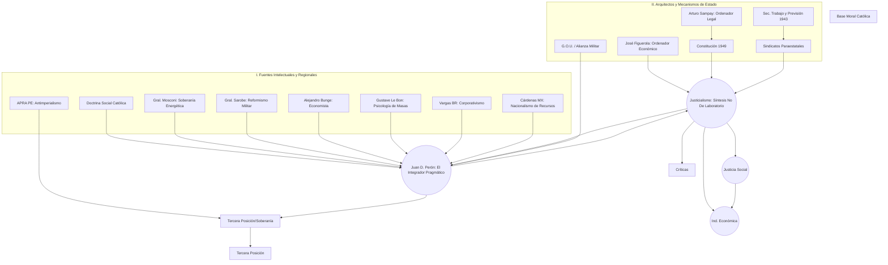

```mermaid
graph TD
    %% Nodos de Síntesis y Doctrina
    JUST((Justicialismo: Síntesis No De Laboratorio))
    PER((Juan D. Perón: El Integrador Pragmático))
    CAT_MOR[Base Moral Católica]
    POL_EXT[Tercera Posición/Soberanía]

    %% Nodos de Fuentes Ideológicas
    subgraph "I. Fuentes Intelectuales y Regionales"
        VAR[Vargas BR: Corporativismo]
        CAR[Cárdenas MX: Nacionalismo de Recursos]
        CAT_DOC[Doctrina Social Católica]
        GBON[Gustave Le Bon: Psicología de Masas]
        MIL_MOS[Gral. Mosconi: Soberanía Energética]
        MIL_SAR[Gral. Sarobe: Reformismo Militar]
        BUNGE[Alejandro Bunge: Economista]
        APRA[APRA PE: Antimperialismo]
    end

    %% Nodos de Mecanismos y Arquitectos
    subgraph "II. Arquitectos y Mecanismos de Estado"
        FIG[José Figuerola: Ordenador Económico]
        SAM[Arturo Sampay: Ordenador Legal]
        STP[Sec. Trabajo y Previsión 1943]
        CGT[Sindicatos Paraestatales]
        GOU[G.O.U. / Alianza Militar]
        CONST[Constitución 1949]
    end

    %% Nodos de Resultados
    SOCI((Justicia Social))
    ECON((Ind. Económica))
    TERCERISMO[Tercera Posición]
    CRITICAS[Críticas]

    %% 1. Flujo de Doctrina y Precursores hacia Perón
    CAT_DOC --> PER
    MIL_MOS --> PER
    MIL_SAR --> PER
    BUNGE --> PER
    GBON --> PER
    VAR --> PER
    CAR --> PER
    
    %% 2. Flujo de Mecanismos hacia la Doctrina
    PER --> JUST
    
    FIG --> JUST
    SAM --> CONST
    CONST --> JUST
    STP --> CGT
    CGT --> JUST
    
    %% 3. Flujo de Resultados y Puntos Clave
    JUST --> SOCI
    JUST --> ECON
    JUST --> PER

    %% 4. Conexiones Cruzadas y Contexto
    GOU --> PER
    APRA --> POL_EXT
    POL_EXT --> TERCERISMO
    PER --> POL_EXT
    JUST --> CRITICAS
    
    %% 5. El Lazo Directo entre Redistribución y Desarrollo
    SOCI --> ECON
```
