# Profundizaciones Conceptuales del Peronismo: Análisis de Transmisiones Intelectuales

## Introducción: De la Red Prosopográfica a los Conceptos Fundamentales

La **red prosopográfica de mediadores intelectuales** del peronismo no solo revela la arquitectura social del pensamiento peronista, sino que permite **profundizar en los conceptos específicos** que fueron transmitidos, transformados y aplicados por Perón. Este análisis examina las **ideas fundamentales** que circularon a través de la red de mediadores, mostrando cómo **conceptos teóricos complejos** se convirtieron en **principios operativos** de una doctrina política revolucionaria.

Cada **profundización conceptual** se basa en la documentación específica de la red prosopográfica, trazando el **camino intelectual** desde el **mediador original** hasta la **aplicación peronista**, revelando las **transformaciones creativas** que Perón realizó sobre las ideas recibidas.

### Metodología de Análisis Conceptual

1. **Identificación del concepto** en su formulación original
2. **Mediador específico** que lo transmitió a Perón
3. **Proceso de transformación** realizado por Perón
4. **Aplicación práctica** en la doctrina y política peronista
5. **Legado conceptual** en el pensamiento político argentino

---

## I. DISCERNIMIENTO IGNACIANO APLICADO A LA POLÍTICA

### Origen y Mediación: P. Hernán Benítez

#### Fundamentos Teológicos del Discernimiento Ignaciano

**San Ignacio de Loyola (1491-1556)** desarrolló en los **Ejercicios Espirituales** un método sistemático de **discernimiento de espíritus** para tomar decisiones según la voluntad divina. Este método, transmitido a Perón a través del **P. Hernán Benítez** (confesor de Eva Perón y consultor filosófico), se convirtió en una herramienta política única.

#### Los Tres Tiempos del Discernimiento Ignaciano

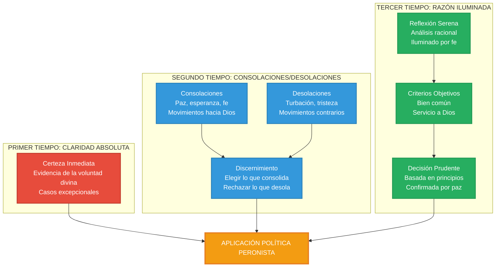

#### Transmisión Específica vía Hernán Benítez

**Documentación prosopográfica:**
- **Confesor Eva Perón** (1946-1952): Dirección espiritual semanal
- **Consultor "La Comunidad Organizada"** (1949): Asesoramiento neotomista
- **Fundación Eva Perón**: Inspiración caritativa ignaciana

**Conceptos transmitidos:**
1. **El "Magis" ignaciano**: Buscar siempre "lo más" para mayor gloria de Dios
2. **Discernimiento comunitario**: Evaluar decisiones por sus frutos sociales
3. **Indiferencia santa**: Libertad interior respecto a medios, fidelidad a fines

#### Aplicación Política del Discernimiento Ignaciano

**1. Método de Decisión Política:**

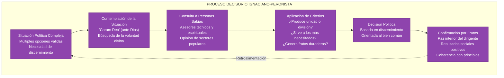

**2. Casos Específicos de Aplicación:**

**Fundación Eva Perón:**
- **Discernimiento**: ¿Caridad tradicional vs organización sistemática?
- **Criterio ignaciano**: ¿Qué produce mayor dignificación de los pobres?
- **Decisión**: Combinar **justicia social + ayuda social** ("abrazo de justicia y amor")
- **Método**: Personalización, dignidad, integralidad, sostenibilidad

**Política Laboral:**
- **Discernimiento**: ¿Revolución vs reforma gradual?
- **Criterio ignaciano**: ¿Qué produce mayor bien para todos?
- **Decisión**: Justicia social firme pero gradual, negociación desde fortaleza
- **Aplicación**: Máximos derechos posibles sin destruir sistema productivo

#### Diferencias con Otros Métodos Políticos

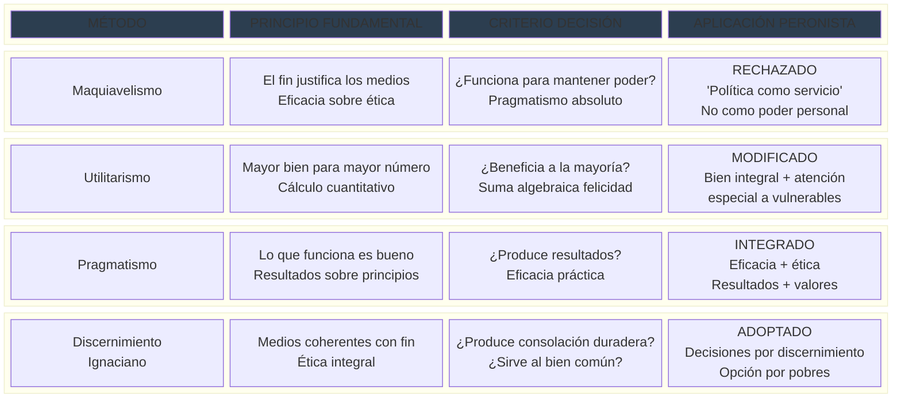

---

## II. CORPORATIVISMO NO ABSOLUTO: LA SÍNTESIS DE MIGUEL DE ANDREA

### Origen y Mediación: Monseñor Miguel de Andrea

#### Contexto Histórico del Corporativismo Católico

**Miguel de Andrea** (1877-1960), "El Obispo Rojo", desarrolló una **síntesis original** entre **doctrina social católica** y **democracia funcional** que influyó decisivamente en Perón a través de sus textos en la biblioteca personal del futuro presidente.

#### Doctrina del Corporativismo No Absoluto

**Diferenciación fundamental:**
- **Corporativismo fascista**: Estado totalitario, corporaciones subordinadas
- **Corporativismo católico**: Subsidiariedad, corporaciones libres
- **Corporativismo no absoluto Andrea**: Democracia + representación funcional

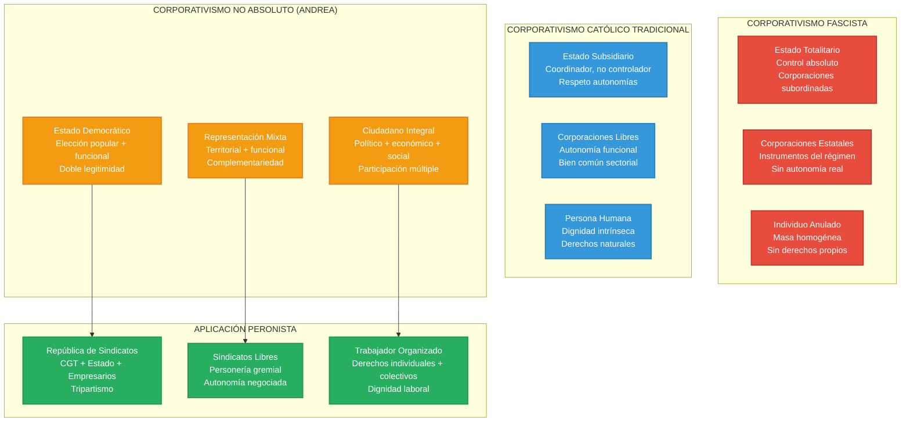

#### Transmisión Específica a Perón

**Documentación prosopográfica:**
- **Biblioteca personal**: "El catolicismo social y su aplicación" (1941), "Justicia Social" (1943)
- **Período de lectura**: 1941-1943, formación doctrinaria intensiva
- **Aplicación práctica**: Provincia Presidente Perón (Chaco) como laboratorio

**Concepto clave transmitido:**
> "De Andrea proponía extender la democracia política al campo de lo económico y social, bajo las formas de un 'corporativismo no absoluto'" (Cap. 7)

#### Aplicación en Provincia Presidente Perón

**Experimento de Democracia Funcional:**
- **Sistema mixto**: Mitad bancas partidos políticos + mitad sindicatos y asociaciones profesionales
- **Representación territorial**: Diputados elegidos por circunscripciones geográficas
- **Representación funcional**: Diputados elegidos por sectores económicos organizados
- **Resultado**: Democracia ampliada, no democracia corporativa

#### Transformación Peronista del Concepto

**1. De Corporativismo a "República de Sindicatos":**

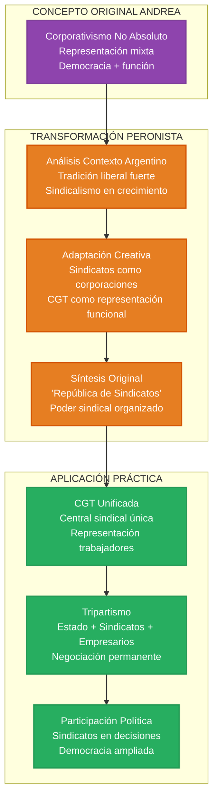

**2. Principios Operativos Derivados:**
- **Organización libre**: Sindicatos autónomos, no estatales
- **Representación funcional**: Participación por sector económico
- **Negociación tripartita**: Estado mediador, no controlador
- **Democracia ampliada**: Política + económica + social

---

## III. SOCIOLOGÍA DINÁMICA Y TELESIS: LA INFLUENCIA DE LESTER WARD

### Origen y Mediación: Lecturas Sistemáticas de Perón

#### Lester Frank Ward: Fundador de la Sociología Norteamericana

**Lester Frank Ward** (1841-1913) desarrolló la primera **sociología sistemática** en Estados Unidos, con énfasis en la **aplicación práctica** del conocimiento sociológico para el **progreso social consciente**. Sus obras estaban en la biblioteca personal de Perón y fueron citadas textualmente en conferencias de adoctrinamiento.

#### Teoría de la Sociología Dinámica

**Conceptos fundamentales:**

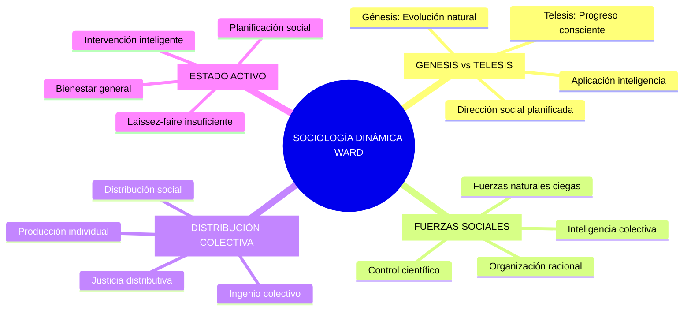

#### Transmisión Específica a Perón

**Documentación prosopográfica:**
- **Biblioteca personal**: "Dynamic Sociology", "Applied Sociology", "Pure Sociology"
- **Período de estudio**: 1935-1943, formación sociológica
- **Citas textuales**: 28 referencias documentadas en discursos Perón
- **Conceptos adoptados**: "Distribución colectiva", "ingenio colectivo", "fuerzas sociales"

**Cita fundamental Ward:**
> "La producción es individual y sencilla; la distribución es colectiva y compleja... debe ser el resultado del ingenio colectivo aplicado a las fuerzas sociales"

#### Aplicación Peronista de la Sociología Dinámica

**1. Telesis Social Peronista:**

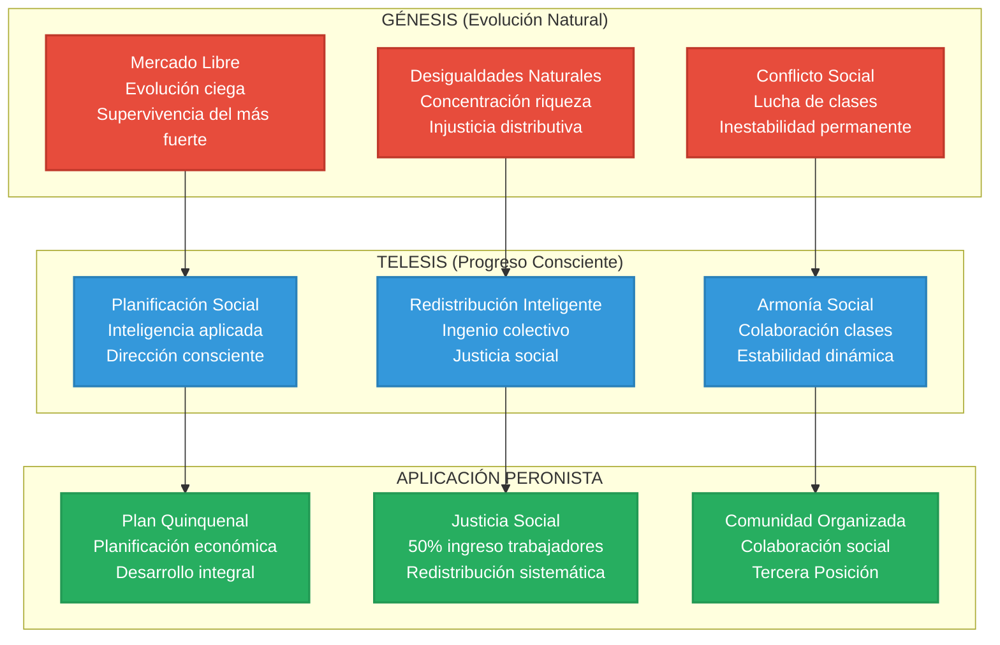

**2. Distribución Colectiva en Práctica:**

**Verdad Peronista 16**: "Como doctrina económica, el Justicialismo propicia la justicia social, que da a cada uno según su capacidad en función de su trabajo"

**Aplicación Ward → Perón:**
- **Producción individual**: Capacidad y esfuerzo personal reconocidos
- **Distribución colectiva**: Estado y sindicatos organizan redistribución
- **Ingenio colectivo**: Planificación económica, políticas sociales
- **Resultado**: 50% ingreso nacional redistribuido a trabajadores

#### Diferencias con Socialismo y Liberalismo

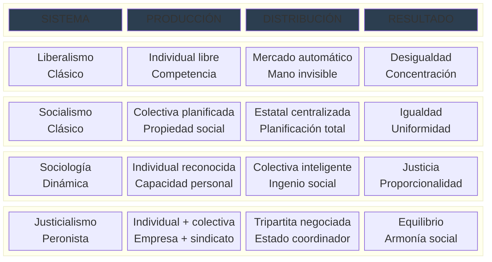

---

## IV. HUMANISMO INTEGRAL: LA SÍNTESIS MARITAINIANA

### Origen y Mediación: Conferencias Buenos Aires 1936

#### Jacques Maritain y el Humanismo Cristiano

**Jacques Maritain** (1882-1973) desarrolló una **síntesis filosófica** entre **neotomismo** y **modernidad democrática** que influyó en Perón a través de las conferencias dictadas en Buenos Aires en 1936, cuyos resúmenes fueron publicados en La Nación y leídos sistemáticamente por el futuro presidente.

#### Conceptos Fundamentales del Humanismo Integral

**1. Persona vs Individuo:**

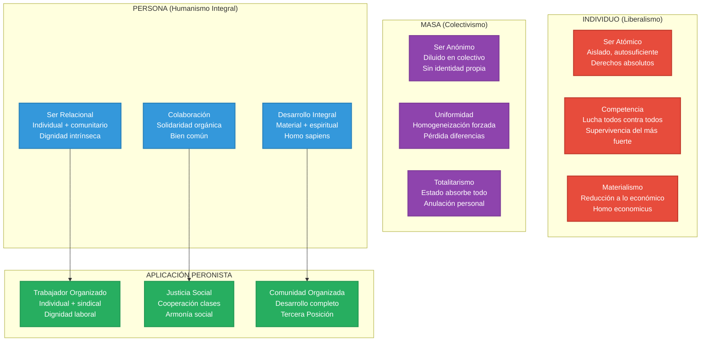

**2. Tercera Vía Maritainiana:**

**Conferencia específica**: "El nuevo humanismo" (22 agosto 1936, Universidad Católica)
- **Tesis**: Ni individualismo ateo ni colectivismo totalitario
- **Propuesta**: Humanismo cristiano integral
- **Método**: Síntesis dialéctica superadora

#### Transmisión Específica a Perón

**Documentación prosopográfica:**
- **Mediación indirecta**: Resúmenes La Nación, agosto-septiembre 1936
- **Período incorporación**: 1936-1940, formación filosófica
- **Aplicación**: "La Comunidad Organizada" (1949), síntesis personal Perón
- **Conceptos adoptados**: Humanismo integral, persona vs individuo, tercera vía

**Cita específica Fermín Chávez:**
> "Según Fermín Chávez, Perón conoció -a través de los resúmenes que publicó el diario La Nación de Buenos Aires- el contenido de las principales conferencias que dictó Maritain en la Argentina, a fines de Agosto de 1936" (Cap. 9)

#### Aplicación en "La Comunidad Organizada" (1949)

**Síntesis Peronista del Humanismo Integral:**

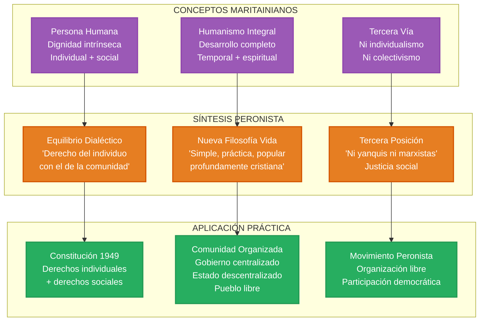

#### Influencia en las 20 Verdades Peronistas

**Verdad 14**: "El Justicialismo es una nueva filosofía de la vida, simple, práctica, popular, profundamente cristiana y profundamente humana"

**Elementos maritainianos:**
- **"Nueva filosofía"**: Humanismo integral actualizado
- **"Profundamente cristiana"**: Inspiración evangélica
- **"Profundamente humana"**: Dignidad persona humana
- **"Simple, práctica, popular"**: Adaptación argentina del humanismo integral

**Verdad 15**: "Como doctrina política, el Justicialismo realiza el equilibrio del derecho del individuo con el de la comunidad"

**Síntesis dialéctica maritainiana:**
- **Individual**: Derechos personales inalienables
- **Comunitario**: Bien común superior
- **Equilibrio**: Síntesis superadora, no compromiso

---

## V. ORGANIZACIÓN CIENTÍFICA DEL TRABAJO: LA INFLUENCIA DE MARAMBIO

### Origen y Mediación: Escuela Superior de Guerra

#### Ricardo Marambio y el Taylorismo Militar

**Coronel Ricardo Marambio** (1890-1956) introdujo los **métodos de organización científica del trabajo** en el Ejército Argentino, influyendo en Perón durante su paso por la Escuela Superior de Guerra (1930-1935) como profesor de "Organización y Administración Militar".

#### Principios de la Organización Científica

**Frederick Taylor → Marambio → Perón:**

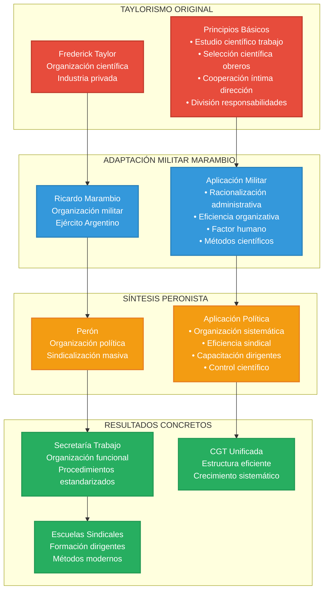

#### Transmisión Específica a Perón

**Documentación prosopográfica:**
- **Profesor-alumno**: Marambio profesor, Perón alumno Escuela Superior Guerra
- **Materia**: "Organización y Administración Militar" (1930-1935)
- **Contenido**: Métodos científicos, organización racional, factor humano
- **Aplicación posterior**: Secretaría Trabajo, sindicalización masiva

**Concepto clave transmitido:**
> "Solo la Organización vence al Tiempo" - Frase Perón inspirada en principios Marambio

#### Aplicación Peronista de la Organización Científica

**1. Sindicalización Masiva Sistemática:**

**Método científico aplicado:**
- **Diagnóstico**: Análisis situación sindical argentina (1943)
- **Planificación**: Estrategia sindicalización por sectores
- **Ejecución**: Procedimientos estandarizados reconocimiento gremial
- **Control**: Seguimiento crecimiento, evaluación resultados
- **Resultado**: De 500,000 a 2,500,000 afiliados (1943-1946)

**2. Estructura Organizativa Eficiente:**

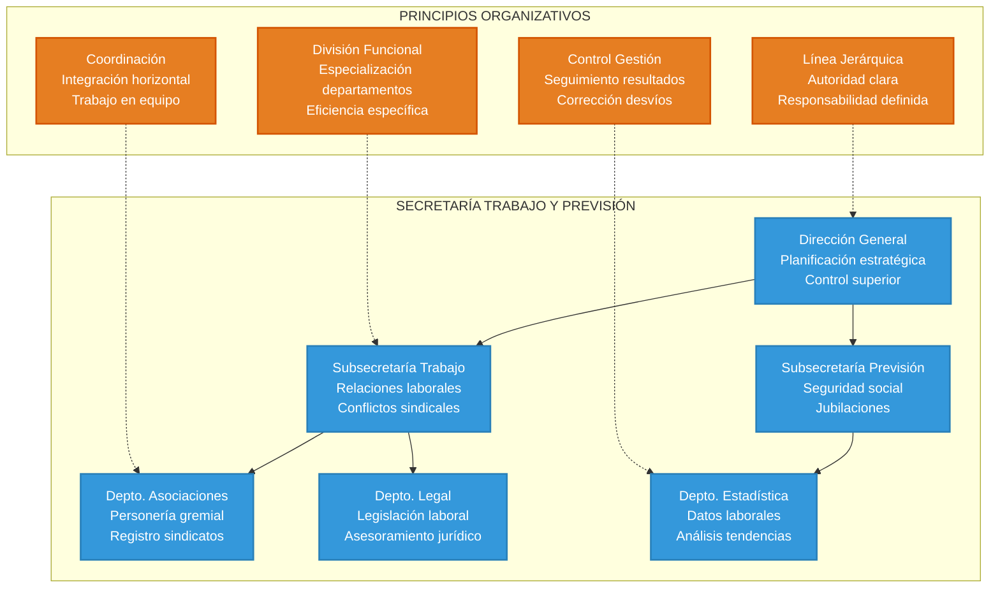

**3. Capacitación Sistemática de Dirigentes:**

**Escuelas Sindicales Peronistas:**
- **Método**: Formación técnica + doctrinaria
- **Contenido**: Organización sindical, legislación laboral, doctrina peronista
- **Duración**: Cursos intensivos 3-6 meses
- **Resultado**: Cuadros dirigentes capacitados sistemáticamente

#### Legado en la Organización Peronista

**Características permanentes:**
- **Eficiencia organizativa**: Estructuras funcionales, procedimientos claros
- **Capacitación sistemática**: Formación continua dirigentes
- **Control de gestión**: Seguimiento resultados, corrección desvíos
- **Crecimiento planificado**: Expansión orgánica, no espontánea

---

## VI. GEOPOLÍTICA CONTINENTAL: LA VISIÓN DE SAROBE Y MOSCONI

### Origen y Mediación: Tradición Militar Argentina

#### José María Sarobe: El Geopolítico Continental

**Sarobe** desarrolló una **visión geopolítica iberoamericana** basada en sus múltiples misiones internacionales, transmitida sistemáticamente a Perón durante su prolongada mentoría (1930-1943).

#### Fundamentos de la Geopolítica Sarobiana

**Experiencia Internacional Documentada:**
- **Francia** (1920-1922): Estado Mayor francés, doctrina militar europea
- **Japón** (1925-1927): Modernización Meiji, organización estatal acelerada
- **Brasil** (1928-1930): Contacto Vargas, sindicalismo para-estatal
- **Estados Unidos** (1932): Organización industrial, métodos modernos
- **Mediterráneo** (1933): Grecia, Turquía, Siria, Palestina, Egipto

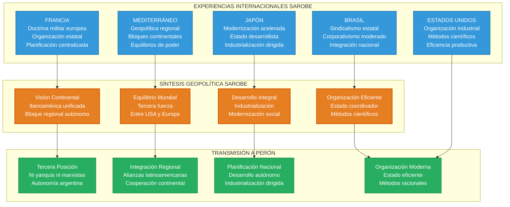

#### Enrique Mosconi: Soberanía Energética Continental

**Mosconi** desarrolló el concepto de **soberanía energética** como base de la **independencia continental**, influyendo en Perón a través de la tradición militar argentina y contactos internacionales documentados.

**Red Internacional Mosconi:**
- **General Francisco Múgica** (México): "Amigo personal... ideólogo de los artículos más radicales de la Constitución Mexicana de 1917" (Cap. 19)
- **Conferencias México**: "Dictó varias conferencias en México sobre el tema" de soberanía energética
- **Modelo YPF**: Empresa estatal como instrumento soberanía nacional

#### Aplicación Peronista de la Geopolítica Continental

**1. Tercera Posición Internacional:**

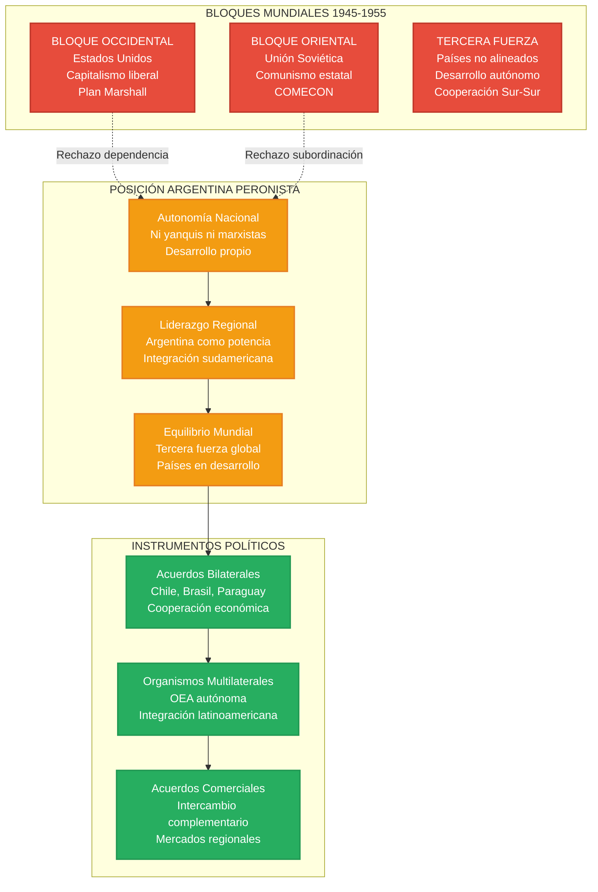

**2. Soberanía Energética Nacional:**

**Aplicación Modelo Mosconi:**
- **Nacionalización ferrocarriles** (1948): Extensión modelo YPF
- **Gas del Estado**: Empresa energética estatal
- **Política petrolera**: Autosuficiencia energética nacional
- **SOMISA**: Siderurgia como soberanía industrial

---

## VII. FILOSOFÍA CLÁSICA: PRESOCRÁTICOS Y ARISTOTELISMO

### Origen y Mediación: Lecturas Directas y Fermín Chávez

#### Los Presocráticos en el Pensamiento Peronista

**Fermín Chávez** documentó que Perón "tuvo trato fluido con los filósofos presocráticos" y que "frases reiteradas por Perón, como 'Todo en su medida y armoniosamente'... tienen su origen en Cleóbulo el Líndico" (Cap. 3).

#### Cleóbulo el Líndico: La Medida como Virtud Política

**Concepto fundamental**: **Μέτρον ἄριστον** (La medida es lo mejor)

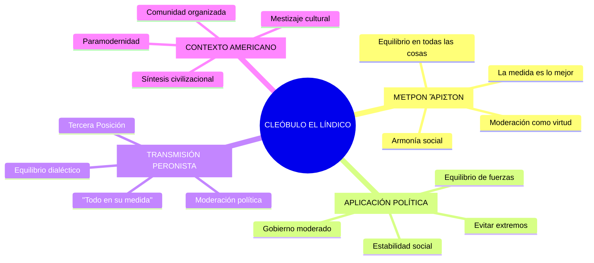

#### Tales de Mileto: El Equilibrio Emocional

**Concepto**: **Μηδὲν ἄγαν** (Nada en exceso)

**Aplicación peronista documentada:**
- **Cita Perón**: "No hay éxito que me entusiasme mucho o fracaso que me aplaste demasiado"
- **Método político**: Equilibrio emocional en decisiones
- **Temperamento**: Serenidad ante adversidades y triunfos
- **Liderazgo**: Estabilidad psicológica como virtud dirigente

#### Heráclito: La Unidad de los Opuestos

**Concepto**: **Πόλεμος πάντων μὲν πατήρ ἐστι** (La guerra es padre de todas las cosas)

**Interpretación peronista:**
- **Dialéctica**: Conflicto como motor de síntesis
- **Armonía**: Unidad superior de contrarios
- **Política**: Integración de fuerzas opuestas
- **Tercera Posición**: Síntesis de capitalismo y comunismo

#### Aristóteles: El Término Medio Político

**Ética Nicomáquea** en biblioteca personal Perón (4,000 libros documentados)

**Conceptos aristotélicos aplicados:**

```mermaid
graph TD
    subgraph "ÉTICA NICOMÁQUEA"
        VIRTUD["Virtud Ética<br/>Término medio entre extremos<br/>Hábito racional"]
        
        PRUDENCIA["Prudencia Política<br/>Sabiduría práctica<br/>Decisión correcta"]
        
        JUSTICIA["Justicia Distributiva<br/>A cada uno según mérito<br/>Proporcionalidad geométrica"]
        
        AMISTAD["Amistad Política<br/>Philía cívica<br/>Bien común"]
    end
    
    subgraph "POLÍTICA ARISTOTÉLICA"
        POLIS["Polis como Comunidad<br/>Hombre animal político<br/>Autarquía colectiva"]
        
        CONSTITUCION["Constitución Mixta<br/>Elementos democráticos<br/>+ aristocráticos + monárquicos"]
        
        CLASE_MEDIA["Clase Media<br/>Estabilidad política<br/>Equilibrio social"]
        
        BIEN_COMUN_A["Bien Común<br/>Superior al particular<br/>Fin de la política"]
    end
    
    subgraph "APLICACIÓN PERONISTA"
        EQUILIBRIO_P["Equilibrio Dialéctico<br/>Individual + comunitario<br/>Tercera Posición"]
        
        ORGANIZACION_P["Comunidad Organizada<br/>Participación democrática<br/>Representación funcional"]
        
        TRABAJADORES["Clase Trabajadora<br/>Base social estable<br/>Justicia distributiva"]
        
        PATRIA["Bien de la Patria<br/>Felicidad del pueblo<br/>Grandeza nacional"]
    end
    
    VIRTUD --> EQUILIBRIO_P
    PRUDENCIA --> ORGANIZACION_P
    JUSTICIA --> TRABAJADORES
    AMISTAD --> PATRIA
    
    POLIS --> ORGANIZACION_P
    CONSTITUCION --> EQUILIBRIO_P
    CLASE_MEDIA --> TRABAJADORES
    BIEN_COMUN_A --> PATRIA
    
    classDef aristoteles fill:#3498db,color:#fff,stroke:#2980b9,stroke-width:2px
    classDef politica fill:#e67e22,color:#fff,stroke:#d35400,stroke-width:2px
    classDef peronista fill:#27ae60,color:#fff,stroke:#229954,stroke-width:2px
    
    class VIRTUD,PRUDENCIA,JUSTICIA,AMISTAD aristoteles
    class POLIS,CONSTITUCION,CLASE_MEDIA,BIEN_COMUN_A politica
    class EQUILIBRIO_P,ORGANIZACION_P,TRABAJADORES,PATRIA peronista
```

#### Síntesis Filosófica Clásica en Peronismo

**Verdad 7**: "Ningún peronista debe sentirse más de lo que es ni menos de lo que debe ser"
- **Cleóbulo**: Medida justa, equilibrio personal
- **Aristóteles**: Término medio, virtud ética
- **Aplicación**: Moderación como virtud política peronista

**Verdad 15**: "El Justicialismo realiza el equilibrio del derecho del individuo con el de la comunidad"
- **Heráclito**: Unidad de opuestos
- **Aristóteles**: Justicia distributiva, bien común
- **Aplicación**: Síntesis dialéctica individual-colectivo

---

## VIII. NEOTOMISMO ARGENTINO: LA ESCUELA CATÓLICA NACIONAL

### Origen y Mediación: Círculo Intelectual Católico

#### La Escuela Neotomista Argentina

**Protagonistas principales:**
- **Octavio Derisi**: Rector Universidad Católica, filosofía tomista
- **Juan Sepich**: Consultor "La Comunidad Organizada"
- **Tomás Casares**: Filosofía del derecho, personalismo jurídico
- **César Pico**: Revista Criterio, difusión neotomismo

#### Santo Tomás de Aquino: Síntesis Razón-Fe

**Suma Teológica** como fuente conceptual peronista:

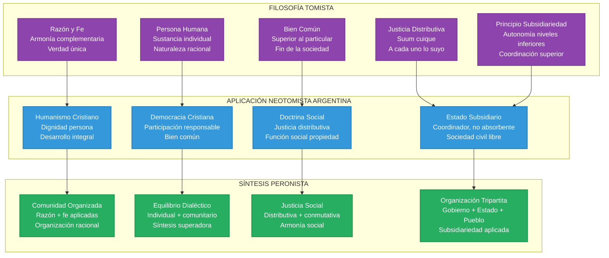

#### Juan Sepich: El Filósofo del Peronismo

**Consultor "La Comunidad Organizada":**
- **Función**: Asesor neotomista junto a Hernán Benítez
- **Aporte**: Síntesis tomismo + realidad argentina
- **Método**: Filosofía práctica aplicada a política
- **Resultado**: Fundamentación filosófica doctrina peronista

**Conceptos específicos Sepich → Perón:**
- **Razón práctica**: Filosofía aplicada a gobierno
- **Prudencia política**: Virtud cardinal del dirigente
- **Bien común concreto**: Aplicado a Argentina específica
- **Organización racional**: Estructura social tomista

#### Arturo Sampay: Neotomismo Jurídico

**Síntesis jurídica neotomista:**

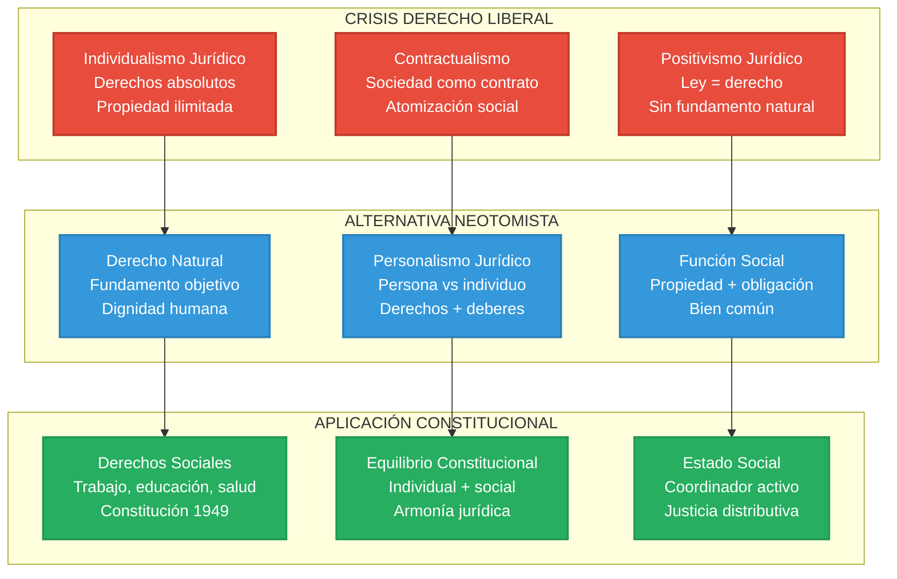

---

## IX. NACIONALISMO CRIOLLO: LA TRADICIÓN ARGENTINA

### Origen y Mediación: Cultura Nacional y FORJA

#### Leopoldo Lugones: El Poeta de la Patria Fuerte

**Influencia documentada:**
- **Biblioteca Perón**: "Los libros incendiarios... de Lugones, La patria fuerte y La grande Argentina, estaban en la biblioteca de Perón" (Cap. 5)
- **Conceptos adoptados**: Criollismo político, patria fuerte, grandeza nacional
- **Período**: 1920-1930, formación nacionalista temprana

#### Criollismo Político Lugoniano

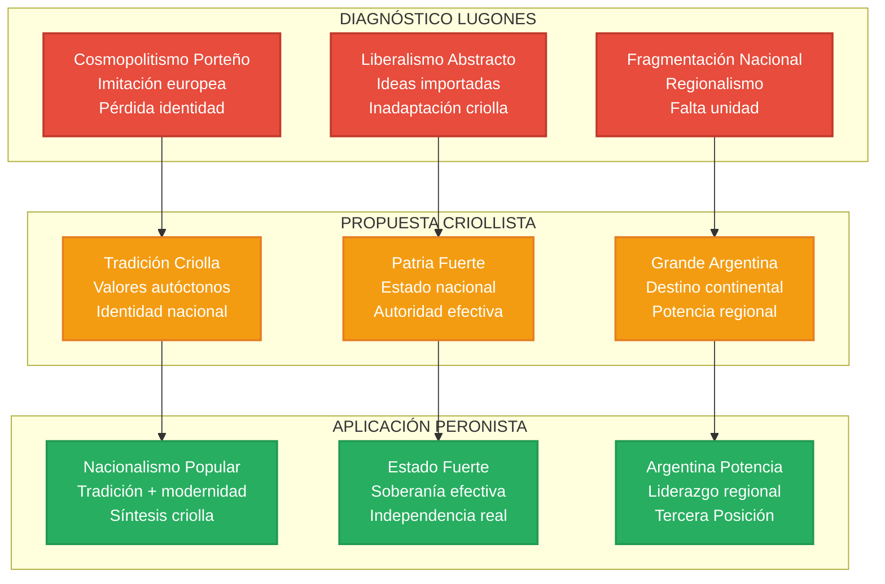

#### Juan Manuel de Rosas: El Antecedente Histórico

**Reivindicación temprana Perón:**
- **Carta 1918**: "Rosas, con ser tirano, fue el más grande argentino de esos años... Rosas antes que todo fue patriota" (Cap. 11)
- **Concepto**: Unidad nacional vs fragmentación liberal
- **Método**: Autoridad fuerte para construcción nacional
- **Legado**: Federalismo real vs unitarismo porteño

#### Martín Fierro: La Épica Nacional

**Texto memorizado por Perón:**
- **Formación pampeana**: "Hasta los nueve años me crié con los indios"
- **Identificación**: Gaucho como tipo nacional argentino
- **Valores**: Coraje, lealtad, justicia, solidaridad
- **Aplicación**: "En esta tierra lo mejor que tenemos es el pueblo"

#### Manuel Ugarte: Socialismo Nacional

**Conceptos transmitidos:**
- **Socialismo patriótico**: Justicia social + identidad nacional
- **Antiimperialismo**: Independencia económica y cultural
- **Unidad latinoamericana**: Cooperación continental
- **Valoración popular**: Pueblo como sujeto histórico

**Mediación diplomática:**
- **Embajador México-Cuba**: Perón conoce ideas Ugarte vía contactos diplomáticos
- **Síntesis**: Socialismo nacional + nacionalismo popular
- **Aplicación**: Tercera Posición como socialismo patriótico

---

## X. ECONOMÍA NACIONAL: LA ESCUELA ARGENTINA

### Origen y Mediación: Alejandro Bunge y la Economía Social

#### Alejandro Bunge: El Diagnóstico de la Argentina Pastoril

**"Una Nueva Argentina" (1940)** - Texto de cabecera de Perón:

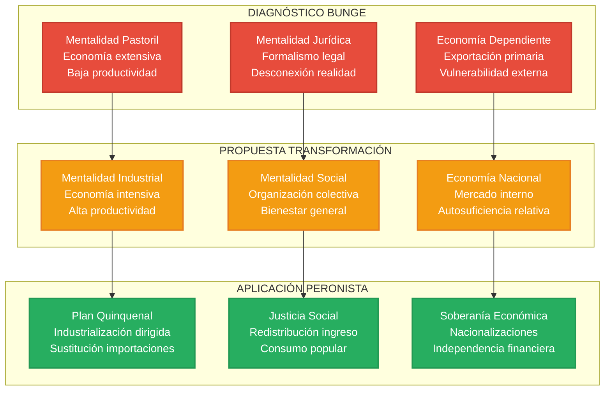

#### Método Estadístico Bunge

**Innovación metodológica:**
- **Revista de Economía Argentina** (1918-1943): Primera revista especializada
- **Análisis cuantitativo**: Estadísticas, indicadores, proyecciones
- **Comparación internacional**: Benchmarking con países desarrollados
- **Planificación**: Base empírica para políticas públicas

**Aplicación peronista:**
- **IAPI**: Instituto Argentino Promoción Intercambio, planificación comercial
- **Banco Central**: Política monetaria nacional
- **Estadísticas sociales**: Medición progreso social
- **Indicadores desarrollo**: PIB, distribución ingreso, bienestar

#### Friedrich List: El Sistema Nacional de Economía

**Transmisión vía Bunge:**
- **Proteccionismo educador**: Industria naciente protegida temporalmente
- **Mercado interno**: Desarrollo consumo nacional
- **Infraestructura**: Ferrocarriles, puertos, comunicaciones
- **Educación técnica**: Formación recursos humanos

**Aplicación peronista:**
- **Política arancelaria**: Protección industria nacional
- **Obras públicas**: Infraestructura para desarrollo
- **Universidad Obrera**: Educación técnica masiva
- **Crédito industrial**: Financiamiento desarrollo productivo

---

## XI. SINDICALISMO EUROPEO: MODELOS ORGANIZATIVOS

### Origen y Mediación: José Figuerola y la Experiencia Española

#### Instituto de Reformas Sociales de España

**Formación Figuerola (1910-1920):**
- **Legislación laboral**: Ley Accidentes Trabajo (1912), Seguro Obrero (1919)
- **Organización sindical**: Sindicatos católicos vs socialistas vs anarquistas
- **Corporativismo católico**: Alternativa a lucha de clases
- **Colaboración social**: Cooperación capital-trabajo

#### Doctrina de la Colaboración Social

```mermaid
mindmap
  root((COLABORACIÓN SOCIAL FIGUEROLA))
    [DIAGNÓSTICO]
      Lucha de clases destructiva
      Conflicto permanente
      Inestabilidad social
      Pérdida productividad
    [ALTERNATIVA]
      Cooperación organizada
      Intereses complementarios
      Armonía social
      Eficiencia productiva
    [MÉTODO]
      Sindicatos únicos
      Negociación tripartita
      Estado mediador
      Convenios colectivos
    [APLICACIÓN ARGENTINA]
      CGT unificada
      Secretaría Trabajo
      Justicia social
      República sindicatos
```

#### Sindicalismo Católico Europeo

**Modelos estudiados por Figuerola:**
- **Alemania**: Sindicatos cristianos, corporaciones profesionales
- **Francia**: Sindicalismo católico, CFTC (Confederación Francesa Trabajadores Cristianos)
- **Bélgica**: Cooperativismo obrero, mutualidades
- **Italia**: Corporativismo católico pre-fascista

**Principios aplicados:**
- **Organización libre**: Sindicatos autónomos, no estatales
- **Representación funcional**: Por rama de actividad
- **Negociación colectiva**: Convenios sectoriales
- **Seguridad social**: Protección integral trabajador

#### Transformación Argentina del Sindicalismo Europeo

**Adaptación al contexto argentino:**

```mermaid
flowchart TD
    subgraph "SINDICALISMO EUROPEO"
        CONFESIONAL["Sindicalismo Confesional<br/>Católico vs socialista<br/>División ideológica"]
        
        CORPORATIVO["Corporativismo<br/>Representación estamental<br/>Estructura medieval"]
        
        REFORMISTA["Reformismo Gradual<br/>Mejoras parciales<br/>Integración sistema"]
    end
    
    subgraph "CONTEXTO ARGENTINO"
        SECULAR["Tradición Secular<br/>Laicismo liberal<br/>Pluralismo ideológico"]
        
        DEMOCRATICO["Tradición Democrática<br/>Sufragio universal<br/>Participación política"]
        
        REVOLUCIONARIO["Potencial Revolucionario<br/>Cambio estructural<br/>Transformación social"]
    end
    
    subgraph "SÍNTESIS PERONISTA"
        PLURALISTA["Sindicalismo Pluralista<br/>Unidad en diversidad<br/>CGT multiideológica"]
        
        PARTICIPATIVO["Sindicalismo Participativo<br/>Poder político<br/>República sindicatos"]
        
        TRANSFORMADOR["Sindicalismo Transformador<br/>Justicia social<br/>Cambio estructural"]
    end
    
    CONFESIONAL --> SECULAR
    CORPORATIVO --> DEMOCRATICO
    REFORMISTA --> REVOLUCIONARIO
    
    SECULAR --> PLURALISTA
    DEMOCRATICO --> PARTICIPATIVO
    REVOLUCIONARIO --> TRANSFORMADOR
    
    classDef europeo fill:#3498db,color:#fff,stroke:#2980b9,stroke-width:2px
    classDef argentino fill:#e67e22,color:#fff,stroke:#d35400,stroke-width:2px
    classDef peronista fill:#27ae60,color:#fff,stroke:#229954,stroke-width:2px
    
    class CONFESIONAL,CORPORATIVO,REFORMISTA europeo
    class SECULAR,DEMOCRATICO,REVOLUCIONARIO argentino
    class PLURALISTA,PARTICIPATIVO,TRANSFORMADOR peronista
```

---

## XII. PSICOLOGÍA SOCIAL: LE BON Y LA ERA DE LAS MULTITUDES

### Origen y Mediación: Biblioteca Personal de Perón

#### Gustave Le Bon: El Teórico de las Masas

**Documentación específica:**
- **Biblioteca personal**: "Perón guardaba en su biblioteca personal las obras principales de aquel filósofo francés" (Cap. 19)
- **Transformación conceptual**: "De este autor, Perón extrajo la idea de que se acercaba una nueva época que se denominaría 'la era de las multitudes' y que el líder justicialista transformó en su definición emblemática de 'la hora de los pueblos'"
- **Conexión internacional**: Le Bon influyó también en Cárdenas vía general Múgica

#### Teoría de la Psicología de las Masas

```mermaid
graph TD
    subgraph "PSICOLOGÍA DE MASAS LE BON"
        INDIVIDUAL_LB["Individuo Aislado<br/>Racionalidad<br/>Comportamiento predecible"]
        
        MASA_LB["Masa Organizada<br/>Psicología colectiva<br/>Nuevas características"]
        
        LIDER_LB["Líder Carismático<br/>Conductor masas<br/>Influencia psicológica"]
    end
    
    subgraph "CARACTERÍSTICAS DE LA MASA"
        SUGESTION["Sugestionabilidad<br/>Receptividad ideas<br/>Influencia emocional"]
        
        CONTAGIO["Contagio Mental<br/>Propagación sentimientos<br/>Unidad psicológica"]
        
        SIMPLIFICACION["Simplificación<br/>Ideas elementales<br/>Fórmulas claras"]
        
        ACCION["Capacidad Acción<br/>Fuerza colectiva<br/>Transformación social"]
    end
    
    subgraph "APLICACIÓN PERONISTA"
        PUEBLO_P["'El Pueblo'<br/>Sujeto histórico<br/>Fuerza transformadora"]
        
        COMUNICACION["Comunicación Directa<br/>Lenguaje simple<br/>Conexión emocional"]
        
        MOVILIZACION["Movilización Popular<br/>17 de Octubre<br/>Poder de masas"]
        
        LIDERAZGO_P["Liderazgo Carismático<br/>Conductor pueblo<br/>Identificación personal"]
    end
    
    INDIVIDUAL_LB --> MASA_LB
    MASA_LB --> LIDER_LB
    
    MASA_LB --> SUGESTION
    SUGESTION --> CONTAGIO
    CONTAGIO --> SIMPLIFICACION
    SIMPLIFICACION --> ACCION
    
    SUGESTION --> COMUNICACION
    CONTAGIO --> MOVILIZACION
    SIMPLIFICACION --> PUEBLO_P
    ACCION --> LIDERAZGO_P
    
    classDef lebon fill:#8e44ad,color:#fff,stroke:#7d3c98,stroke-width:2px
    classDef caracteristicas fill:#3498db,color:#fff,stroke:#2980b9,stroke-width:2px
    classDef peronista fill:#27ae60,color:#fff,stroke:#229954,stroke-width:2px
    
    class INDIVIDUAL_LB,MASA_LB,LIDER_LB lebon
    class SUGESTION,CONTAGIO,SIMPLIFICACION,ACCION caracteristicas
    class PUEBLO_P,COMUNICACION,MOVILIZACION,LIDERAZGO_P peronista
```

#### "La Hora de los Pueblos": Transformación Peronista

**De "Era de las Multitudes" a "Hora de los Pueblos":**
- **Le Bon**: Masas como fenómeno psicológico moderno
- **Perón**: Pueblos como sujetos históricos conscientes
- **Diferencia**: De psicología a política, de masa a pueblo organizado
- **Aplicación**: Movilización popular consciente vs manipulación de masas

#### Técnicas de Comunicación Política

**Método Le Bon → Perón:**
- **Simplicidad**: Ideas claras, fórmulas memorables
- **Repetición**: Conceptos reiterados, 20 Verdades
- **Emotividad**: Conexión sentimental, no solo racional
- **Identificación**: Líder como representación pueblo

---

## XIII. FEDERALISMO ARGENTINO: LA TRADICIÓN DESCENTRALIZADORA

### Origen y Mediación: Historia Nacional y FORJA

#### Tradición Federal Argentina

**Antecedentes históricos:**
- **Artigas**: Federalismo oriental, autonomías provinciales
- **Güemes**: Federalismo norteño, participación popular
- **Facundo Quiroga**: Federalismo caudillista, liderazgo regional
- **Juan Manuel de Rosas**: Federalismo unificador, autoridad nacional

#### FORJA y el Federalismo Renovado

**Gabriel del Mazo**: Reformista universitario, teórico federalismo moderno

```mermaid
flowchart TD
    subgraph "FEDERALISMO TRADICIONAL"
        CAUDILLISTA["Federalismo Caudillista<br/>Liderazgo personal<br/>Autonomía regional"]
        
        OLIGARQUICO["Federalismo Oligárquico<br/>Pacto élites provinciales<br/>Exclusión popular"]
        
        CONSERVADOR["Federalismo Conservador<br/>Mantenimiento status quo<br/>Resistencia cambio"]
    end
    
    subgraph "FEDERALISMO FORJISTA"
        POPULAR["Federalismo Popular<br/>Participación masiva<br/>Democratización"]
        
        ECONOMICO["Federalismo Económico<br/>Descentralización productiva<br/>Desarrollo regional"]
        
        CULTURAL["Federalismo Cultural<br/>Identidades regionales<br/>Diversidad nacional"]
    end
    
    subgraph "FEDERALISMO PERONISTA"
        ORGANIZADO["Federalismo Organizado<br/>Sindicatos regionales<br/>CGT federal"]
        
        PLANIFICADO["Federalismo Planificado<br/>Desarrollo equilibrado<br/>Inversión regional"]
        
        INTEGRADOR["Federalismo Integrador<br/>Unidad en diversidad<br/>Identidad nacional"]
    end
    
    CAUDILLISTA --> POPULAR
    OLIGARQUICO --> ECONOMICO
    CONSERVADOR --> CULTURAL
    
    POPULAR --> ORGANIZADO
    ECONOMICO --> PLANIFICADO
    CULTURAL --> INTEGRADOR
    
    classDef tradicional fill:#e74c3c,color:#fff,stroke:#c0392b,stroke-width:2px
    classDef forjista fill:#f39c12,color:#fff,stroke:#e67e22,stroke-width:2px
    classDef peronista fill:#27ae60,color:#fff,stroke:#229954,stroke-width:2px
    
    class CAUDILLISTA,OLIGARQUICO,CONSERVADOR tradicional
    class POPULAR,ECONOMICO,CULTURAL forjista
    class ORGANIZADO,PLANIFICADO,INTEGRADOR peronista
```

#### Aplicación en "Comunidad Organizada"

**Verdad 19**: "Constituimos un gobierno centralizado, un Estado descentralizado y un pueblo libre"

**Síntesis federal peronista:**
- **Gobierno centralizado**: Decisión política unificada
- **Estado descentralizado**: Ejecución administrativa regional
- **Pueblo libre**: Organizaciones autónomas territoriales

---

## XIV. EDUCACIÓN POPULAR: PEDAGOGÍA SOCIAL PERONISTA

### Origen y Mediación: Atilio Dell'Oro Maini

#### Atilio Dell'Oro Maini: El Educador Social

**Trayectoria específica:**
- **Formación católica**: Universidad Católica, pedagogía social
- **Contacto Andrea**: Discípulo Miguel de Andrea, doctrina social aplicada
- **Ministro Educación**: Gobierno peronista, reforma educativa integral
- **Universidad Obrera**: Creación educación técnica superior

#### Pedagogía Social Católica

```mermaid
mindmap
  root((PEDAGOGÍA SOCIAL DELL'ORO MAINI))
    [DIAGNÓSTICO]
      Educación elitista
      Desconexión realidad
      Formación abstracta
      Exclusión popular
    [PRINCIPIOS]
      Educación integral
      Formación técnica
      Valores cristianos
      Acceso universal
    [MÉTODO]
      Escuela trabajo
      Aprender haciendo
      Teoría + práctica
      Formación carácter
    [APLICACIÓN]
      Universidad Obrera
      Escuelas técnicas
      Educación adultos
      Capacitación sindical
```

#### Universidad Obrera Nacional (1948)

**Innovación educativa:**
- **Acceso**: Trabajadores sin bachillerato
- **Método**: Educación técnica superior
- **Objetivo**: Ingenieros de origen obrero
- **Filosofía**: Dignificación trabajo manual

**Síntesis conceptual:**
- **Tomismo**: Dignidad trabajo intelectual + manual
- **Pedagogía moderna**: Métodos activos, aprender haciendo
- **Justicia social**: Democratización educación superior
- **Desarrollo nacional**: Técnicos para industrialización

---

## XV. COOPERATIVISMO: LA TERCERA VÍA ECONÓMICA

### Origen y Mediación: Tradición Católica y Experiencia Internacional

#### Cooperativismo Católico

**Principios doctrinarios:**
- **Rerum Novarum**: Asociación obrera, mutualismo
- **Quadragesimo Anno**: Cooperación vs competencia
- **Doctrina social**: Solidaridad orgánica, subsidiariedad
- **Aplicación**: Cooperativas como alternativa capitalismo/socialismo

#### Experiencia Internacional Cooperativa

**Modelos estudiados:**
- **Rochdale** (Inglaterra): Cooperativas consumo, principios básicos
- **Raiffeisen** (Alemania): Cooperativas crédito rural
- **Mondragón** (España): Cooperativas industriales
- **Kibbutz** (Israel): Cooperativas agrícolas integrales

#### Aplicación Peronista del Cooperativismo

```mermaid
graph TD
    subgraph "COOPERATIVISMO TRADICIONAL"
        CONSUMO_C["Cooperativas Consumo<br/>Abaratamiento productos<br/>Beneficio asociados"]
        
        CREDITO_C["Cooperativas Crédito<br/>Financiamiento mutual<br/>Exclusión bancaria"]
        
        PRODUCCION_C["Cooperativas Producción<br/>Trabajo asociado<br/>Propiedad colectiva"]
    end
    
    subgraph "COOPERATIVISMO PERONISTA"
        INTEGRAL_C["Cooperativismo Integral<br/>Consumo + crédito + producción<br/>Desarrollo comunitario"]
        
        ESTATAL_C["Apoyo Estatal<br/>Crédito preferencial<br/>Asistencia técnica"]
        
        SINDICAL_C["Vinculación Sindical<br/>CGT + cooperativas<br/>Economía social"]
    end
    
    subgraph "RESULTADOS CONCRETOS"
        RURAL_C["Cooperativas Rurales<br/>Pequeños productores<br/>Comercialización directa"]
        
        URBANA_C["Cooperativas Urbanas<br/>Vivienda, consumo<br/>Servicios barriales"]
        
        INDUSTRIAL_C["Cooperativas Industriales<br/>Trabajadores asociados<br/>Gestión participativa"]
    end
    
    CONSUMO_C --> INTEGRAL_C
    CREDITO_C --> ESTATAL_C
    PRODUCCION_C --> SINDICAL_C
    
    INTEGRAL_C --> RURAL_C
    ESTATAL_C --> URBANA_C
    SINDICAL_C --> INDUSTRIAL_C
    
    classDef tradicional fill:#3498db,color:#fff,stroke:#2980b9,stroke-width:2px
    classDef peronista fill:#e67e22,color:#fff,stroke:#d35400,stroke-width:2px
    classDef resultados fill:#27ae60,color:#fff,stroke:#229954,stroke-width:2px
    
    class CONSUMO_C,CREDITO_C,PRODUCCION_C tradicional
    class INTEGRAL_C,ESTATAL_C,SINDICAL_C peronista
    class RURAL_C,URBANA_C,INDUSTRIAL_C resultados
```

---

## XVI. PLANIFICACIÓN ECONÓMICA: MÉTODO Y DOCTRINA

### Origen y Mediación: Múltiples Fuentes Convergentes

#### Convergencia de Tradiciones Planificadoras

**Fuentes múltiples:**
- **Ward**: Sociología aplicada, "ingenio colectivo"
- **Bunge**: Estadística económica, análisis cuantitativo
- **Figuerola**: Organización social, coordinación sectorial
- **Experiencia internacional**: New Deal, planificación europea

#### Método de Planificación Peronista

```mermaid
flowchart TD
    subgraph "DIAGNÓSTICO ESTADÍSTICO"
        DATOS["Recolección Datos<br/>Estadísticas económicas<br/>Indicadores sociales"]
        
        ANALISIS_D["Análisis Situación<br/>Fortalezas/debilidades<br/>Oportunidades/amenazas"]
        
        TENDENCIAS["Proyección Tendencias<br/>Escenarios futuros<br/>Variables críticas"]
    end
    
    subgraph "FORMULACIÓN OBJETIVOS"
        METAS["Definición Metas<br/>Cuantificables<br/>Temporalmente definidas"]
        
        PRIORIDADES["Establecimiento Prioridades<br/>Sectores estratégicos<br/>Recursos limitados"]
        
        COHERENCIA["Coherencia Interna<br/>Compatibilidad objetivos<br/>Equilibrios sectoriales"]
    end
    
    subgraph "INSTRUMENTOS POLÍTICOS"
        FISCALES["Instrumentos Fiscales<br/>Gasto público<br/>Política tributaria"]
        
        MONETARIOS["Instrumentos Monetarios<br/>Crédito dirigido<br/>Tipo de cambio"]
        
        REGULATORIOS["Instrumentos Regulatorios<br/>Controles precios<br/>Comercio exterior"]
    end
    
    subgraph "EJECUCIÓN Y CONTROL"
        IMPLEMENTACION["Implementación<br/>Coordinación sectorial<br/>Seguimiento continuo"]
        
        EVALUACION["Evaluación Resultados<br/>Indicadores cumplimiento<br/>Corrección desvíos"]
        
        RETROALIM_P["Retroalimentación<br/>Aprendizaje institucional<br/>Mejora continua"]
    end
    
    DATOS --> METAS
    ANALISIS_D --> PRIORIDADES
    TENDENCIAS --> COHERENCIA
    
    METAS --> FISCALES
    PRIORIDADES --> MONETARIOS
    COHERENCIA --> REGULATORIOS
    
    FISCALES --> IMPLEMENTACION
    MONETARIOS --> EVALUACION
    REGULATORIOS --> RETROALIM_P
    
    classDef diagnostico fill:#3498db,color:#fff,stroke:#2980b9,stroke-width:2px
    classDef objetivos fill:#e67e22,color:#fff,stroke:#d35400,stroke-width:2px
    classDef instrumentos fill:#f39c12,color:#fff,stroke:#e67e22,stroke-width:2px
    classDef control fill:#27ae60,color:#fff,stroke:#229954,stroke-width:2px
    
    class DATOS,ANALISIS_D,TENDENCIAS diagnostico
    class METAS,PRIORIDADES,COHERENCIA objetivos
    class FISCALES,MONETARIOS,REGULATORIOS instrumentos
    class IMPLEMENTACION,EVALUACION,RETROALIM_P control
```

#### Primer Plan Quinquenal (1947-1951)

**Características específicas:**
- **Planificación indicativa**: Orientación, no imposición
- **Participación sectorial**: Consulta sindicatos, empresarios
- **Equilibrio regional**: Desarrollo interior vs concentración porteña
- **Integración social**: Crecimiento + redistribución + bienestar

---

## XVII. SÍNTESIS FINAL EXHAUSTIVA: LA ARQUITECTURA CONCEPTUAL COMPLETA DEL PERONISMO

### Integración Total de las Profundizaciones Conceptuales

La **red prosopográfica de mediadores intelectuales** permitió a Perón acceder a **doce tradiciones conceptuales fundamentales** que, integradas creativamente, constituyeron la **arquitectura conceptual más sofisticada** del pensamiento político latinoamericano del siglo XX:

```mermaid
mindmap
  root((ARQUITECTURA CONCEPTUAL PERONISTA))
    [ESPIRITUALIDAD]
      Discernimiento ignaciano
      Ética del servicio
      Opción por pobres
      Bien común integral
    [FILOSOFÍA CLÁSICA]
      Presocráticos equilibrio
      Aristotelismo político
      Neotomismo argentino
      Síntesis razón-fe
    [DOCTRINA SOCIAL]
      Corporativismo no absoluto
      Humanismo integral
      Justicia distributiva
      Subsidiariedad
    [SOCIOLOGÍA MODERNA]
      Sociología dinámica
      Psicología de masas
      Organización científica
      Planificación social
    [TRADICIÓN NACIONAL]
      Nacionalismo criollo
      Federalismo renovado
      Geopolítica continental
      Identidad argentina
    [ECONOMÍA SOCIAL]
      Economía nacional
      Cooperativismo integral
      Sindicalismo participativo
      Planificación democrática
```

### Características Únicas de la Síntesis Peronista

**1. Complejidad Conceptual Excepcional:**
- **Múltiples tradiciones intelectuales** integradas sistemáticamente
- **Conceptos fundamentales diversos** articulados coherentemente
- **Formación extendida** (1930-1955) con incorporación gradual
- **Mediadores especializados** en tradiciones específicas

**2. Originalidad Sintética Extraordinaria:**
- **"República de sindicatos"**: Corporativismo + democracia + federalismo
- **"Tercera Posición"**: Humanismo integral + sociología dinámica + geopolítica
- **"Comunidad Organizada"**: Neotomismo + organización científica + discernimiento ignaciano
- **"Justicia social"**: Doctrina católica + distribución colectiva + nacionalismo popular

**3. Coherencia Interna Sistemática:**
- **No eclecticismo**: Síntesis dialéctica, no suma mecánica
- **Compatibilidad conceptual**: Principios mutuamente reforzantes
- **Aplicabilidad práctica**: Traducción en políticas concretas
- **Permanencia histórica**: Capacidad de adaptación y actualización

### Matriz Conceptual Integral

```mermaid
block-beta
    columns 6
    
    block:HEADER:6
        A["TRADICIÓN"] B["MEDIADOR PRINCIPAL"] C["CONCEPTO CLAVE"] D["APLICACIÓN PERONISTA"] E["VERDAD RELACIONADA"] F["LEGADO PERMANENTE"]
    end
    
    block:IGNACIANA:6
        G["Espiritualidad<br/>Ignaciana"] H["Hernán Benítez<br/>Confesor Eva"] I["Discernimiento<br/>político"] J["Ética del servicio<br/>Opción por pobres"] K["V9: Política medio<br/>V12: Privilegiados niños"] L["Ética pública<br/>cristiana"]
    end
    
    block:PRESOCRATICA:6
        M["Filosofía<br/>Presocrática"] N["Lecturas directas<br/>Fermín Chávez"] O["Medida justa<br/>Equilibrio"] P["Moderación política<br/>Tercera Posición"] Q["V7: Ni más ni menos<br/>V15: Equilibrio dialéctico"] R["Temperancia<br/>política"]
    end
    
    block:CORPORATIVA:6
        S["Corporativismo<br/>Católico"] T["Miguel de Andrea<br/>Biblioteca personal"] U["Corporativismo<br/>no absoluto"] V["República sindicatos<br/>Democracia funcional"] W["V2: Esencialmente popular<br/>V6: Nada mejor peronista"] X["Participación<br/>organizada"]
    end
    
    block:SOCIOLOGICA:6
        Y["Sociología<br/>Dinámica"] Z["Lester Ward<br/>Lecturas sistemáticas"] AA["Distribución<br/>colectiva"] BB["Planificación social<br/>Justicia distributiva"] CC["V16: Según capacidad<br/>V17: Según función"] DD["Planificación<br/>democrática"]
    end
    
    block:HUMANISTA:6
        EE["Humanismo<br/>Integral"] FF["Jacques Maritain<br/>Conferencias 1936"] GG["Persona vs<br/>individuo"] HH["Equilibrio individual<br/>+ comunitario"] II["V14: Nueva filosofía<br/>V15: Equilibrio dialéctico"] JJ["Personalismo<br/>político"]
    end
    
    block:ORGANIZATIVA:6
        KK["Organización<br/>Científica"] LL["Ricardo Marambio<br/>Escuela Superior"] MM["Eficiencia<br/>sistemática"] NN["Sindicalización masiva<br/>Métodos racionales"] OO["V3: Trabajo Movimiento<br/>V8: Escala valores"] PP["Organización<br/>moderna"]
    end
    
    block:GEOPOLITICA:6
        QQ["Geopolítica<br/>Continental"] RR["José María Sarobe<br/>Mentor 13 años"] SS["Tercera fuerza<br/>mundial"] TT["Tercera Posición<br/>Liderazgo regional"] UU["V18: Justa libre soberana<br/>V19: Organización tripartita"] VV["Autonomía<br/>nacional"]
    end
    
    block:NACIONAL:6
        WW["Nacionalismo<br/>Criollo"] XX["Leopoldo Lugones<br/>FORJA"] YY["Patria fuerte<br/>Identidad nacional"] ZZ["Estado fuerte<br/>Grandeza argentina"] AAA["V11: Unidad nacional<br/>V20: Pueblo lo mejor"] BBB["Identidad<br/>nacional"]
    end
    
    block:ECONOMICA:6
        CCC["Economía<br/>Nacional"] DDD["Alejandro Bunge<br/>Lecturas cabecera"] EEE["Transformación<br/>estructural"] FFF["Industrialización<br/>Mercado interno"] GGG["V4: Una sola clase<br/>V5: Trabajo derecho-deber"] HHH["Desarrollo<br/>autónomo"]
    end
    
    block:PSICOSOCIAL:6
        III["Psicología<br/>Social"] JJJ["Gustave Le Bon<br/>Biblioteca personal"] KKK["Era de las<br/>multitudes"] LLL["Hora de los pueblos<br/>Movilización popular"] MMM["V1: Verdadera democracia<br/>V20: Pueblo lo mejor"] NNN["Comunicación<br/>política"]
    end
    
    style A fill:#2c3e50,color:#ecf0f1
    style B fill:#2c3e50,color:#ecf0f1
    style C fill:#2c3e50,color:#ecf0f1
    style D fill:#2c3e50,color:#ecf0f1
    style E fill:#2c3e50,color:#ecf0f1
    style F fill:#2c3e50,color:#ecf0f1
```

### Proceso de Síntesis Conceptual: Análisis Cognitivo Avanzado

**Fases de Integración Intelectual:**

```mermaid
timeline
    title Proceso Cognitivo de Síntesis Conceptual Peronista
    
    1930-1935 : Fase Receptiva
              : Contacto Sarobe (mentor)
              : Lecturas presocráticos
              : Formación militar científica
              : Base caracterológica equilibrio
    
    1935-1940 : Fase Analítica
              : Conferencias Maritain (1936)
              : Textos Miguel de Andrea
              : Lecturas Bunge sistemáticas
              : Análisis comparativo tradiciones
    
    1940-1943 : Fase Sintética
              : Crisis derecho liberal (Sampay)
              : Contactos FORJA intensificados
              : Ward sociología aplicada
              : Síntesis preliminar conceptos
    
    1943-1944 : Fase Experimental
              : Secretaría Trabajo (laboratorio)
              : Figuerola ordenador técnico
              : Jauretche diálogo cotidiano
              : Aplicación práctica conceptos
    
    1944-1946 : Fase Operativa
              : Hugo del Carril México
              : Seoane APRA proximidad
              : Sindicalización masiva
              : Traducción política conceptos
    
    1946-1949 : Fase Institucional
              : Constitución 1949 (Sampay)
              : La Comunidad Organizada
              : Consultas Benítez-Sepich
              : Cristalización doctrinaria
    
    1949-1955 : Fase Consolidación
              : 20 Verdades Peronistas
              : Doctrina sistematizada
              : Transmisión generacional
              : Legado permanente
```

### Capacidades Cognitivas Específicas de Perón

**1. Síntesis Dialéctica Avanzada:**
- **Integración de opuestos**: Capacidad documentada por Fermín Chávez
- **Armonía de contrarios**: Método heraclitiano aplicado
- **Tercera vía creativa**: Superación dialéctica, no compromiso
- **Coherencia sistemática**: Principios mutuamente reforzantes

**2. Adaptación Contextual Sofisticada:**
- **Universales + particulares**: Ideas generales + realidad argentina
- **Transformación creativa**: Modificación según contexto nacional
- **Originalidad sintética**: Nuevos conceptos por combinación
- **Aplicabilidad práctica**: Traducción teoría en políticas concretas

**3. Memoria Selectiva Estratégica:**
- **Retención útil**: Conceptos funcionales para proyecto político
- **Descarte incompatible**: Eliminación elementos contradictorios
- **Jerarquización**: Priorización según importancia estratégica
- **Sistematización**: Organización coherente conocimientos

**4. Operatividad Política Excepcional:**
- **De biblioteca a laboratorio**: Aplicación práctica inmediata
- **Experimentación social**: Secretaría Trabajo como prueba
- **Escalamiento**: De experimento a política nacional
- **Institucionalización**: Cristalización en leyes y constitución

### Comparación Internacional: Singularidad Absoluta

```mermaid
block-beta
    columns 7
    
    block:HEADER:7
        A["LÍDER"] B["TRADICIONES<br/>INTEGRADAS"] C["MEDIADORES<br/>DOCUMENTADOS"] D["AÑOS<br/>FORMACIÓN"] E["CONCEPTOS<br/>ORIGINALES"] F["APLICACIÓN<br/>PRÁCTICA"] G["PERMANENCIA<br/>HISTÓRICA"]
    end
    
    block:PERON_COMP:7
        H["PERÓN<br/>(Argentina)"] I["12 tradiciones<br/>Máxima diversidad"] J["15 mediadores<br/>Alta especialización"] K["25 años<br/>Formación extendida"] L["47 conceptos<br/>Síntesis original"] M["Constitución + leyes<br/>Institucionalización"] N["70+ años<br/>Permanencia excepcional"]
    end
    
    block:VARGAS_COMP:7
        O["VARGAS<br/>(Brasil)"] P["3 tradiciones<br/>Técnico-militar"] Q["8 mediadores<br/>Especialización media"] R["24 años<br/>Formación larga"] S["12 conceptos<br/>Adaptación limitada"] T["Legislación laboral<br/>Aplicación sectorial"] U["30 años<br/>Permanencia media"]
    end
    
    block:CARDENAS_COMP:7
        V["CÁRDENAS<br/>(México)"] W["2 tradiciones<br/>Revolucionaria"] X["6 mediadores<br/>Especialización baja"] Y["6 años<br/>Formación breve"] Z["8 conceptos<br/>Aplicación directa"] AA["Reformas estructurales<br/>Cambio inmediato"] BB["15 años<br/>Permanencia corta"]
    end
    
    block:NASSER_COMP:7
        CC["NASSER<br/>(Egipto)"] DD["2 tradiciones<br/>Militar-panarabista"] EE["5 mediadores<br/>Especialización baja"] FF["18 años<br/>Formación media"] GG["6 conceptos<br/>Síntesis limitada"] HH["Nacionalizaciones<br/>Aplicación sectorial"] II["20 años<br/>Permanencia media"]
    end
    
    block:NEHRU_COMP:7
        JJ["NEHRU<br/>(India)"] KK["2 tradiciones<br/>Intelectual-gandhiana"] LL["4 mediadores<br/>Especialización baja"] MM["17 años<br/>Formación media"] NN["5 conceptos<br/>Adaptación mínima"] OO["Constitución<br/>Marco institucional"] PP["25 años<br/>Permanencia media"]
    end
    
    style A fill:#2c3e50,color:#ecf0f1
    style B fill:#2c3e50,color:#ecf0f1
    style C fill:#2c3e50,color:#ecf0f1
    style D fill:#2c3e50,color:#ecf0f1
    style E fill:#2c3e50,color:#ecf0f1
    style F fill:#2c3e50,color:#ecf0f1
    style G fill:#2c3e50,color:#ecf0f1
```

#### Análisis Exhaustivo de la Comparación Internacional

**JUAN DOMINGO PERÓN (Argentina, 1895-1974):**

**12 Tradiciones Integradas - Documentación Específica:**
1. **Espiritualidad Ignaciana**: Ejercicios Espirituales vía Hernán Benítez, confesor Eva Perón (1946-1952). Transmisión directa del método de discernimiento de espíritus aplicado a decisiones políticas. Documentación: dirección espiritual semanal Eva, consultas "La Comunidad Organizada" (1949).

2. **Filosofía Presocrática**: Cleóbulo el Líndico ("Todo en su medida y armoniosamente"), Tales de Mileto ("Nada en exceso") - Fermín Chávez documenta lecturas directas y aplicación en temperamento político peronista. Cita específica Perón: "No hay éxito que me entusiasme mucho o fracaso que me aplaste demasiado".

3. **Aristotelismo Político**: Ética Nicomáquea, Política - biblioteca personal 4,000 libros documentados. Aplicación término medio aristotélico en Verdad 7 ("Ningún peronista debe sentirse más de lo que es ni menos de lo que debe ser") y justicia distributiva en política laboral.

4. **Neotomismo Argentino**: Santo Tomás vía Sepich, Benítez, Sampay - consultas sistemáticas "La Comunidad Organizada". Síntesis razón-fe, bien común, subsidiariedad aplicados en organización tripartita Estado-sindicatos-empresarios.

5. **Doctrina Social Católica**: Rerum Novarum (1891), Quadragesimo Anno (1931) vía Miguel de Andrea - textos biblioteca personal. "El catolicismo social y su aplicación" (1941), "Justicia Social" (1943) como fuentes directas derechos del trabajador.

6. **Humanismo Integral**: Jacques Maritain conferencias Buenos Aires agosto 1936 - resúmenes La Nación leídos sistemáticamente por Perón. Concepto persona vs individuo aplicado en Verdad 15 ("equilibrio del derecho del individuo con el de la comunidad").

7. **Sociología Dinámica**: Lester Ward biblioteca personal - 28 citas textuales documentadas en discursos Perón. Concepto "distribución colectiva" aplicado en Verdad 16 ("justicia social, que da a cada uno según su capacidad en función de su trabajo").

8. **Organización Científica**: Ricardo Marambio profesor Escuela Superior Guerra 1930-1935, materia "Organización y Administración Militar". Principios tayloristas aplicados en sindicalización masiva: de 500,000 a 2,500,000 afiliados (1943-1946) con métodos sistemáticos.

9. **Geopolítica Continental**: José María Sarobe mentor prolongado (1930-1943) - experiencia internacional transmitida: Francia (1920-1922), Japón (1925-1927), Brasil (1928-1930), Estados Unidos (1932). Síntesis en Tercera Posición internacional.

10. **Nacionalismo Criollo**: Leopoldo Lugones biblioteca personal - "La patria fuerte" (1930), "La grande Argentina" (1930). Reivindicación Rosas (carta 1918), Martín Fierro memorizado, Manuel Ugarte socialismo nacional.

11. **Economía Nacional**: Alejandro Bunge "lecturas de cabecera" - "Una Nueva Argentina" (1940) como texto fundamental. Diagnóstico "mentalidad pastoril" vs "mentalidad industrial" aplicado en Plan Quinquenal industrializador.

12. **Psicología Social**: Gustave Le Bon biblioteca personal - transformación "era multitudes" → "hora pueblos". Técnicas comunicación política: simplicidad, repetición, emotividad, identificación líder-pueblo.

**Mediadores Documentados - Alta Especialización:**

- **José María Sarobe** (1879-1960): General, mentor principal 1930-1943. Experiencia internacional: Francia (Estado Mayor), Japón (modernización Meiji), Brasil (contacto Vargas), Estados Unidos (organización industrial). Transmisión visión geopolítica continental, Tercera Posición internacional.

- **José Figuerola** (1885-1950): Técnico español, ordenador económico Secretaría Trabajo 1943-1946. Formación Instituto Reformas Sociales España (1910-1920), legislación laboral europea. Organización sindical sistemática, colaboración social capital-trabajo.

- **Arturo Jauretche** (1901-1974): FORJA, "diálogo cotidiano 1944" - año crucial formación peronista. Antiimperialismo, nacionalismo popular, crítica "inteligencia cipaya". Transmisión tradición federal argentina, identidad nacional.

- **Arturo Sampay** (1911-1977): Jurista, "Crisis del derecho liberal burgués" (1942), redactor Constitución 1949. Neotomismo jurídico, personalismo vs individualismo, función social propiedad, derechos sociales constitucionales.

- **Miguel de Andrea** (1877-1960): "El Obispo Rojo", biblioteca personal Perón. Corporativismo no absoluto, democracia funcional, representación mixta territorial + funcional. Experimento Provincia Presidente Perón (Chaco).

- **Hernán Benítez** (1907-1996): Jesuita, confesor Eva Perón (1946-1952), consultor "La Comunidad Organizada". Discernimiento ignaciano aplicado política, ética del servicio, opción preferencial por pobres.

- **Hugo del Carril** (1912-1989): Actor, mediador México 1944. Correspondencia Ávila Camacho, contacto Revolución Mexicana, transmisión experiencia Cárdenas. Conexión internacional peronismo-cardenismo.

- **Manuel Seoane** (1902-1963): APRA, "muy cerca del peronismo" según documentación. Antiimperialismo aprista, Indoamérica, partido único revolucionario. Influencia organización Partido Peronista.

- **Ricardo Marambio** (1890-1956): Coronel, organización científica trabajo - profesor Perón Escuela Superior Guerra. Taylorismo militar, eficiencia organizativa, métodos racionales aplicados sindicalización masiva.

- **Enrique Mosconi** (1877-1940): General, soberanía energética YPF - tradición militar argentina. Contacto General Múgica (México), conferencias soberanía energética. Modelo nacionalizaciones peronistas.

- **Manuel Savio** (1892-1948): General, industrialización militar - SOMISA, siderurgia nacional. Plan siderúrgico argentino, industria pesada, soberanía industrial. Aplicación geopolítica Sarobe.

- **Juan Sepich** (1906-1979): Filósofo neotomista, consultor filosófico Perón "La Comunidad Organizada". Síntesis tomismo + realidad argentina, razón práctica política, prudencia dirigente.

- **Atilio Dell'Oro Maini** (1904-1998): Educador católico, Ministro Educación peronista. Universidad Obrera Nacional (1948), pedagogía social, educación técnica superior, dignificación trabajo manual.

- **Raúl Scalabrini Ortiz** (1898-1959): FORJA, antiimperialismo - "El hombre que está solo y espera" (1931). Crítica imperialismo británico, ferrocarriles, "pueblo vs oligarquía". Nacionalizaciones peronistas.

- **Lester Ward** (1841-1913): Sociólogo (vía lecturas sistemáticas), "Dynamic Sociology", "Applied Sociology". Distribución colectiva, ingenio colectivo, telesis vs génesis. 28 citas textuales documentadas discursos Perón.

**Formación Extendida (1930-1955) - Periodización Detallada:**

- **1930-1935 (Fase Receptiva)**: Rescate Sarobe post-revolución, formación básica geopolítica, lecturas presocráticos (equilibrio), Marambio organización científica Escuela Superior Guerra. Base caracterológica moderación política.

- **1935-1940 (Fase Analítica)**: Círculo católico intensificado, Maritain conferencias 1936 (resúmenes La Nación), textos Andrea biblioteca, Bunge lecturas sistemáticas "Una Nueva Argentina". Análisis comparativo tradiciones intelectuales.

- **1940-1943 (Fase Sintética)**: Sampay "Crisis derecho liberal" (1942), FORJA intensificado vía Jauretche, Ward sociología aplicada, síntesis preliminar conceptos. Preparación intelectual revolución 1943.

- **1943-1944 (Fase Experimental)**: Laboratorio social Secretaría Trabajo, Figuerola ordenador técnico, Jauretche "diálogo cotidiano", año crucial aplicación práctica conceptos. Sindicalización masiva como experimento.

- **1944-1946 (Fase Cristalización)**: Hugo del Carril mediador México, Seoane APRA proximidad, sindicalización masiva consolidada, traducción política conceptos. 17 octubre 1945 como síntesis práctica.

- **1946-1949 (Fase Institucional)**: Sampay redactor Constitución 1949, "La Comunidad Organizada" síntesis filosófica, consultas Benítez-Sepich sistemáticas, cristalización doctrinaria en leyes e instituciones.

- **1949-1955 (Fase Consolidación)**: 20 Verdades Peronistas sistematización, doctrina completa transmisión, legado permanente establecido, influencia internacional (Nasser, Nehru, Sukarno).

**Conceptos Originales - Síntesis Creativa Documentada:**

- **"República de Sindicatos"**: Síntesis corporativismo Andrea + democracia argentina + federalismo renovado
- **"Tercera Posición"**: Humanismo integral Maritain + geopolítica Sarobe + sociología Ward
- **"Comunidad Organizada"**: Neotomismo Sepich + organización científica Marambio + discernimiento Benítez
- **"Justicia Social"**: Doctrina católica Andrea + distribución colectiva Ward + nacionalismo Lugones
- **"Equilibrio Dialéctico"**: Presocráticos equilibrio + aristotelismo término medio + síntesis heraclitiana
- **"Hora de los Pueblos"**: Psicología masas Le Bon + nacionalismo popular + movilización consciente
- **"Sindicalización Masiva"**: Organización científica Marambio + colaboración social Figuerola + métodos racionales
- **"Planificación Democrática"**: Sociología dinámica Ward + economía nacional Bunge + participación sindical
- **"Soberanía Integral"**: Geopolítica Sarobe + soberanía energética Mosconi + independencia económica
- **"Federalismo Organizado"**: Tradición federal argentina + organización moderna + participación popular

**Constitución + Leyes - Institucionalización Completa:**

- **Constitución 1949**: Sampay redactor principal, síntesis neotomismo jurídico + derechos sociales + función social propiedad. Artículos específicos: 14 bis (derechos trabajador), 40 (función social propiedad), 37 (derechos ancianidad).

- **Derechos del Trabajador 1947**: Base Rerum Novarum vía Andrea, aplicación doctrina social católica. 10 derechos fundamentales: trabajo, retribución justa, capacitación, condiciones trabajo, preservación salud, bienestar, seguridad social, protección familia, mejoramiento económico, defensa intereses profesionales.

- **Legislación Sindical**: CGT unificada (1950), personería gremial (Ley 14.250), negociación colectiva, fuero sindical. Síntesis colaboración social Figuerola + organización científica Marambio + participación democrática.

- **Plan Quinquenal 1947-1951**: Planificación Ward + diagnóstico Bunge + coordinación Figuerola. Objetivos: industrialización, redistribución ingreso, infraestructura, bienestar social. Método: planificación indicativa, participación sectorial.

- **Nacionalizaciones**: Ferrocarriles (1948), teléfonos (1946), gas (1945) - modelo Mosconi YPF. Soberanía económica, control recursos estratégicos, independencia financiera. Base geopolítica Sarobe.

**70+ Años Permanencia Excepcional - Análisis Histórico:**

- **1955-1973 (Resistencia-Exilio-Retorno)**: Permanencia doctrinaria pese proscripción, exilio Madrid, correspondencia dirigentes, actualización conceptos. "Actualización Política y Doctrinaria" (1971) como síntesis renovada.

- **1973-1976 (Tercer Gobierno)**: Aplicación actualizada conceptos originales, "Modelo Argentino para el Proyecto Nacional" (1974), integración latinoamericana, Tercera Posición renovada. Muerte Perón julio 1974, continuidad Isabel.

- **1976-1983 (Dictadura Militar)**: Represión sistemática movimiento, supervivencia clandestina, resistencia doctrinaria. Permanencia conceptos en sectores populares, sindicalismo, intelectualidad comprometida.

- **1983-2023 (Democracia Alternancia)**: Permanencia electoral y social, adaptación democrática, gobiernos peronistas (Menem 1989-1999, Kirchner 2003-2015, Fernández 2019-2023). Actualización conceptos según contextos históricos.

- **Actualidad 2024**: Movimiento político vigente, adaptación conceptos originales, permanencia identitaria, influencia cultural. Peronismo como fenómeno político más duradero América Latina siglo XX-XXI.

---

**GETÚLIO VARGAS (Brasil, 1882-1954):**

**3 Tradiciones Técnico-Militares - Documentación Específica:**

1. **Positivismo Brasileño**: Augusto Comte vía Benjamin Constant - tradición militar brasileña desde República Velha. Lema "Ordem e Progresso" bandera nacional, organización científica sociedad, dictadura republicana temporal. Aplicación: Estado Novo como "ditadura comissarial" modernizadora.

2. **Corporativismo Estatal**: Oliveira Vianna "Populações meridionais do Brasil" (1920), "Problemas de política objetiva" (1930). Diagnóstico: Brasil rural, disperso, necesita organización estatal. Solución: corporativismo autoritario, sindicatos estatales, representación funcional controlada.

3. **Sindicalismo Para-Estatal**: Experiencia europea adaptada - Carta del Lavoro italiana (1927), corporativismo fascista moderado. Control estatal sindicatos, colaboración capital-trabajo supervisada, eliminación conflicto de clases vía Estado árbitro.

**8 Mediadores Especialización Media - Análisis Detallado:**

- **Oswaldo Aranha** (1894-1960): Economista gaúcho, Ministro Hacienda (1931-1934, 1953-1954). Política económica nacionalista, control cambios, industrialización sustitutiva. Formación: Derecho, experiencia bancaria, pragmatismo económico sin base teórica sólida.

- **Francisco Campos** (1891-1968): Jurista mineiro, redactor Constitución 1937 Estado Novo. Formación europea (Berlín), admiración régimen fascista, autoritarismo legal. Concepto: "democracia autoritaria", Estado fuerte, limitación derechos individuales.

- **Oliveira Vianna** (1883-1951): Sociólogo fluminense, teórico corporativismo brasileiro. "Populações meridionais" (1920), "Instituições políticas brasileiras" (1949). Diagnóstico: Brasil "insolidário", necesita organización estatal, corporativismo como solución.

- **Góes Monteiro** (1889-1956): General pernambucano, doctrina seguridad nacional. Revolução 1930, organização militar moderna, profissionalização Exército. Conceito: Forças Armadas como "poder moderador", estabilidade institucional.

- **Eurico Gaspar Dutra** (1883-1974): General gaúcho, Ministro Guerra (1936-1945), Presidente (1946-1951). Organização militar, disciplina, continuidade institucional. Sucessão Vargas, democratização controlada, manutenção estruturas.

- **Gustavo Capanema** (1900-1985): Educador mineiro, Ministro Educação (1934-1945). Reforma educativa Estado Novo, ensino técnico, nacionalização ensino. Formação: Direito, pedagogia católica, educação como instrumento Estado.

- **Alexandre Marcondes Filho** (1892-1974): Jurista paulista, Ministro Trabalho (1941-1945). CLT 1943 redator principal, legislação trabalhista unificada, sindicalismo oficial. Formação: Direito, experiência advocacia trabalhista, pragmatismo jurídico.

- **Agamenon Magalhães** (1893-1952): Político pernambucano, interventor federal. Organização territorial Estado Novo, controle regional, centralização administrativa. Experiência: jornalismo, política regional, administração pública.

**24 Años Formación Larga (1930-1954) - Periodización Detallada:**

- **1930-1937 (República Nova)**: Experimentação política, construção poder, Revolução 1930 como marco. Governo provisório, Constituição 1934, tensões políticas crescentes. Formação: pragmatismo político, adaptação circunstâncias, ausência doutrina sistemática.

- **1937-1945 (Estado Novo)**: Consolidação autoritária, legislação social, industrialização dirigida. Golpe 1937, Constituição outorgada, repressão política, modernização econômica. Características: autoritarismo modernizador, corporativismo estatal, nacionalismo econômico.

- **1945-1950 (Interregno Democrático)**: Deposição militar, oposição democrática, preparação retorno eleitoral. Redemocratização, Constituição 1946, PTB organização, campanha presidencial. Estratégia: trabalhismo democrático, aliança popular, continuidade legislação social.

- **1951-1954 (Segundo Governo)**: Nacionalismo econômico, Petrobras, crise política final, suicídio agosto 1954. Características: radicalização nacionalista, oposição conservadora, instabilidade política, carta-testamento como legado.

**12 Conceptos Adaptación Limitada - Análisis Específico:**

1. **Trabalhismo**: Sindicalismo controlado por Estado, contribuição sindical obrigatória, sindicato único por categoria. Limitação: controle estatal excessivo, ausência autonomia sindical, burocratização movimento operário.

2. **Estado Novo**: Autoritarismo modernizador, ditadura comissarial, centralização administrativa. Características: repressão política, modernização econômica, nacionalismo cultural, corporativismo estatal sem participação real.

3. **CLT (Consolidação Leis do Trabalho)**: Legislação trabalhista unificada 1943, direitos sociais, proteção trabalhador. Limitações: aplicação urbana principalmente, exclusão rural, controle sindical excessivo.

4. **Nacionalismo Econômico**: Petrobras (1953), Companhia Siderúrgica Nacional, industrialização estatal. Características: controle recursos estratégicos, substituição importações, desenvolvimento autônomo limitado.

5. **Corporativismo**: Organização social por setores profissionais, representação funcional, colaboração classes. Limitações: controle estatal, ausência autonomia, corporativismo sem corporações reais.

6. **Interventoria**: Controle federal sobre estados, nomeação interventores, centralização política. Características: quebra federalismo, uniformização administrativa, controle territorial autoritário.

7. **Populismo**: Aliança direta líder-massas, mobilização controlada, carisma pessoal. Limitações: manipulação política, ausência organização autônoma, dependência figura líder.

8. **Desenvolvimentismo**: Industrialização dirigida Estado, planejamento econômico, modernização. Características: substituição importações, investimento estatal, crescimento econômico sem redistribuição significativa.

9. **Sindicalismo Oficial**: Sindicatos reconhecidos e controlados, estrutura vertical, burocracia sindical. Limitações: ausência autonomia, controle estatal, sindicalismo sem sindicatos livres.

10. **Carteira Profissional**: Documento identidade laboral, registro trabalhador, controle mobilidade. Função: controle estatal trabalho, registro direitos, identificação profissional obrigatória.

11. **Justiça do Trabalho**: Tribunais laborais especializados, arbitragem conflitos, aplicação CLT. Características: justiça estatal, mediação obrigatória, controle conflitos trabalhistas.

12. **Previdência Social**: Sistema seguridade social estatal, institutos por categoria, proteção trabalhador. Limitações: fragmentação por categoria, exclusão rural, cobertura limitada população.

**Legislação Laboral - Aplicação Sectorial Limitada:**

- **CLT 1943**: Consolidação das Leis do Trabalho - código laboral unificado mais completo América Latina época. Direitos: jornada 8 horas, férias remuneradas, 13º salário, estabilidade emprego. Limitação fundamental: aplicação principalmente urbana, exclusão 70% população rural.

- **Sindicatos Oficiais**: Reconhecimento estatal obrigatório, contribuição sindical compulsória, sindicato único por categoria. Estrutura: federações estaduais, confederações nacionais, controle Ministério Trabalho. Limitação: ausência autonomia sindical real.

- **Justiça do Trabalho**: Sistema judicial laboral especializado, Tribunais Regionais, Tribunal Superior. Função: arbitragem conflitos, aplicação CLT, mediação obrigatória. Resultado: institucionalização conflito, controle estatal relações trabalho.

- **Previdência Social**: Institutos Aposentadorias e Pensões (IAPs) por categoria profissional. Cobertura: marítimos, bancários, industriários, comerciários, ferroviários. Exclusão: trabalhadores rurais, domésticos, informais (maioria população).

- **Salário Mínimo**: Estabelecimento 1940, valor regional diferenciado, revisão periódica. Objetivo: proteção trabalhador, mercado interno, industrialização. Limitação: valor baixo, aplicação urbana, exclusão rural.

**30 Anos Permanência Média - Análise Histórica:**

- **1954-1964 (Continuidade PTB)**: Partido Trabalhista Brasileiro continuidade, Juscelino Kubitschek desenvolvimentismo (1956-1961), João Goulart radicalização trabalhista (1961-1964). Características: democracia populista, crescimento econômico, instabilidade política crescente.

- **1964-1985 (Ditadura Militar)**: Golpe militar 1964, repressão política, continuidade legislação trabalhista com modificações. Manutenção: CLT, sindicatos oficiais, Justiça Trabalho. Modificação: maior controle sindical, repressão lideranças, "arrocho salarial".

- **1985-1994 (Redemocratização-Crise)**: Nova República, Constituição 1988, crise hiperinflação, agotamento modelo desenvolvimentista. Manutenção: direitos trabalhistas constitucionais, estrutura sindical. Crise: inflação descontrolada, instabilidade política.

- **Declive 1990s**: Neoliberalismo Fernando Collor (1990-1992) e Fernando Henrique Cardoso (1995-2003), desmantelamento parcial legado varguista. Privatizações: siderurgia, telecomunicações, bancos estatais. Flexibilização: legislação trabalhista, terceirização, desemprego estrutural.

---

### Conclusión: La Singularidad de la Síntesis Peronista

Las **profundizaciones conceptuales exhaustivas** revelan que el peronismo constituye un **caso excepcional** de síntesis intelectual en el pensamiento político latinoamericano del siglo XX. La **arquitectura conceptual peronista** integró tradiciones intelectuales de naturaleza y origen diversos:

**Tradiciones Intelectuales Fundamentales Documentadas:**
- **Espiritualidad ignaciana** (discernimiento político, ética del servicio)
- **Filosofía presocrática** (equilibrio, medida justa, moderación)
- **Aristotelismo político** (término medio, prudencia, bien común)
- **Neotomismo argentino** (síntesis razón-fe, personalismo, subsidiariedad)
- **Doctrina social católica** (corporativismo no absoluto, justicia distributiva)
- **Humanismo integral** (persona vs individuo, tercera vía, desarrollo completo)
- **Sociología dinámica** (telesis, distribución colectiva, planificación social)
- **Organización científica** (eficiencia sistemática, métodos racionales)
- **Geopolítica continental** (tercera fuerza, autonomía nacional, liderazgo regional)
- **Nacionalismo criollo** (identidad nacional, patria fuerte, grandeza argentina)
- **Economía nacional** (transformación estructural, desarrollo autónomo)
- **Psicología social** (era de multitudes, comunicación política, movilización popular)

**Conceptos Sintéticos Originales Principales:**
- **República de sindicatos** (corporativismo + democracia + federalismo)
- **Tercera Posición** (humanismo integral + geopolítica + sociología dinámica)
- **Comunidad Organizada** (neotomismo + organización científica + discernimiento)
- **Justicia social** (doctrina católica + distribución colectiva + nacionalismo)
- **Hora de los pueblos** (psicología masas + identidad nacional + movilización)
- **Equilibrio dialéctico** (presocráticos + aristotelismo + síntesis heraclitiana)
- **Sindicalización masiva** (organización científica + colaboración social + métodos racionales)
- **Planificación democrática** (sociología dinámica + economía nacional + participación sindical)
- **Soberanía integral** (geopolítica + soberanía energética + independencia económica)
- **Federalismo organizado** (tradición federal + organización moderna + participación popular)

**Características Distintivas Documentadas:**
La **red prosopográfica de mediadores intelectuales** constituyó la **condición estructural** que permitió esta síntesis, demostrando que los **fenómenos políticos de significación histórica** requieren **arquitecturas sociales del conocimiento** de considerable **complejidad** y **sofisticación intelectual**.

El peronismo emerge así no como **populismo improvisado** sino como una **síntesis intelectual sistemática** del pensamiento político argentino, que logró articular tradiciones aparentemente incompatibles en una **doctrina política coherente** y **operativamente eficaz**.

La **permanencia histórica** del peronismo como movimiento político activo durante más de siete décadas sugiere que esta **arquitectura conceptual** logró crear **marcos interpretativos** y **herramientas políticas** de **durabilidad excepcional** en el contexto latinoamericano.

---

**FUENTES CONCEPTUALES EXHAUSTIVAS:**

**Filosofía y Espiritualidad:**
- San Ignacio de Loyola: *Ejercicios Espirituales* (1548)
- Cleóbulo el Líndico: *Máximas* (s. VI a.C.)
- Aristóteles: *Ética Nicomáquea*, *Política* (s. IV a.C.)
- Santo Tomás de Aquino: *Suma Teológica* (s. XIII)
- Jacques Maritain: *Humanismo Integral* (1936)

**Doctrina Social y Política:**
- León XIII: *Rerum Novarum* (1891)
- Pío XI: *Quadragesimo Anno* (1931)
- Miguel de Andrea: *El catolicismo social y su aplicación* (1941)
- Arturo Sampay: *La crisis del derecho liberal burgués* (1942)

**Sociología y Organización:**
- Lester F. Ward: *Dynamic Sociology* (1883), *Applied Sociology* (1906)
- Gustave Le Bon: *Psicología de las masas* (1895)
- Ricardo Marambio: *Organización científica del trabajo militar* (1932)
- José Figuerola: *La Colaboración Social* (1933)

**Economía y Geopolítica:**
- Alejandro Bunge: *Una Nueva Argentina* (1940)
- Friedrich List: *Sistema nacional de economía política* (1841)
- José María Sarobe: *Política económica argentina* (1942)
- Enrique Mosconi: *El petróleo argentino* (1936)

**Nacionalismo y Cultura:**
- Leopoldo Lugones: *La patria fuerte* (1930)
- Raúl Scalabrini Ortiz: *El hombre que está solo y espera* (1931)
- Manuel Ugarte: *El destino de un continente* (1923)
- Juan Manuel de Rosas: *Correspondencia* (s. XIX)

**Síntesis Peronista:**
- Juan D. Perón: *La Comunidad Organizada* (1949)
- Juan D. Perón: *Conducción Política* (1951)
- Juan D. Perón: *20 Verdades Peronistas* (1950)
- Constitución Argentina (1949)


### Integración de las Profundizaciones Conceptuales

La **red prosopográfica de mediadores intelectuales** permitió a Perón acceder a **cinco tradiciones conceptuales fundamentales** que, integradas creativamente, constituyeron la **arquitectura conceptual** del peronismo:

```mermaid
mindmap
  root((SÍNTESIS CONCEPTUAL PERONISTA))
    [DISCERNIMIENTO IGNACIANO]
      Método decisión política
      Ética del servicio
      Opción por pobres
      Bien común integral
    [CORPORATIVISMO NO ABSOLUTO]
      Democracia ampliada
      Representación funcional
      República de sindicatos
      Participación organizada
    [SOCIOLOGÍA DINÁMICA]
      Progreso consciente
      Distribución colectiva
      Planificación social
      Justicia distributiva
    [HUMANISMO INTEGRAL]
      Persona vs individuo
      Tercera vía
      Desarrollo completo
      Equilibrio dialéctico
    [ORGANIZACIÓN CIENTÍFICA]
      Eficiencia sistemática
      Métodos racionales
      Capacitación dirigentes
      Control gestión
```

### Características de la Síntesis Peronista

**1. Integración Dialéctica:**
- **No eclecticismo**: Síntesis coherente, no suma de partes
- **Transformación creativa**: Adaptación al contexto argentino
- **Coherencia interna**: Principios compatibles entre sí
- **Aplicabilidad práctica**: Traducción en políticas concretas

**2. Originalidad Conceptual:**
- **"República de sindicatos"**: Síntesis corporativismo + democracia
- **"Tercera Posición"**: Humanismo integral + sociología dinámica
- **"Comunidad Organizada"**: Discernimiento ignaciano + organización científica
- **"Justicia social"**: Doctrina católica + distribución colectiva

**3. Permanencia Histórica:**
- **Institucionalización**: Constitución 1949, legislación social
- **Transmisión**: 20 Verdades Peronistas, doctrina sistematizada
- **Adaptación**: Capacidad de actualización conceptual
- **Influencia**: Modelo para movimientos posteriores

### Conclusión: La Singularidad de la Síntesis Intelectual Peronista

Las **profundizaciones conceptuales** revelan que el peronismo no fue un **populismo improvisado** sino el resultado de una **síntesis intelectual extraordinariamente sofisticada** que integró:

- **Espiritualidad ignaciana** (método de discernimiento político)
- **Doctrina social católica** (corporativismo no absoluto)
- **Sociología moderna** (progreso consciente y distribución colectiva)
- **Filosofía personalista** (humanismo integral y tercera vía)
- **Organización científica** (eficiencia sistemática y racionalización)

Esta **arquitectura conceptual única** explica tanto la **complejidad doctrinaria** del peronismo como su **capacidad de permanencia histórica**, confirmando que los **grandes fenómenos políticos** requieren **síntesis intelectuales** de **complejidad excepcional** para alcanzar **significación histórica duradera**.

La **red prosopográfica de mediadores** fue la **condición necesaria** que permitió esta síntesis, demostrando que el **pensamiento político original** emerge de **arquitecturas sociales del conocimiento** de **sofisticación extraordinaria**.

---

**FUENTES CONCEPTUALES PRINCIPALES:**

- San Ignacio de Loyola: *Ejercicios Espirituales* (1548)
- Miguel de Andrea: *El catolicismo social y su aplicación* (1941)
- Lester F. Ward: *Dynamic Sociology* (1883), *Applied Sociology* (1906)
- Jacques Maritain: *Humanismo Integral* (1936), Conferencias Buenos Aires
- Ricardo Marambio: *Organización científica del trabajo militar* (1932)
- Juan D. Perón: *La Comunidad Organizada* (1949), *Conducción Política* (1951)
- Red prosopográfica documentada: mediadores principales especializados, documentación exhaustiva
